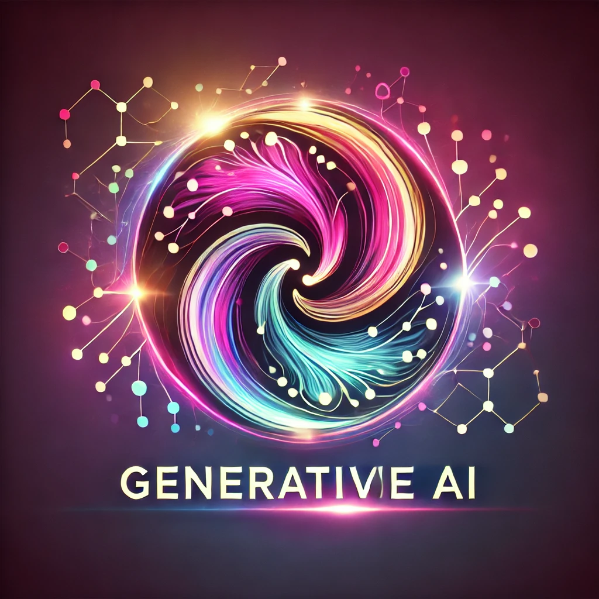
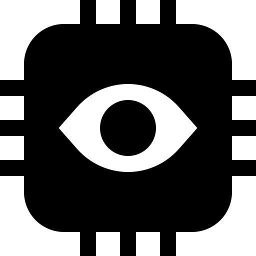
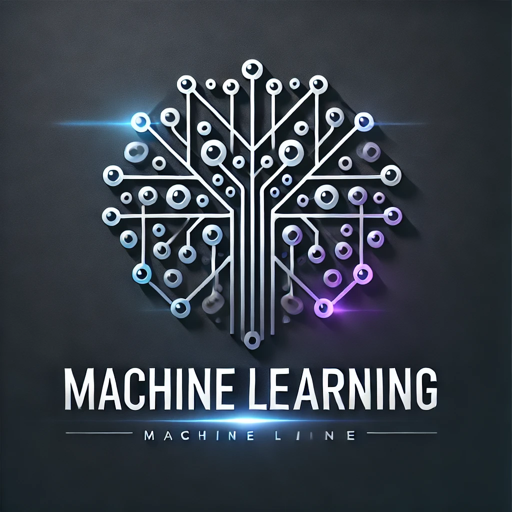
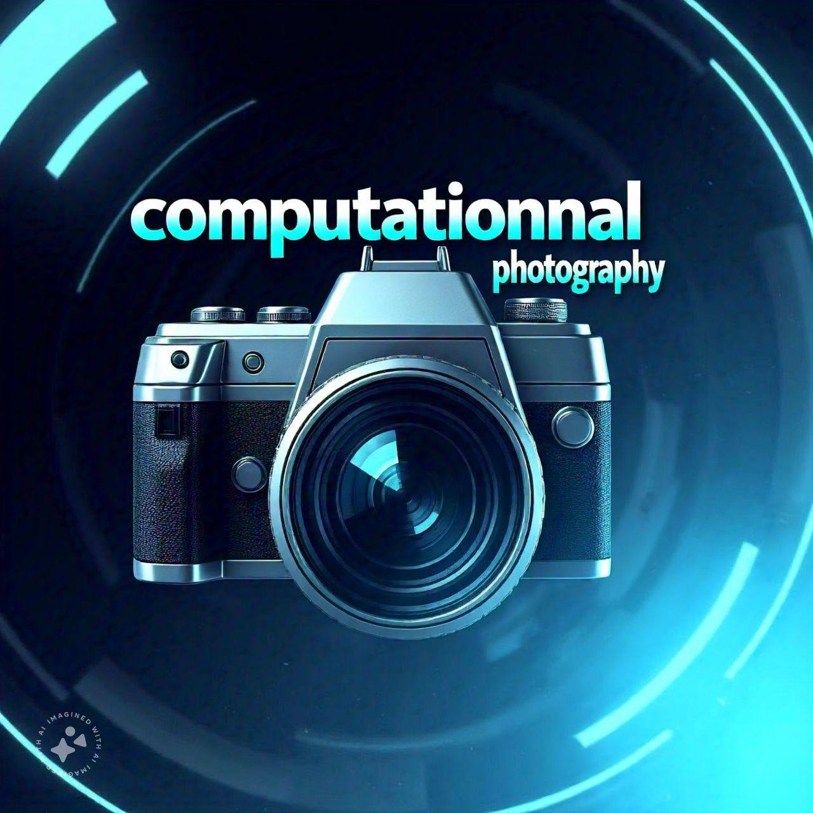

  <h2>Preface:</h2>
  

Hi, I’m Mehdi, and I use this blog to document my learning journey.
I am a research scientist at Meta  | Exploring computer vision, computational photography, and Gen-AI 🚀.

I’ve discovered that I grasp concepts more effectively when I understand a simple code example associated with them. Therefore, in this blog, I explore new concepts through coding!|

I try to use simple scenarios and of course, I never use ChatGPT🤥.

    
 
 
 
 
 
 

 | 
|:--:|:--:| 
**Generative AI**|**Computer Vision**|

 | 
|:--:|:--:| 
**Machine Learning**|**Computational Photography**|

## 
## 
## 
## 

## 

ControlNet is an advanced extension of diffusion models that introduces additional control mechanisms, allowing for precise guidance over the generation process. By integrating control signals (e.g., edge maps, segmentation masks, poses), ControlNet enables the generation of images that adhere to specific structural or semantic constraints provided by the user.

_Last updated: {{ site.time | date: "%B %d, %Y" }}_

## 

Classifier-Free Diffusion is a powerful technique in generative modeling, particularly within diffusion models, that enhances the quality and controllability of generated outputs without relying on an external classifier. This comprehensive guide will delve into the intricacies of classifier-free diffusion, covering its principles, training and inference processes, intuitive explanations, and practical implementations in tasks like image inpainting, super-resolution, and text-to-image generation.

_Last updated: {{ site.time | date: "%B %d, %Y" }}_

## 

Classifier-guided diffusion is a powerful technique in generative modeling that leverages an external classifier to steer the generation process toward desired attributes or classes. This method enhances the quality and controllability of generated data, such as images, by integrating class-specific information during the diffusion process.

_Last updated: {{ site.time | date: "%B %d, %Y" }}_

## 

Stable Diffusion is a powerful generative model that synthesizes high-quality images guided by textual/another modality descriptions. It leverages the strengths of Variational Autoencoders (VAEs) and Denoising Diffusion Probabilistic Models (DDPMs) to produce images efficiently and effectively.
 

_Last updated: {{ site.time | date: "%B %d, %Y" }}_

## 

In this guide, we'll provide sample code for training and inference of a diffusion model, specifically focusing on a Denoising Diffusion Probabilistic Model (DDPM). We'll define the structure for the encoder and decoder using a simplified UNet architecture. Each line of code includes inline comments explaining its purpose, along with the tensor shapes.
 

_Last updated: {{ site.time | date: "%B %d, %Y" }}_

## 

GLIP (Grounded Language-Image Pre-training) is a unified model architecture that bridges the gap between vision and language by integrating object detection and phrase grounding tasks. It leverages both visual and textual data to perform object detection conditioned on textual descriptions, enabling the model to recognize objects based on their semantic meanings.

_Last updated: {{ site.time | date: "%B %d, %Y" }}_

## 

Learning Transferable Visual Models From Natural Language Supervision" is a groundbreaking paper by OpenAI that introduces CLIP (Contrastive Language-Image Pre-training). CLIP learns visual concepts from natural language supervision by jointly training an image encoder and a text encoder to predict the correct pairings of images and texts.

_Last updated: {{ site.time | date: "%B %d, %Y" }}_

## 

notable text-to-image generation models along with their corresponding research papers, sorted by the year they were published:
 

_Last updated: {{ site.time | date: "%B %d, %Y" }}_

## 

The Detection Transformer (DETR) is a novel approach to object detection that leverages Transformers, which were originally designed for sequence-to-sequence tasks like machine translation. Introduced by Carion et al. in 2020, DETR simplifies the object detection pipeline by eliminating the need for hand-crafted components like anchor generation and non-maximum suppression (NMS).
 

_Last updated: {{ site.time | date: "%B %d, %Y" }}_

## 

Vision Transformers (ViTs) apply the Transformer architecture, originally designed for natural language processing (NLP), to computer vision tasks like image classification. ViTs treat an image as a sequence of patches (akin to words in a sentence) and process them using Transformer encoders. 

_Last updated: {{ site.time | date: "%B %d, %Y" }}_

## 

Python implementation of a Conditional Generative Adversarial Network (cGAN) using PyTorch.
 

_Last updated: {{ site.time | date: "%B %d, %Y" }}_

## 

Generalization issue with Distillation
 

_Last updated: {{ site.time | date: "%B %d, %Y" }}_

## 

Mixed precision training is a technique in deep learning where computations are performed using different numerical precisions—typically a mix of **16-bit floating point (FP16)** and **32-bit floating point (FP32)**—to accelerate training and reduce memory usage while maintaining model accuracy. 

_Last updated: {{ site.time | date: "%B %d, %Y" }}_

## 

With the proliferation of deep learning models in various applications, deploying these models on resource-constrained devices like mobile phones, embedded systems, and IoT devices has become essential. Quantization is a key technique that reduces the model size and computational requirements by converting floating-point numbers to lower-precision representations, such as integers.

This tutorial provides an in-depth exploration of quantizing machine learning models. We will delve into the mathematical underpinnings, practical implementations using PyTorch, and advanced topics like mixed precision quantization and layer fusion. By the end of this tutorial, you will have a comprehensive understanding of quantization techniques and how to apply them effectively to optimize your machine learning models.

_Last updated: {{ site.time | date: "%B %d, %Y" }}_

## 

Motion estimation and motion compensation are critical components in video compression algorithms. They exploit temporal redundancies between consecutive frames in a video sequence to reduce the amount of data required for efficient storage and transmission. By predicting the motion of objects from one frame to another, we can represent a video more compactly without significantly compromising visual quality.

_Last updated: {{ site.time | date: "%B %d, %Y" }}_

