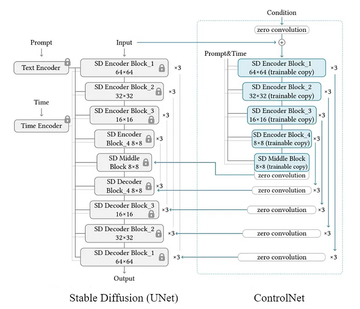
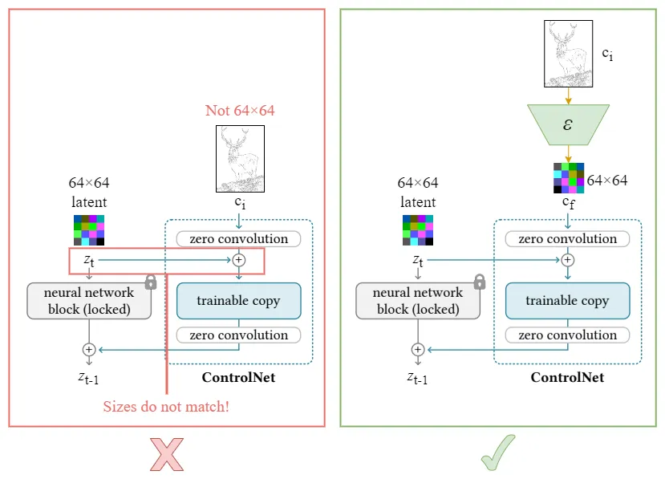

[](../)

## [](../main_page/GenAI)

# ControlNet: A Comprehensive Tutorial on Controllers in Diffusion Models

## Table of Contents

1. [Introduction](#1-introduction)
2. [Intuitions Behind ControlNet](#2-intuitions-behind-controlnet)
3. [Architecture of ControlNet](#3-architecture-of-controlnet)
    - [U-Net Backbone](#unet-backbone)
    - [The Controller](#the-controller)
    - [Zero Convolutions](#zero-convolutions)
4. [ControlNet Loss Function](#4-controlnet-loss-function)
5. [Training Procedure](#5-training-procedure)
6. [Inference Procedure](#6-inference-procedure)
7. [Segmentation Task: Sample Code](#7-segmentation-task-sample-code)
8. [Conclusion](#8-conclusion)

---

## 1. Introduction

In the realm of generative models, diffusion models have emerged as powerful tools for generating high-fidelity images. However, standard diffusion models often lack precise control over the generated content, limiting their applicability in tasks requiring specific structural or semantic constraints. ControlNet is an innovative extension of diffusion models designed to address this limitation by introducing **controllers** that provide additional conditioning signals, enabling fine-grained control over the generation process.

This tutorial delves into the intricacies of ControlNet, focusing on the role of the controller, the architectural innovations such as zero convolutions, and the specialized loss functions that facilitate controlled generation. By the end of this guide, you will have a comprehensive understanding of ControlNet and how to implement it for tasks like image segmentation.

---

## 2. Intuitions Behind ControlNet

### The Need for Control

While diffusion models like Denoising Diffusion Probabilistic Models (DDPM) and their variants (e.g., Stable Diffusion) excel at generating realistic images, they primarily rely on stochastic processes and conditioning information like text prompts. This approach, while powerful, lacks the capability to enforce strict structural constraints or incorporate specific semantic information beyond high-level descriptions.

**Example Scenario:**
Imagine generating an image of a cat sitting on a chair based solely on a text prompt. While the model can produce a plausible image, it might not adhere precisely to the desired pose, background, or chair design.

### Introducing Controllers

ControlNet introduces **controllers**—additional neural network modules that process auxiliary inputs (e.g., edge maps, segmentation masks, poses) to guide the diffusion model. These controllers integrate with the main diffusion model, providing explicit structural or semantic information that ensures the generated images conform to specific requirements.

**Benefits:**
- **Precision:** Enables fine-grained control over image attributes.
- **Flexibility:** Supports various types of control signals.
- **Enhanced Quality:** Maintains high image fidelity while adhering to constraints.

---



## 3. Architecture of ControlNet

ControlNet builds upon the standard U-Net architecture commonly used in diffusion models. It introduces additional pathways and mechanisms to incorporate control signals effectively.

### U-Net Backbone

The U-Net serves as the core architecture for both standard diffusion models and ControlNet. It consists of an encoder-decoder structure with skip connections that facilitate the flow of information across different spatial resolutions.

**Components:**
- **Encoder:** Downsamples the input image, capturing high-level features.
- **Decoder:** Upsamples the features back to the original resolution.
- **Skip Connections:** Directly connect corresponding layers in the encoder and decoder, preserving spatial information.

### The Controller

The **controller** is the distinguishing feature of ControlNet. It processes the auxiliary control signals and integrates their information into the U-Net architecture.

**Key Functions:**
1. **Feature Extraction:** The controller extracts meaningful features from the control signals (e.g., edge maps).
2. **Conditioning:** These features are then used to condition the U-Net's layers, influencing the denoising process to adhere to the control signals.

**Implementation Details:**
- **Separate Pathways:** The controller often mirrors the encoder's structure, enabling it to process control signals at multiple scales.
- **Fusion Mechanisms:** Feature maps from the controller are fused with the U-Net's feature maps, typically through concatenation or addition.

### Zero Convolutions

**Zero Convolutions** are specialized layers introduced in ControlNet to ensure that the controller does not interfere with the diffusion model's initial training phases. These layers are initialized with weights set to zero, effectively nullifying their impact at the outset.

**Purpose:**
- **Stabilize Training:** Prevent the controller from disrupting the already trained diffusion model during the early training stages.
- **Gradual Integration:** Allow the controller to gradually influence the generation process as training progresses.

**Implementation:**
```python
import torch.nn as nn

class ZeroConv2d(nn.Module):
    def __init__(self, in_channels, out_channels, kernel_size=1, padding=0):
        super(ZeroConv2d, self).__init__()
        self.conv = nn.Conv2d(in_channels, out_channels, kernel_size, padding=padding)
        nn.init.constant_(self.conv.weight, 0)
        nn.init.constant_(self.conv.bias, 0)

    def forward(self, x):
        return self.conv(x)
```

**Usage in ControlNet:**
Zero convolutions are typically placed after the controller's convolutional layers, ensuring that their initial output is zero and allowing for gradual learning.

---

## 4. ControlNet Loss Function

ControlNet employs a specialized loss function that extends the standard diffusion loss to account for the additional control signals.

### Diffusion Loss

The core objective remains predicting the noise added during the forward diffusion process. The Mean Squared Error (MSE) between the predicted noise and the actual noise serves as the primary loss component.

**Formula:**
$$
\mathcal{L}_{\text{diffusion}} = \mathbb{E}_{x_0, \epsilon, t} \left[ \| \epsilon - \epsilon_\theta(x_t, t, c) \|^2 \right]
$$

- **$$x_0$$:** Original image.
- **$$\epsilon$$:** Noise added to the image at time step $$t$$.
- **$$c$$:** Control signal (e.g., segmentation mask).
- **$$\epsilon_\theta$$:** Noise prediction model (ControlNet).

### Perceptual Loss (Optional)

To ensure that the generated images not only adhere to the control signals but also maintain perceptual quality, an auxiliary **perceptual loss** can be incorporated.

**Purpose:**
- **Feature Consistency:** Ensures that high-level features between the generated image and the ground truth are consistent.
- **Enhanced Quality:** Encourages the preservation of semantic content and visual coherence.

**Formula:**
$$
\mathcal{L}_{\text{perceptual}} = \mathbb{E}_{x_0, c, t} \left[ \| \phi(x_{\text{generated}}) - \phi(x_0) \|^2 \right]
$$

- **$$\phi$$:** Pre-trained feature extractor (e.g., VGG network).

### Combined Loss

The total loss function combines the diffusion loss and the perceptual loss, weighted by a hyperparameter $$\lambda$$.

$$
\mathcal{L}_{\text{total}} = \mathcal{L}_{\text{diffusion}} + \lambda \, \mathcal{L}_{\text{perceptual}}
$$

- **$$\lambda$$:** Balances the influence of the perceptual loss relative to the diffusion loss.

**Implementation Example:**
```python
lambda_perceptual = 0.1
loss_total = loss_diffusion + lambda_perceptual * loss_perceptual
```

---


## 5. Training Procedure

Training ControlNet involves optimizing the model parameters to minimize the combined loss function. Below is a step-by-step guide, accompanied by a PyTorch implementation example.

### Step-by-Step Guide

1. **Data Preparation:**
    - **Images ($$x_0$$):** Original images from the dataset.
    - **Control Signals ($$c$$):** Auxiliary inputs such as segmentation masks.
    - **Transformations:** Apply necessary transformations (e.g., resizing, normalization).

2. **Noise Scheduling:**
    - Define a variance schedule $$\beta_t$$ for the forward diffusion process.
    - Compute cumulative products $$\bar{\alpha}_t = \prod_{s=1}^t (1 - \beta_s)$$.

3. **Model Initialization:**
    - Initialize the ControlNet model.
    - Initialize zero convolutions to prevent early interference.

4. **Forward Pass:**
    - Sample a random time step $$t$$ for each image in the batch.
    - Add noise to $$x_0$$ to obtain $$x_t$$.
    - Use ControlNet to predict the noise $$\epsilon_\theta(x_t, t, c)$$.

5. **Loss Computation:**
    - Calculate the diffusion loss (MSE between predicted and actual noise).
    - Optionally, compute the perceptual loss.
    - Combine the losses to obtain the total loss.

6. **Backpropagation and Optimization:**
    - Backpropagate the total loss.
    - Update the model parameters using an optimizer (e.g., Adam).

7. **Iterate:**
    - Repeat the process for multiple epochs until convergence.

### PyTorch Implementation Example

```python
import torch
import torch.nn as nn
import torch.optim as optim
from torch.utils.data import DataLoader, Dataset
import torchvision.transforms as transforms
from torchvision import models

# Define ZeroConv2d
class ZeroConv2d(nn.Module):
    def __init__(self, in_channels, out_channels, kernel_size=1, padding=0):
        super(ZeroConv2d, self).__init__()
        self.conv = nn.Conv2d(in_channels, out_channels, kernel_size, padding=padding)
        nn.init.constant_(self.conv.weight, 0)
        nn.init.constant_(self.conv.bias, 0)

    def forward(self, x):
        return self.conv(x)

# Define ResidualBlock
class ResidualBlock(nn.Module):
    def __init__(self, in_channels, out_channels, time_emb_dim, cond_emb_dim=None):
        super(ResidualBlock, self).__init__()
        self.conv1 = nn.Conv2d(in_channels, out_channels, kernel_size=3, padding=1)
        self.time_emb = nn.Linear(time_emb_dim, out_channels)
        self.cond_emb = nn.Linear(cond_emb_dim, out_channels) if cond_emb_dim else None
        self.conv2 = nn.Conv2d(out_channels, out_channels, kernel_size=3, padding=1)
        self.relu = nn.ReLU()
        self.residual_conv = nn.Conv2d(in_channels, out_channels, kernel_size=1) if in_channels != out_channels else nn.Identity()
    
    def forward(self, x, t_emb, c_emb=None):
        out = self.conv1(x)
        out += self.time_emb(t_emb).unsqueeze(-1).unsqueeze(-1)  # Broadcast time embedding
        if self.cond_emb and c_emb is not None:
            out += self.cond_emb(c_emb).unsqueeze(-1).unsqueeze(-1)  # Broadcast condition embedding
        out = self.relu(out)
        out = self.conv2(out)
        return self.relu(out + self.residual_conv(x))

# Define ControlNet
class ControlNet(nn.Module):
    def __init__(self, in_channels=3, cond_channels=3, out_channels=3, time_emb_dim=256, cond_emb_dim=256, base_channels=64):
        super(ControlNet, self).__init__()
        # Time embedding MLP
        self.time_mlp = nn.Sequential(
            nn.Linear(1, time_emb_dim),
            nn.ReLU(),
            nn.Linear(time_emb_dim, time_emb_dim)
        )
        
        # Control signal processing
        self.cond_conv = ZeroConv2d(cond_channels, cond_emb_dim, kernel_size=3, padding=1)
        
        # U-Net Encoder
        self.encoder1 = ResidualBlock(in_channels, base_channels, time_emb_dim, cond_emb_dim)
        self.encoder2 = ResidualBlock(base_channels, base_channels*2, time_emb_dim, cond_emb_dim)
        self.encoder3 = ResidualBlock(base_channels*2, base_channels*4, time_emb_dim, cond_emb_dim)
        
        # Bottleneck
        self.bottleneck = ResidualBlock(base_channels*4, base_channels*4, time_emb_dim, cond_emb_dim)
        
        # U-Net Decoder
        self.decoder3 = ResidualBlock(base_channels*4 + base_channels*2, base_channels*2, time_emb_dim, cond_emb_dim)
        self.decoder2 = ResidualBlock(base_channels*2 + base_channels, base_channels, time_emb_dim, cond_emb_dim)
        self.decoder1 = ResidualBlock(base_channels + in_channels, base_channels, time_emb_dim, cond_emb_dim)
        
        # Final output convolution
        self.final_conv = nn.Conv2d(base_channels, out_channels, kernel_size=1)
    
    def forward(self, x, t, c):
        """
        x: Noisy image tensor of shape [B, C, H, W]
        t: Time step tensor of shape [B]
        c: Control signal tensor of shape [B, C', H, W]
        """
        # Embed time
        t_emb = self.time_mlp(t.unsqueeze(-1))  # Shape: [B, time_emb_dim]
        
        # Process control signal
        c_emb = self.cond_conv(c)               # Shape: [B, cond_emb_dim, H, W]
        c_emb = F.adaptive_avg_pool2d(c_emb, (1,1))  # Shape: [B, cond_emb_dim, 1, 1]
        c_emb = c_emb.view(c_emb.size(0), -1)      # Shape: [B, cond_emb_dim]
        
        # Encoder path
        e1 = self.encoder1(x, t_emb, c_emb)        # Shape: [B, base_channels, H, W]
        e2 = self.encoder2(F.max_pool2d(e1, 2), t_emb, c_emb)  # Shape: [B, base_channels*2, H/2, W/2]
        e3 = self.encoder3(F.max_pool2d(e2, 2), t_emb, c_emb)  # Shape: [B, base_channels*4, H/4, W/4]
        
        # Bottleneck
        b = self.bottleneck(F.max_pool2d(e3, 2), t_emb, c_emb)  # Shape: [B, base_channels*4, H/8, W/8]
        
        # Decoder path
        d3 = F.interpolate(b, scale_factor=2, mode='nearest')  # Shape: [B, base_channels*4, H/4, W/4]
        d3 = torch.cat([d3, e3], dim=1)                      # Shape: [B, base_channels*8, H/4, W/4]
        d3 = self.decoder3(d3, t_emb, c_emb)                 # Shape: [B, base_channels*2, H/4, W/4]
        
        d2 = F.interpolate(d3, scale_factor=2, mode='nearest')  # Shape: [B, base_channels*2, H/2, W/2]
        d2 = torch.cat([d2, e2], dim=1)                        # Shape: [B, base_channels*4, H/2, W/2]
        d2 = self.decoder2(d2, t_emb, c_emb)                   # Shape: [B, base_channels, H/2, W/2]
        
        d1 = F.interpolate(d2, scale_factor=2, mode='nearest')  # Shape: [B, base_channels, H, W]
        d1 = torch.cat([d1, e1], dim=1)                        # Shape: [B, base_channels + in_channels, H, W]
        d1 = self.decoder1(d1, t_emb, c_emb)                   # Shape: [B, base_channels, H, W]
        
        # Final output
        out = self.final_conv(d1)                               # Shape: [B, out_channels, H, W]
        return out

# Define PerceptualLoss
class PerceptualLoss(nn.Module):
    def __init__(self, feature_extractor):
        super(PerceptualLoss, self).__init__()
        self.feature_extractor = feature_extractor
        # Freeze feature extractor parameters
        for param in self.feature_extractor.parameters():
            param.requires_grad = False

    def forward(self, generated, target):
        gen_features = self.feature_extractor(generated)
        target_features = self.feature_extractor(target)
        loss = nn.MSELoss()(gen_features, target_features)
        return loss

# Example Feature Extractor (VGG16)
vgg = models.vgg16(pretrained=True).features[:16].eval().cuda()
for param in vgg.parameters():
    param.requires_grad = False

perceptual_loss_fn = PerceptualLoss(vgg).cuda()

# Define Custom Dataset
class CustomSegmentationDataset(Dataset):
    def __init__(self, images, segmentation_masks, transform=None):
        """
        images: List of PIL images or file paths.
        segmentation_masks: List of corresponding segmentation masks.
        transform: Transformations to apply.
        """
        self.images = images
        self.segmentation_masks = segmentation_masks
        self.transform = transform

    def __len__(self):
        return len(self.images)

    def __getitem__(self, idx):
        x0 = self.images[idx]
        c = self.segmentation_masks[idx]
        if self.transform:
            x0 = self.transform(x0)
            c = self.transform(c)
        return {'image': x0, 'control_signal': c}

# Hyperparameters
batch_size = 16
learning_rate = 1e-4
num_epochs = 100
lambda_perceptual = 0.1
T = 1000  # Number of diffusion steps

# Define Beta Schedule
beta = torch.linspace(0.0001, 0.02, T).cuda()
alpha = 1.0 - beta
alpha_cumprod = torch.cumprod(alpha, dim=0).cuda()
one_minus_alpha_cumprod = 1.0 - alpha_cumprod

# Define Transformations
transform = transforms.Compose([
    transforms.Resize((256, 256)),
    transforms.ToTensor()
])

# Initialize Dataset and DataLoader
# Replace with actual data loading
# images = [...]  # List of PIL images
# segmentation_masks = [...]  # List of segmentation masks
# dataset = CustomSegmentationDataset(images, segmentation_masks, transform=transform)
# dataloader = DataLoader(dataset, batch_size=batch_size, shuffle=True)

# For demonstration, using random tensors
class RandomSegmentationDataset(Dataset):
    def __init__(self, num_samples, channels, height, width):
        self.num_samples = num_samples
        self.channels = channels
        self.height = height
        self.width = width

    def __len__(self):
        return self.num_samples

    def __getitem__(self, idx):
        image = torch.randn(self.channels, self.height, self.width)
        mask = torch.randint(0, 2, (self.channels, self.height, self.width)).float()  # Binary mask
        return {'image': image, 'control_signal': mask}

dataset = RandomSegmentationDataset(num_samples=1000, channels=3, height=256, width=256)
dataloader = DataLoader(dataset, batch_size=batch_size, shuffle=True)

# Initialize ControlNet Model
model = ControlNet(
    in_channels=3,
    cond_channels=3,
    out_channels=3,
    time_emb_dim=256,
    cond_emb_dim=256,
    base_channels=64
).cuda()

# Initialize Optimizer
optimizer = optim.Adam(model.parameters(), lr=learning_rate)

# Define Loss Functions
mse_loss_fn = nn.MSELoss()

# Training Loop
for epoch in range(num_epochs):
    model.train()
    epoch_loss = 0.0
    for batch in dataloader:
        x0 = batch['image'].cuda()              # Original images
        c = batch['control_signal'].cuda()      # Segmentation masks

        B, C, H, W = x0.size()

        # Sample random time steps
        t = torch.randint(1, T+1, (B,)).cuda()  # [B]

        # Sample noise
        epsilon = torch.randn_like(x0).cuda()

        # Compute x_t using the forward diffusion process
        sqrt_alpha_cumprod_t = alpha_cumprod[t-1].sqrt().view(B, 1, 1, 1)
        sqrt_one_minus_alpha_cumprod_t = one_minus_alpha_cumprod[t-1].sqrt().view(B, 1, 1, 1)
        xt = sqrt_alpha_cumprod_t * x0 + sqrt_one_minus_alpha_cumprod_t * epsilon

        # Predict noise using ControlNet
        epsilon_pred = model(xt, t.float(), c)  # [B, C, H, W]

        # Compute diffusion loss
        loss_diffusion = mse_loss_fn(epsilon_pred, epsilon)

        # Optional: Compute perceptual loss
        # Generate image from predicted noise
        # Here, we perform a single reverse step for demonstration
        with torch.no_grad():
            x_generated = (xt - (beta[t-1].sqrt()) * epsilon_pred) / alpha[t-1].sqrt()
        
        loss_perceptual = perceptual_loss_fn(x_generated, x0)

        # Total loss
        loss_total = loss_diffusion + lambda_perceptual * loss_perceptual

        # Backpropagation
        optimizer.zero_grad()
        loss_total.backward()
        optimizer.step()

        epoch_loss += loss_total.item()

    avg_loss = epoch_loss / len(dataloader)
    print(f"Epoch [{epoch+1}/{num_epochs}], Loss: {avg_loss:.6f}")
```

**Key Components Explained:**

1. **ZeroConv2d:**
    - Ensures that the controller does not influence the model initially by initializing convolutional weights to zero.

2. **ResidualBlock and ControlNet Classes:**
    - **ResidualBlock:** Implements a residual connection with optional conditioning on time and control embeddings.
    - **ControlNet:** Integrates the controller into the U-Net architecture, processing control signals and fusing them with the main network.

3. **PerceptualLoss:**
    - Utilizes a pre-trained VGG16 network to compute feature-based losses, ensuring perceptual similarity between generated and target images.

4. **CustomSegmentationDataset:**
    - Placeholder for datasets consisting of images and corresponding segmentation masks.

5. **Training Loop:**
    - **Time Step Sampling:** Randomly samples a time step $$t$$ for each image in the batch.
    - **Noise Addition:** Generates $$x_t$$ by adding noise to $$x_0$$ based on the sampled $$t$$.
    - **Noise Prediction:** ControlNet predicts the noise component.
    - **Loss Computation:** Calculates the diffusion loss (MSE between predicted and actual noise) and the perceptual loss.
    - **Optimization:** Updates model parameters to minimize the combined loss.

**Notes:**
- **Perceptual Loss Integration:** For enhanced image quality, incorporate the perceptual loss by performing a reverse diffusion step to obtain $$x_{\text{generated}}$$ and computing $$\mathcal{L}_{\text{perceptual}}$$.
- **Data Loading:** Replace the `RandomSegmentationDataset` with actual data loading logic tailored to your dataset.

---

## 6. Inference Procedure

After training, ControlNet can generate images conditioned on control signals (e.g., segmentation masks) by performing an iterative denoising process starting from pure noise.

### Step-by-Step Guide

1. **Model Preparation:**
    - Load the trained ControlNet model.
    - Set the model to evaluation mode.

2. **Control Signal Preparation:**
    - Prepare the control signals (e.g., segmentation masks) corresponding to the desired output.

3. **Noise Initialization:**
    - Initialize $$x_T$$ with pure Gaussian noise.

4. **Iterative Denoising:**
    - For each time step $$t = T, T-1, \dots, 1$$:
        - Predict the noise $$\epsilon_\theta(x_t, t, c)$$ using ControlNet.
        - Compute $$x_{t-1}$$ using the reverse diffusion formula.
        - Optionally, add noise $$\sigma_t z$$ to maintain stochasticity.

5. **Output Generation:**
    - The final $$x_0$$ after denoising is the generated image.

### PyTorch Implementation Example

```python
import torch
import torch.nn.functional as F
import torchvision.utils as vutils

# Assume ControlNet and ZeroConv2d are defined as before

# Function to perform a single reverse diffusion step
def reverse_diffusion_step(model, xt, t, c, beta, alpha_cumprod, one_minus_alpha_cumprod):
    """
    model: Trained ControlNet model
    xt: Current noisy image tensor [B, C, H, W]
    t: Current time step (scalar)
    c: Control signal tensor [B, C', H, W]
    beta: Tensor of beta values [T]
    alpha_cumprod: Tensor of alpha_cumprod [T]
    one_minus_alpha_cumprod: Tensor of 1 - alpha_cumprod [T]
    """
    B, C, H, W = xt.size()
    
    # Predict noise using ControlNet
    t_tensor = torch.full((B,), t, device=xt.device, dtype=torch.float)
    epsilon_pred = model(xt, t_tensor, c)  # [B, C, H, W]
    
    # Compute coefficients
    sqrt_alpha_cumprod_t = alpha_cumprod[t-1].sqrt()
    sqrt_one_minus_alpha_cumprod_t = one_minus_alpha_cumprod[t-1].sqrt()
    alpha_t = alpha_cumprod[t-1]
    
    # Compute x_prev
    x_prev = (xt - (beta[t-1] / sqrt_one_minus_alpha_cumprod_t) * epsilon_pred) / sqrt_alpha_cumprod_t
    
    # Add noise if not the final step
    if t > 1:
        sigma = torch.sqrt(beta[t-1])
        z = torch.randn_like(xt)
        x_prev += sigma * z
    
    return x_prev

# Inference Function
def generate_image(model, c, T=1000, beta_schedule=None):
    """
    model: Trained ControlNet model
    c: Control signal tensor [B, C', H, W]
    T: Number of diffusion steps
    beta_schedule: Tensor of beta values [T]
    """
    device = next(model.parameters()).device
    
    if beta_schedule is None:
        beta = torch.linspace(0.0001, 0.02, T).to(device)
    else:
        beta = beta_schedule.to(device)
    
    alpha = 1.0 - beta
    alpha_cumprod = torch.cumprod(alpha, dim=0).to(device)
    one_minus_alpha_cumprod = 1.0 - alpha_cumprod
    
    B, C_cond, H, W = c.size()
    
    # Initialize with random noise
    xt = torch.randn(B, 3, H, W).to(device)
    
    # Iterative denoising
    for t in reversed(range(1, T+1)):
        xt = reverse_diffusion_step(model, xt, t, c, beta, alpha_cumprod, one_minus_alpha_cumprod)
        if t % 100 == 0 or t == 1:
            print(f"Completed step {t}/{T}")
    
    # Clamp the generated image to [0,1]
    generated_image = torch.clamp(xt, -1.0, 1.0)
    return generated_image

# Example Usage
if __name__ == "__main__":
    # Hyperparameters
    batch_size = 4
    C_cond, H, W = 3, 256, 256
    T = 1000  # Number of diffusion steps
    
    # Initialize model and load trained weights
    model = ControlNet(
        in_channels=3,
        cond_channels=3,
        out_channels=3,
        time_emb_dim=256,
        cond_emb_dim=256,
        base_channels=64
    ).cuda()
    
    # Load trained weights
    model.load_state_dict(torch.load('controlnet_trained.pth'))
    model.eval()
    
    # Prepare control signals (segmentation masks)
    # Replace with actual segmentation masks
    # For demonstration, using random masks
    c = torch.randn(batch_size, C_cond, H, W).cuda()
    
    # Generate images
    with torch.no_grad():
        generated_images = generate_image(model, c, T=T)
    
    # Save or visualize generated images
    vutils.save_image(generated_images, 'generated_segmentation.png', normalize=True)
    print("Generated images saved to 'generated_segmentation.png'")
```

**Key Components Explained:**

1. **reverse_diffusion_step Function:**
    - Performs a single step of the reverse diffusion process.
    - Predicts the noise using ControlNet.
    - Computes the previous time step's image $$x_{t-1}$$.
    - Adds Gaussian noise $$\sigma_t z$$ if not at the final step to maintain stochasticity.

2. **generate_image Function:**
    - Initializes the process with pure noise $$x_T$$.
    - Iteratively applies the reverse diffusion step from $$t = T$$ down to $$t = 1$$.
    - Clamps the final image to ensure valid pixel values.
    - Returns the generated image tensor.

3. **Example Usage:**
    - Loads the trained ControlNet model.
    - Prepares control signals (segmentation masks).
    - Generates images by conditioning on the control signals.
    - Saves the generated images for visualization.

**Notes:**
- **Control Signals:** Replace the random tensors with actual segmentation masks relevant to your application.
- **Trained Weights:** Ensure that `controlnet_trained.pth` contains the trained model weights.
- **Optimization:** During inference, the model is set to evaluation mode, and gradient computations are disabled for efficiency.

---

## 7. Segmentation Task: Sample Code

In this section, we provide a complete example of using ControlNet for an image segmentation task. The goal is to generate images conditioned on segmentation masks, ensuring that the generated content adheres to the specified segmentation structure.

### Step-by-Step Implementation

1. **Dataset Preparation:**
    - Use a dataset consisting of images and their corresponding segmentation masks.
    - Apply necessary transformations to both images and masks.

2. **Model Initialization:**
    - Instantiate the ControlNet model.
    - Optionally, incorporate zero convolutions to stabilize training.

3. **Training Loop:**
    - For each batch:
        - Add noise to the original images.
        - Use ControlNet to predict the noise based on noisy images and segmentation masks.
        - Compute the diffusion loss.
        - Optionally, compute the perceptual loss.
        - Update model parameters.

4. **Inference:**
    - Generate new images by providing segmentation masks and performing the reverse diffusion process.

### Complete PyTorch Code Example

```python
import torch
import torch.nn as nn
import torch.optim as optim
from torch.utils.data import DataLoader, Dataset
import torchvision.transforms as transforms
from torchvision import models
import torchvision.utils as vutils
from PIL import Image
import os

# Define ZeroConv2d
class ZeroConv2d(nn.Module):
    def __init__(self, in_channels, out_channels, kernel_size=1, padding=0):
        super(ZeroConv2d, self).__init__()
        self.conv = nn.Conv2d(in_channels, out_channels, kernel_size, padding=padding)
        nn.init.constant_(self.conv.weight, 0)
        nn.init.constant_(self.conv.bias, 0)

    def forward(self, x):
        return self.conv(x)

# Define ResidualBlock
class ResidualBlock(nn.Module):
    def __init__(self, in_channels, out_channels, time_emb_dim, cond_emb_dim=None):
        super(ResidualBlock, self).__init__()
        self.conv1 = nn.Conv2d(in_channels, out_channels, kernel_size=3, padding=1)
        self.time_emb = nn.Linear(time_emb_dim, out_channels)
        self.cond_emb = nn.Linear(cond_emb_dim, out_channels) if cond_emb_dim else None
        self.conv2 = nn.Conv2d(out_channels, out_channels, kernel_size=3, padding=1)
        self.relu = nn.ReLU()
        self.residual_conv = nn.Conv2d(in_channels, out_channels, kernel_size=1) if in_channels != out_channels else nn.Identity()
    
    def forward(self, x, t_emb, c_emb=None):
        out = self.conv1(x)
        out += self.time_emb(t_emb).unsqueeze(-1).unsqueeze(-1)  # Broadcast time embedding
        if self.cond_emb and c_emb is not None:
            out += self.cond_emb(c_emb).unsqueeze(-1).unsqueeze(-1)  # Broadcast condition embedding
        out = self.relu(out)
        out = self.conv2(out)
        return self.relu(out + self.residual_conv(x))

# Define ControlNet
class ControlNet(nn.Module):
    def __init__(self, in_channels=3, cond_channels=3, out_channels=3, time_emb_dim=256, cond_emb_dim=256, base_channels=64):
        super(ControlNet, self).__init__()
        # Time embedding MLP
        self.time_mlp = nn.Sequential(
            nn.Linear(1, time_emb_dim),
            nn.ReLU(),
            nn.Linear(time_emb_dim, time_emb_dim)
        )
        
        # Control signal processing
        self.cond_conv = ZeroConv2d(cond_channels, cond_emb_dim, kernel_size=3, padding=1)
        
        # U-Net Encoder
        self.encoder1 = ResidualBlock(in_channels, base_channels, time_emb_dim, cond_emb_dim)
        self.encoder2 = ResidualBlock(base_channels, base_channels*2, time_emb_dim, cond_emb_dim)
        self.encoder3 = ResidualBlock(base_channels*2, base_channels*4, time_emb_dim, cond_emb_dim)
        
        # Bottleneck
        self.bottleneck = ResidualBlock(base_channels*4, base_channels*4, time_emb_dim, cond_emb_dim)
        
        # U-Net Decoder
        self.decoder3 = ResidualBlock(base_channels*4 + base_channels*2, base_channels*2, time_emb_dim, cond_emb_dim)
        self.decoder2 = ResidualBlock(base_channels*2 + base_channels, base_channels, time_emb_dim, cond_emb_dim)
        self.decoder1 = ResidualBlock(base_channels + in_channels, base_channels, time_emb_dim, cond_emb_dim)
        
        # Final output convolution
        self.final_conv = nn.Conv2d(base_channels, out_channels, kernel_size=1)
    
    def forward(self, x, t, c):
        """
        x: Noisy image tensor of shape [B, C, H, W]
        t: Time step tensor of shape [B]
        c: Control signal tensor of shape [B, C', H, W]
        """
        # Embed time
        t_emb = self.time_mlp(t.unsqueeze(-1))  # Shape: [B, time_emb_dim]
        
        # Process control signal
        c_emb = self.cond_conv(c)               # Shape: [B, cond_emb_dim, H, W]
        c_emb = F.adaptive_avg_pool2d(c_emb, (1,1))  # Shape: [B, cond_emb_dim, 1, 1]
        c_emb = c_emb.view(c_emb.size(0), -1)      # Shape: [B, cond_emb_dim]
        
        # Encoder path
        e1 = self.encoder1(x, t_emb, c_emb)        # Shape: [B, base_channels, H, W]
        e2 = self.encoder2(F.max_pool2d(e1, 2), t_emb, c_emb)  # Shape: [B, base_channels*2, H/2, W/2]
        e3 = self.encoder3(F.max_pool2d(e2, 2), t_emb, c_emb)  # Shape: [B, base_channels*4, H/4, W/4]
        
        # Bottleneck
        b = self.bottleneck(F.max_pool2d(e3, 2), t_emb, c_emb)  # Shape: [B, base_channels*4, H/8, W/8]
        
        # Decoder path
        d3 = F.interpolate(b, scale_factor=2, mode='nearest')  # Shape: [B, base_channels*4, H/4, W/4]
        d3 = torch.cat([d3, e3], dim=1)                      # Shape: [B, base_channels*8, H/4, W/4]
        d3 = self.decoder3(d3, t_emb, c_emb)                 # Shape: [B, base_channels*2, H/4, W/4]
        
        d2 = F.interpolate(d3, scale_factor=2, mode='nearest')  # Shape: [B, base_channels*2, H/2, W/2]
        d2 = torch.cat([d2, e2], dim=1)                        # Shape: [B, base_channels*4, H/2, W/2]
        d2 = self.decoder2(d2, t_emb, c_emb)                   # Shape: [B, base_channels, H/2, W/2]
        
        d1 = F.interpolate(d2, scale_factor=2, mode='nearest')  # Shape: [B, base_channels, H, W]
        d1 = torch.cat([d1, e1], dim=1)                        # Shape: [B, base_channels + in_channels, H, W]
        d1 = self.decoder1(d1, t_emb, c_emb)                   # Shape: [B, base_channels, H, W]
        
        # Final output
        out = self.final_conv(d1)                               # Shape: [B, out_channels, H, W]
        return out

# Define PerceptualLoss
class PerceptualLoss(nn.Module):
    def __init__(self, feature_extractor):
        super(PerceptualLoss, self).__init__()
        self.feature_extractor = feature_extractor
        # Freeze feature extractor parameters
        for param in self.feature_extractor.parameters():
            param.requires_grad = False

    def forward(self, generated, target):
        gen_features = self.feature_extractor(generated)
        target_features = self.feature_extractor(target)
        loss = nn.MSELoss()(gen_features, target_features)
        return loss

# Example Feature Extractor (VGG16)
vgg = models.vgg16(pretrained=True).features[:16].eval().cuda()
for param in vgg.parameters():
    param.requires_grad = False

perceptual_loss_fn = PerceptualLoss(vgg).cuda()

# Define Custom Dataset
class SegmentationDataset(Dataset):
    def __init__(self, image_dir, mask_dir, transform=None):
        """
        image_dir: Directory containing images.
        mask_dir: Directory containing segmentation masks.
        transform: Transformations to apply.
        """
        self.image_dir = image_dir
        self.mask_dir = mask_dir
        self.transform = transform
        self.images = sorted(os.listdir(image_dir))
        self.masks = sorted(os.listdir(mask_dir))

    def __len__(self):
        return len(self.images)

    def __getitem__(self, idx):
        img_path = os.path.join(self.image_dir, self.images[idx])
        mask_path = os.path.join(self.mask_dir, self.masks[idx])
        image = Image.open(img_path).convert('RGB')
        mask = Image.open(mask_path).convert('RGB')  # Assuming mask is RGB
        
        if self.transform:
            image = self.transform(image)
            mask = self.transform(mask)
        return {'image': image, 'control_signal': mask}

# Hyperparameters
batch_size = 16
learning_rate = 1e-4
num_epochs = 100
lambda_perceptual = 0.1
T = 1000  # Number of diffusion steps

# Define Beta Schedule
beta = torch.linspace(0.0001, 0.02, T).cuda()
alpha = 1.0 - beta
alpha_cumprod = torch.cumprod(alpha, dim=0).cuda()
one_minus_alpha_cumprod = 1.0 - alpha_cumprod

# Define Transformations
transform = transforms.Compose([
    transforms.Resize((256, 256)),
    transforms.ToTensor()
])

# Initialize Dataset and DataLoader
# Replace 'path_to_images' and 'path_to_masks' with actual paths
# image_dir = 'path_to_images'
# mask_dir = 'path_to_masks'
# dataset = SegmentationDataset(image_dir, mask_dir, transform=transform)
# dataloader = DataLoader(dataset, batch_size=batch_size, shuffle=True)

# For demonstration, using random tensors
class RandomSegmentationDataset(Dataset):
    def __init__(self, num_samples, channels, height, width):
        self.num_samples = num_samples
        self.channels = channels
        self.height = height
        self.width = width

    def __len__(self):
        return self.num_samples

    def __getitem__(self, idx):
        image = torch.randn(self.channels, self.height, self.width)
        mask = torch.randint(0, 2, (self.channels, self.height, self.width)).float()  # Binary mask
        return {'image': image, 'control_signal': mask}

dataset = RandomSegmentationDataset(num_samples=1000, channels=3, height=256, width=256)
dataloader = DataLoader(dataset, batch_size=batch_size, shuffle=True)

# Initialize ControlNet Model
model = ControlNet(
    in_channels=3,
    cond_channels=3,
    out_channels=3,
    time_emb_dim=256,
    cond_emb_dim=256,
    base_channels=64
).cuda()

# Initialize Optimizer
optimizer = optim.Adam(model.parameters(), lr=learning_rate)

# Define Loss Functions
mse_loss_fn = nn.MSELoss()

# Training Loop
for epoch in range(num_epochs):
    model.train()
    epoch_loss = 0.0
    for batch in dataloader:
        x0 = batch['image'].cuda()              # Original images
        c = batch['control_signal'].cuda()      # Segmentation masks

        B, C, H, W = x0.size()

        # Sample random time steps
        t = torch.randint(1, T+1, (B,)).cuda()  # [B]

        # Sample noise
        epsilon = torch.randn_like(x0).cuda()

        # Compute x_t using the forward diffusion process
        sqrt_alpha_cumprod_t = alpha_cumprod[t-1].sqrt().view(B, 1, 1, 1)
        sqrt_one_minus_alpha_cumprod_t = one_minus_alpha_cumprod[t-1].sqrt().view(B, 1, 1, 1)
        xt = sqrt_alpha_cumprod_t * x0 + sqrt_one_minus_alpha_cumprod_t * epsilon

        # Predict noise using ControlNet
        epsilon_pred = model(xt, t.float(), c)  # [B, C, H, W]

        # Compute diffusion loss
        loss_diffusion = mse_loss_fn(epsilon_pred, epsilon)

        # Optional: Compute perceptual loss
        # Generate image from predicted noise
        # Here, we perform a single reverse step for demonstration
        with torch.no_grad():
            x_generated = (xt - (beta[t-1].sqrt()) * epsilon_pred) / alpha[t-1].sqrt()
        
        loss_perceptual = perceptual_loss_fn(x_generated, x0)

        # Total loss
        loss_total = loss_diffusion + lambda_perceptual * loss_perceptual

        # Backpropagation
        optimizer.zero_grad()
        loss_total.backward()
        optimizer.step()

        epoch_loss += loss_total.item()

    avg_loss = epoch_loss / len(dataloader)
    print(f"Epoch [{epoch+1}/{num_epochs}], Loss: {avg_loss:.6f}")
```

**Key Components Explained:**

1. **SegmentationDataset Class:**
    - Handles loading of images and their corresponding segmentation masks.
    - Applies necessary transformations.

2. **Training Loop Enhancements:**
    - **Perceptual Loss Computation:**
        - Generates an intermediate image $$x_{\text{generated}}$$ using a single reverse diffusion step.
        - Computes the perceptual loss between $$x_{\text{generated}}$$ and the ground truth $$x_0$$.
    - **Total Loss Calculation:**
        - Combines diffusion loss and perceptual loss, weighted by $$\lambda_{\text{perceptual}}$$.

3. **Notes:**
    - **Perceptual Loss Integration:** For more accurate image generation, consider performing a full reverse diffusion process before computing perceptual loss, albeit at increased computational cost.
    - **Data Loading:** Replace the `RandomSegmentationDataset` with actual data paths to utilize real images and segmentation masks.

---

## 8. Comparison with Other Guided Diffusion Algorithms

ControlNet distinguishes itself among various guided diffusion methodologies through its unique integration of control signals. Below is a comparative analysis highlighting key differences and advantages.

| **Aspect**                  | **ControlNet**                                                    | **Stable Diffusion**                                           | **Classifier Guidance**                                       | **Classifier-Free Guidance**                                 |
|-----------------------------|-------------------------------------------------------------------|----------------------------------------------------------------|---------------------------------------------------------------|--------------------------------------------------------------|
| **Guidance Method**         | Uses explicit control signals (e.g., edge maps, segmentation masks) | Conditions on textual or other embeddings                      | Utilizes gradients from an external classifier                | Combines conditional and unconditional model predictions      |
| **Model Complexity**        | Adds additional parameters and pathways for control signals         | Operates in a latent space for efficiency                      | Requires training and integrating a separate classifier      | Single model architecture without external classifiers       |
| **Intuition**               | Provides direct structural or semantic control over generation     | Generates images based on latent representations and conditions | Steers generation by modifying gradients based on classifier feedback | Balances conditional adherence and diversity without a classifier |
| **Mathematical Formulation**| $$ \epsilon_\theta(x_t, t, c) $$                                 | $$ \epsilon_\theta(x_t, t, c) $$                               | Modifies $$ \epsilon_\theta $$ using classifier gradients    | $$ \epsilon_{\text{guided}} = \epsilon_\theta(x_t, t, c) + s (\epsilon_\theta(x_t, t, c) - \epsilon_\theta(x_t, t, \text{null})) $$ |
| **Training Complexity**     | Requires paired data of images and control signals                  | Standard training with conditioning data                      | More complex due to dual-model training                       | Simpler as it avoids training an external classifier          |
| **Control Precision**       | High precision with explicit control inputs                         | Moderate precision based on condition embeddings                | Depends on classifier accuracy and guidance strength          | Offers adjustable precision through guidance scaling        |
| **Flexibility**             | Highly flexible with various types of control signals               | Primarily text-based or similar high-level conditions           | Limited to classifier-defined conditions                      | Flexible through internal conditional mechanisms             |
| **Use Cases**               | Image editing, pose-guided generation, architectural design         | Text-to-image generation, creative content creation              | Conditional image synthesis based on classifier categories    | General-purpose conditional image generation without specific structural controls |

### Detailed Insights

- **ControlNet vs. Stable Diffusion:**
    - **ControlNet** provides explicit structural control, enabling applications like pose-guided image generation or inpainting with precise structural adherence.
    - **Stable Diffusion** focuses on efficiency by operating in a latent space and primarily uses textual embeddings for conditioning, offering high-quality image generation but with less structural control.

- **ControlNet vs. Classifier Guidance:**
    - **Classifier Guidance** relies on an external classifier to influence the diffusion model's generation process, which can introduce additional computational overhead and potential biases.
    - **ControlNet** integrates control signals directly, providing more direct and efficient guidance without the need for separate classifiers.

- **ControlNet vs. Classifier-Free Guidance:**
    - **Classifier-Free Guidance** simplifies the architecture by merging conditional and unconditional predictions within a single model, allowing for flexible guidance scaling.
    - **ControlNet** offers more precise control by incorporating explicit control signals, which can be advantageous for applications requiring strict adherence to structural conditions.

---

## 9. Conclusion

ControlNet represents a significant advancement in the field of generative models, particularly within the framework of diffusion models. By introducing controllers that process explicit control signals, ControlNet bridges the gap between high-fidelity image generation and precise structural or semantic control. This capability unlocks a plethora of applications, including but not limited to image editing, pose-guided generation, and architectural design.

**Key Takeaways:**

- **Precision Control:** ControlNet allows for fine-grained control over the generation process, ensuring that outputs adhere to specific constraints.
- **Architectural Innovations:** The integration of controllers and zero convolutions ensures stability and flexibility during training and inference.
- **Versatility:** ControlNet's architecture is adaptable to various control signals, making it a versatile tool for diverse applications.
- **Enhanced Quality:** By potentially incorporating perceptual losses, ControlNet maintains high image quality while adhering to control constraints.

Understanding the architectural nuances and training procedures of ControlNet equips practitioners with the tools to harness its full potential, pushing the boundaries of what is achievable with diffusion-based generative models.

---

## 10. References

1. **Diffusion Models:**
    - Ho, J., Jain, A., & Abbeel, P. (2020). *Denoising Diffusion Probabilistic Models*. [arXiv:2006.11239](https://arxiv.org/abs/2006.11239)

2. **ControlNet Paper:**
    - Zhang, L., et al. (2023). *Adding Conditional Control to Text-to-Image Diffusion Models*. [arXiv:2302.05543](https://arxiv.org/abs/2302.05543)

3. **Stable Diffusion:**
    - Rombach, R., Blattmann, A., Lorenz, D., Esser, P., & Ommer, B. (2022). *High-Resolution Image Synthesis with Latent Diffusion Models*. [arXiv:2112.10752](https://arxiv.org/abs/2112.10752)

4. **Classifier Guidance:**
    - Dhariwal, P., & Nichol, A. (2021). *Diffusion Models Beat GANs on Image Synthesis*. [arXiv:2105.05233](https://arxiv.org/abs/2105.05233)

5. **Classifier-Free Guidance:**
    - Ho, J., & Salimans, T. (2022). *Classifier-Free Diffusion Guidance*. [arXiv:2207.12598](https://arxiv.org/abs/2207.12598)

6. **Perceptual Losses for Real-Time Style Transfer and Super-Resolution:**
    - Johnson, J., Alahi, A., & Fei-Fei, L. (2016). *Perceptual Losses for Real-Time Style Transfer and Super-Resolution*. [arXiv:1603.08155](https://arxiv.org/abs/1603.08155)

7. **Understanding GANs and Diffusion Models:**
    - Radford, A., Metz, L., & Chintala, S. (2015). *Unsupervised Representation Learning with Deep Convolutional Generative Adversarial Networks*. [arXiv:1511.06434](https://arxiv.org/abs/1511.06434)

8. **Hugging Face Diffusers Library:**
    - Hugging Face. *Diffusers: State-of-the-Art Diffusion Models*. [GitHub Repository](https://github.com/huggingface/diffusers)

---

# End of Tutorial

This comprehensive guide has walked you through the fundamental concepts, architectural innovations, loss functions, and practical implementations of ControlNet within diffusion models. By integrating controllers and leveraging mechanisms like zero convolutions, ControlNet empowers developers and researchers to generate images with precise structural and semantic control, broadening the horizons of generative modeling applications.

If you have further questions or need additional clarifications on any section, feel free to reach out!
