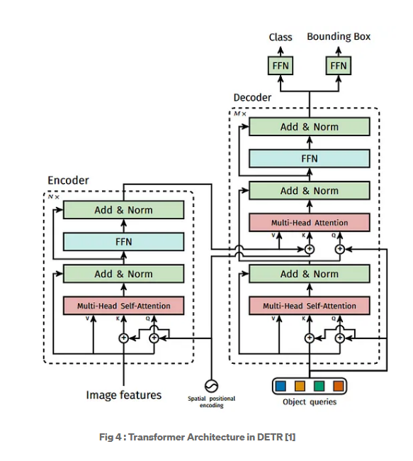

[](../)

# Understanding DETR: Object Detection with Transformers
#### Good video [Here](https://www.youtube.com/watch?v=T35ba_VXkMY&ab_channel=YannicKilcher)
**Table of Contents**

1. [Introduction](#introduction)
2. [Why Transformers for Object Detection?](#why-transformers-for-object-detection)
3. [DETR Architecture Overview](#detr-architecture-overview)
4. [Encoder Detailed Explanation](#encoder-detailed-explanation)
5. [Decoder Detailed Explanation](#decoder-detailed-explanation)
6. [Loss Functions and Bipartite Matching](#loss-functions-and-bipartite-matching)
7. [Conclusion](#conclusion)

---

## Introduction

The **Detection Transformer (DETR)** is a novel approach to object detection that leverages Transformers, which were originally designed for sequence-to-sequence tasks like machine translation. Introduced by Carion et al. in 2020, DETR simplifies the object detection pipeline by eliminating the need for hand-crafted components like anchor generation and non-maximum suppression (NMS).

---


## Why Transformers for Object Detection?

Traditional object detection models rely on convolutional neural networks (CNNs) with added complexities like region proposal networks, anchor boxes, and NMS. Transformers offer a simpler and more unified architecture by modeling object detection as a direct set prediction problem.

**Reasons for Using Transformers:**

- **Global Context Modeling:** Transformers can capture long-range dependencies, making them suitable for understanding global context in images.
- **Simplified Pipeline:** Eliminates the need for NMS and anchor boxes, reducing hyperparameters.
- **Set Prediction:** Treats object detection as a set prediction problem, which aligns well with the permutation-invariant nature of Transformers.

---

## DETR Architecture Overview

DETR consists of three main components:

1. **Backbone CNN:** Extracts feature maps from the input image.
2. **Transformer Encoder:** Processes the feature maps to capture global context.
3. **Transformer Decoder:** Generates object predictions using learned object queries.

Below is a high-level diagram of the DETR architecture:

```
Input Image --> Backbone CNN --> Transformer Encoder --> Transformer Decoder --> Predictions
```

---


## Encoder Detailed Explanation

### Role of the Encoder

The encoder processes the feature map from the backbone and outputs a sequence of context-rich feature representations. It models the relationships between all positions in the feature map, capturing global information.

### Mathematical Formulation

Let $X \in \mathbb{R}^{H \times W \times C}$ be the feature map from the backbone, where:

- $H$, $W$: Height and width of the feature map.
- $C$: Number of channels.

We flatten $X$ to $\mathbf{x} \in \mathbb{R}^{N \times C}$, where $N = H \times W$.

**Positional Encoding:**

Since Transformers lack inherent positional awareness, we add positional encodings $\mathbf{p}$ to $\mathbf{x}$:

$$\mathbf{z}_0 = \mathbf{x} + \mathbf{p}$$

**Encoder Layers:**

Each encoder layer consists of:

1. **Multi-Head Self-Attention (MHSA):**

   $\text{MHSA}(\mathbf{z}_{l-1}) = \textrm{Softmax}\left( \frac{\mathbf{Q}\mathbf{K}^\top}{\sqrt{d_k}} \right)\mathbf{V}$

   Where:

   - $\mathbf{Q}, \mathbf{K}, \mathbf{V}$: Queries, keys, and values computed from $\mathbf{z}_{l-1}$.
   - $d_k$: Dimensionality of keys.

2. **Feed-Forward Network (FFN):**

   $$\text{FFN}(\mathbf{z}) = \textrm{ReLU}(\mathbf{z}\mathbf{W}_1 + \mathbf{b}_1)\mathbf{W}_2 + \mathbf{b}_2$$

**Layer Normalization and Residual Connections:**

Each sub-layer is wrapped with residual connections and layer normalization:

$$
\mathbf{z}'_l = \textrm{LayerNorm}\left(\mathbf{z}_{l-1} + \textrm{MHSA}(\mathbf{z}_{l-1})\right)
$$

$$
\mathbf{z}_l = \textrm{LayerNorm}(\mathbf{z}'_l + \textrm{FFN}(\mathbf{z}'_l))
$$

### Intuition Behind the Encoder

The encoder allows each position in the feature map to attend to every other position, capturing global relationships. This is crucial for understanding complex scenes where objects might interact.




### Code Snippet

```python
import torch
import torch.nn as nn

class TransformerEncoder(nn.Module):
    def __init__(self, d_model=256, nhead=8, num_layers=6):
        super().__init__()
        encoder_layer = nn.TransformerEncoderLayer(d_model=d_model, nhead=nhead)
        self.encoder = nn.TransformerEncoder(encoder_layer, num_layers=num_layers)
        self.pos_encoder = PositionalEncoding(d_model)
    
    def forward(self, src):
        # src shape: (N, C) where N = H * W
        src = self.pos_encoder(src)  # Add positional encoding
        memory = self.encoder(src)   # Output shape: (N, C)
        return memory

class PositionalEncoding(nn.Module):
    def __init__(self, d_model, max_len=5000):
        super().__init__()
        # Implementation of positional encoding
        # ...
    
    def forward(self, x):
        # x shape: (N, C)
        # ...
        return x + self.pe[:x.size(0), :]
```

**Tensor Sizes:**

- Input `src`: $N \times C$
- Output `memory`: $N \times C$

---

## Decoder Detailed Explanation

### Role of the Decoder

The decoder generates object predictions by querying the encoded image features. It uses a fixed set of learned object queries to produce a set of predictions in parallel.

### Mathematical Formulation

**Object Queries:**

Let $\mathbf{q} \in \mathbb{R}^{M \times C}$ be the learned object queries, where $M$ is the number of object queries (e.g., 100).

**Decoder Layers:**

Each decoder layer consists of:

1. **Masked Multi-Head Self-Attention (MMHSA) on Object Queries:**
```math
   \mathbf{q}'_l = \text{LayerNorm}(\mathbf{q}_{l-1} + \text{MMHSA}(\mathbf{q}_{l-1}))
```
2. **Multi-Head Cross-Attention (MHCA) between Object Queries and Encoder Output:**

   $\mathbf{q}''_l = \text{LayerNorm}(\mathbf{q}'_l + \text{MHCA}(\mathbf{q}'_l, \mathbf{z}))$

   Where $\mathbf{z}$ is the encoder output.

3. **Feed-Forward Network (FFN):**

   $\mathbf{q}_l = \text{LayerNorm}(\mathbf{q}''_l + \text{FFN}(\mathbf{q}''_l))$

### Intuition Behind the Decoder

- **Object Queries:** Act as slots that the model fills with detected objects. They attend to relevant parts of the encoder output to gather object-specific information.
- **Cross-Attention:** Enables object queries to focus on different parts of the image, effectively learning where objects are located.

### Code Snippet

```python
class TransformerDecoder(nn.Module):
    def __init__(self, d_model=256, nhead=8, num_layers=6, num_queries=100):
        super().__init__()
        decoder_layer = nn.TransformerDecoderLayer(d_model=d_model, nhead=nhead)
        self.decoder = nn.TransformerDecoder(decoder_layer, num_layers=num_layers)
        self.query_pos = nn.Parameter(torch.randn(num_queries, d_model))  # Object queries
    
    def forward(self, tgt, memory):
        # tgt shape: (num_queries, C)
        # memory shape: (N, C)
        tgt2 = self.decoder(tgt, memory)  # Output shape: (num_queries, C)
        return tgt2
```

**Tensor Sizes:**

- Input `tgt`: $M \times C$ (object queries)
- Input `memory`: $N \times C$ (encoder output)
- Output `tgt2`: $M \times C$ (decoder output)

### Detailed Workflow of the Decoder

1. **Initialization:**

   - Start with learned object queries $\mathbf{q}_0$.

2. **Self-Attention on Object Queries:**

   - Each object query attends to other queries to capture dependencies among predicted objects.
   - Helps in modeling mutual exclusivity and interactions.

3. **Cross-Attention between Queries and Encoder Output:**

   - Object queries attend to the encoder output to gather relevant image features.
   - Cross-attention weights determine which parts of the image each query focuses on.

4. **Feed-Forward Network:**

   - Applies non-linear transformations to enhance feature representations.

5. **Output Layers:**

   - Apply linear layers to predict bounding boxes and class labels for each query.

### Mathematical Expressions

**Cross-Attention Computation:**
```math
\text{Attention}(\mathbf{Q}, \mathbf{K}, \mathbf{V}) = \text{Softmax}\left( \frac{\mathbf{Q}\mathbf{K}^\top}{\sqrt{d_k}} \right)\mathbf{V}
```
- $\mathbf{Q}$: Projected object queries.
- $\mathbf{K}, \mathbf{V}$: Projected encoder outputs.

---

## Loss Functions and Bipartite Matching

### Set Prediction Loss

DETR uses a set-based global loss that forces unique predictions via bipartite matching between predicted and ground truth objects.

### Hungarian Algorithm for Bipartite Matching

- **Goal:** Find an optimal one-to-one mapping between predictions and ground truth objects.
- **Cost Matrix:** For each pair of predicted and ground truth objects, compute a matching cost.

### Matching Cost Computation

For each prediction $\hat{y}_i$ and ground truth $y_j$:
```math
\text{Cost}_{i,j} = -\mathbb{1}_{\{c_j \neq \varnothing\}} \hat{p}_i(c_j) + \mathbb{1}_{\{c_j = \varnothing\}} \alpha
```
- $\hat{p}_i(c_j)$: Predicted probability of class $c_j$.
- Additional terms for bounding box matching using $\ell_1$ loss and GIoU loss.

### Loss Functions

1. **Classification Loss:**

   - Cross-entropy loss between predicted class probabilities and ground truth labels.

2. **Bounding Box Loss:**

   - **$\ell_1$ Loss:**

 
  
   - **Generalized IoU (GIoU) Loss:**


3. **Total Loss:**
```math
   \mathcal{L} = \lambda_{\text{class}} \mathcal{L}_{\text{class}} + \lambda_{\text{bbox}} \mathcal{L}_{\text{bbox}} + \lambda_{\text{giou}} \mathcal{L}_{\text{giou}}
```
   - $\lambda$ are hyperparameters to balance the losses.

### Intuition Behind the Loss Function

- **Set-Based Loss:** Ensures that each ground truth object is assigned to a unique prediction.
- **Bipartite Matching:** Prevents multiple predictions from matching the same ground truth, eliminating the need for NMS.
- **Combination of Losses:** Balances classification and localization accuracy.

### Code Snippet

```python
import torch.nn.functional as F
from scipy.optimize import linear_sum_assignment

def compute_loss(pred_logits, pred_boxes, target_labels, target_boxes):
    # pred_logits shape: (num_queries, num_classes)
    # pred_boxes shape: (num_queries, 4)
    # target_labels, target_boxes: lists of tensors

    # Compute cost matrix
    cost_matrix = compute_cost(pred_logits, pred_boxes, target_labels, target_boxes)
    
    # Perform Hungarian matching
    indices = linear_sum_assignment(cost_matrix.cpu())
    
    # Compute losses
    loss_class = F.cross_entropy(pred_logits, target_labels)
    loss_bbox = F.l1_loss(pred_boxes, target_boxes)
    loss_giou = 1 - generalized_iou(pred_boxes, target_boxes)
    
    total_loss = loss_class + loss_bbox + loss_giou
    return total_loss

def compute_cost(pred_logits, pred_boxes, target_labels, target_boxes):
    # Implementation of cost computation
    # ...
    return cost_matrix
```

---

## Conclusion

DETR revolutionizes object detection by framing it as a direct set prediction problem using Transformers. The architecture simplifies the detection pipeline, removes the need for heuristic components like NMS, and provides a unified end-to-end trainable model.

**Key Takeaways:**

- **Transformer Encoder:** Captures global context in images.
- **Transformer Decoder:** Uses object queries to predict objects in parallel.
- **Set-Based Loss with Bipartite Matching:** Ensures unique assignment of predictions to ground truth objects.

By leveraging the strengths of Transformers, DETR opens new avenues for research and applications in object detection and beyond.
