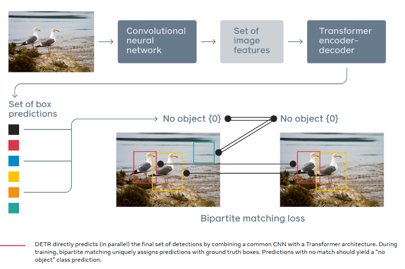
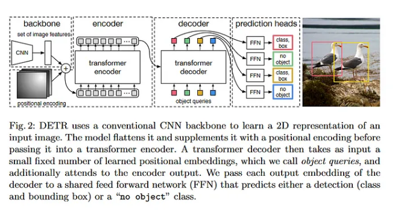

[](../)

# Understanding DETR: Object Detection with Transformers
#### Good video [Here](https://www.youtube.com/watch?v=T35ba_VXkMY&ab_channel=YannicKilcher)
**Table of Contents**

1. [Introduction](#introduction)
2. [Why Transformers for Object Detection?](#why-transformers-for-object-detection)
3. [DETR Architecture Overview](#detr-architecture-overview)
4. [Encoder Detailed Explanation](#encoder-detailed-explanation)
5. [Decoder Detailed Explanation](#decoder-detailed-explanation)
6. [Remarks on the Tensor Size and architecture wrap up](Remarks-on-the-Tensor-Size-and-architecture-wrap-up)
7. [Loss Functions and Bipartite Matching](#loss-functions-and-bipartite-matching)
8. [Conclusion](#conclusion)

---

## Introduction

The **Detection Transformer (DETR)** is a novel approach to object detection that leverages Transformers, which were originally designed for sequence-to-sequence tasks like machine translation. Introduced by Carion et al. in 2020, DETR simplifies the object detection pipeline by eliminating the need for hand-crafted components like anchor generation and non-maximum suppression (NMS).

---


## Why Transformers for Object Detection?

Traditional object detection models rely on convolutional neural networks (CNNs) with added complexities like region proposal networks, anchor boxes, and NMS. Transformers offer a simpler and more unified architecture by modeling object detection as a direct set prediction problem.

**Reasons for Using Transformers:**

- **Global Context Modeling:** Transformers can capture long-range dependencies, making them suitable for understanding global context in images.
- **Simplified Pipeline:** Eliminates the need for NMS and anchor boxes, reducing hyperparameters.
- **Set Prediction:** Treats object detection as a set prediction problem, which aligns well with the permutation-invariant nature of Transformers.

---

## DETR Architecture Overview

DETR consists of three main components:

1. **Backbone CNN:** Extracts feature maps from the input image.
2. **Transformer Encoder:** Processes the feature maps to capture global context.
3. **Transformer Decoder:** Generates object predictions using learned object queries.

Below is a high-level diagram of the DETR architecture:

```
Input Image --> Backbone CNN --> Transformer Encoder --> Transformer Decoder --> Predictions
```

---



## Encoder Detailed Explanation

### Role of the Encoder

The encoder processes the feature map from the backbone and outputs a sequence of context-rich feature representations. It models the relationships between all positions in the feature map, capturing global information.

Below is a detailed, step-by-step breakdown of the DETR encoder. The DETR encoder is essentially a stack of standard Transformer encoder layers, each composed of:

1. **Self-Attention** (attention over the input sequence itself)
2. **Feed-Forward Network (FFN)**

We will detail the mathematical operations, their dimensions, and provide a PyTorch-like pseudo-code snippet with inline comments. We will assume the following for simplicity:

- **Model dimension:** $$D$$ (e.g., 256)  
- **Number of heads:** $$H$$ (e.g., 8)  
- **Per-head dimension:** $$d_{head} = D/H$$ (e.g., 256/8 = 32)  
- **Number of encoder tokens:** $$N_{enc} = H' \times W'$$, where $$H'$$ and $$W'$$ are spatial dims of the feature map after the backbone and projection (for instance, $$N_{enc} = 2000$$).  
- **Batch size:** $$B$$ (e.g., 2 or 4, etc.)  
- **Number of encoder layers:** $$L$$ (e.g., 6)

**Input to the Encoder:**

- The DETR encoder receives as input a 2D feature map from a CNN backbone, flattened into a sequence of feature vectors. After positional encoding and a linear projection:

  $$
  \text{enc}_\text{inp} \in \mathbb{R}^{B \times N_{enc} \times D}
  $$

  Each element is a $$D$$-dim vector representing a specific spatial location in the feature map.

**Encoder Layer Workflow:**

Each encoder layer consists of:

1. **Self-Attention**: The encoder attends to itself. Each token in the input sequence attends to all others (including itself).
2. **Feed-Forward Network**: A two-layer MLP applied to each token independently.

**Mathematical Formulation:**

Let $$\mathbf{X}^{(l)}$$ be the input to the $$l$$-th encoder layer. Initially, $$\mathbf{X}^{(0)} = \text{enc}_\text{inp}$$.

1. **Multi-Head Self-Attention:**

   Compute queries, keys, and values from $$\mathbf{X}^{(l)}$$:

   $$
   Q = \mathbf{X}^{(l)}W_Q, \quad K = \mathbf{X}^{(l)}W_K, \quad V = \mathbf{X}^{(l)}W_V
   $$

   Dimensions:
   - $$\mathbf{X}^{(l)}, Q, K, V \in \mathbb{R}^{B \times N_{enc} \times D}$$.

   Reshape for multi-heads:

   $$
   Q' = \text{reshape}(Q, [B, N_{enc}, H, d_{head}]) \rightarrow \mathbb{R}^{B \times H \times N_{enc} \times d_{head}}
   $$
   Similarly for $$K', V'$$.

   Compute attention scores:

   $$
   A = \text{softmax}\left(\frac{Q'K'^{T}}{\sqrt{d_{head}}}\right) \in \mathbb{R}^{B \times H \times N_{enc} \times N_{enc}}
   $$

   Apply attention to values:

   $$
   O' = A V' \in \mathbb{R}^{B \times H \times N_{enc} \times d_{head}}
   $$

   Reshape back:

   $$
   O = \text{reshape}(O', [B, N_{enc}, D])W_{O}
   $$

   Residual + LayerNorm:

   $$
   \mathbf{X}^{(l)} := \text{LayerNorm}(\mathbf{X}^{(l)} + O)
   $$

3. **Feed-Forward Network (FFN):**

   The FFN is typically two linear layers with a ReLU in between:

   $$
   \mathbf{X}^{(l)} := \mathbf{X}^{(l)} + \text{Dropout}( \text{ReLU}(\mathbf{X}^{(l)}W_1 + b_1)W_2 + b_2 )
   $$

   Then another LayerNorm:

   $$
   \mathbf{X}^{(l)} := \text{LayerNorm}(\mathbf{X}^{(l)})
   $$

After $$L$$ encoder layers, the output $$\mathbf{X}^{(L)}$$ is used by the decoder as “memory”.

---

### Pseudo-Code in PyTorch-Like Style

```python
import torch
import torch.nn as nn
import torch.nn.functional as F

class TransformerEncoderLayer(nn.Module):
    def __init__(self, d_model=256, nhead=8, dim_feedforward=2048, dropout=0.1):
        super().__init__()
        
        # Multi-head self-attention
        self.self_attn = nn.MultiheadAttention(embed_dim=d_model, num_heads=nhead, dropout=dropout)
        
        # Feed-forward network
        self.linear1 = nn.Linear(d_model, dim_feedforward)
        self.linear2 = nn.Linear(dim_feedforward, d_model)
        
        self.norm1 = nn.LayerNorm(d_model)
        self.norm2 = nn.LayerNorm(d_model)
        
        self.dropout1 = nn.Dropout(dropout)
        self.dropout2 = nn.Dropout(dropout)

    def forward(self, src):  
        # src: (B, N_enc, D)
        
        # PyTorch's MultiheadAttention expects (N_enc, B, D)
        src_transposed = src.transpose(0, 1)  # (N_enc, B, D)
        
        # Self-attention
        # Query=Key=Value=src itself
        attn_output, _ = self.self_attn(src_transposed, src_transposed, src_transposed)
        # attn_output: (N_enc, B, D)
        
        # Residual + LayerNorm
        src = src + self.dropout1(attn_output.transpose(0, 1))  # back to (B, N_enc, D)
        src = self.norm1(src)  # (B, N_enc, D)
        
        # Feed-Forward Network
        ff_output = self.linear2(F.relu(self.linear1(src)))  # (B, N_enc, D)
        
        # Residual + LayerNorm
        src = src + self.dropout2(ff_output)
        src = self.norm2(src)  # (B, N_enc, D)
        
        return src


# Example usage:
B = 2
N_enc = 2000
D = 256

enc_input = torch.randn(B, N_enc, D)  # (B, N_enc, D)

encoder_layer = TransformerEncoderLayer(d_model=D, nhead=8, dim_feedforward=2048)

# Pass through one encoder layer
out = encoder_layer(enc_input)
# out: (B, N_enc, D)
```

**Inline Comments and Dimensions:**

- `enc_input`: Shape `(B, N_enc, D)`. The flattened feature map with positional encodings added.
- Internally, before passing to `nn.MultiheadAttention`, we transpose to `(N_enc, B, D)` because PyTorch’s multi-head attention layer expects `(sequence_length, batch_size, embed_dim)` format.

**Multi-head Self-Attention Step-by-Step:**

- `src_transposed`: `(N_enc, B, D)`
- Attention is computed across `N_enc` tokens.
- `attn_output`: `(N_enc, B, D)`

After attention, we transpose back to `(B, N_enc, D)` and apply residual + LayerNorm.

**Feed-Forward Network:**

- Apply linear layers: `(B, N_enc, D) -> (B, N_enc, dim_feedforward) -> ReLU -> (B, N_enc, D)`
- Residual + LayerNorm.

You stack `L` such layers to form the full encoder. The final encoder output is `(B, N_enc, D)` and is fed into the DETR decoder as the "memory".

---

**Summary of Encoder:**

This provides a detailed workflow of a single DETR encoder layer:

- Receives a batch of sequences `(B, N_enc, D)`.
- Applies multi-head self-attention over the sequence.
- Applies a feed-forward network to each token independently.
- Each sub-layer is followed by residual connection and LayerNorm.
- After `L` layers, we get the final encoder output that represents the transformed image features.
**Input Shapes to the Decoder:**

- **Encoder Output:** $$\text{enc}_\text{out} \in \mathbb{R}^{B \times N_{enc} \times D}$$  
  This is the output from the Transformer encoder. It represents a set of $$N_{enc}$$ feature vectors, each of dimension $$D$$.

- **Query Embeddings:** $$\text{queries} \in \mathbb{R}^{B \times N_{query} \times D}$$  
  These are learned positional embeddings (object queries) that serve as the initial input to the decoder. Initially, at the first decoder layer, these queries are usually a set of learned parameters (not dependent on the image content). For subsequent layers, they are the output of the previous decoder layer.


## Decoder Layer Workflow:

A single decoder layer takes queries and the encoder output and does:

1. **Self-Attention (on queries):**  
   - Compute $$Q, K, V$$ for self-attention from the current queries.
   - Perform multi-head attention.
   - Add & normalize (residual connection + LayerNorm).

2. **Cross-Attention (queries attend to encoder output):**  
   - Compute $$Q$$ from queries, $$K, V$$ from encoder output.
   - Perform multi-head cross-attention.
   - Add & normalize (residual connection + LayerNorm).

3. **Feed-Forward Network (FFN):**  
   - A two-layer MLP (linear -> ReLU -> linear).
   - Add & normalize (residual connection + LayerNorm).

The output of the last decoder layer is used to produce object class predictions and bounding box predictions.

---

### Mathematical Formulation

**Self-Attention:**  
For each decoder layer, given the current query embeddings $$\mathbf{Q}^{(l)}$$:

1. Project to queries, keys, and values for self-attention:

   $$
   Q = \mathbf{Q}^{(l)}W_{Q}^{self}, \quad K = \mathbf{Q}^{(l)}W_{K}^{self}, \quad V = \mathbf{Q}^{(l)}W_{V}^{self}
   $$
   Dimensions:
   - $$Q, K, V \in \mathbb{R}^{B \times N_{query} \times D}$$

3. Reshape for multi-heads:

   $$
   Q' = \text{reshape}(Q, [B, N_{query}, H, d_{head}]) \rightarrow \mathbb{R}^{B \times H \times N_{query} \times d_{head}}
   $$
   Similarly for $$K', V'$$.

4. Compute attention weights:

   $$
   A = \text{softmax}\left(\frac{Q'K'^{T}}{\sqrt{d_{head}}}\right) \in \mathbb{R}^{B \times H \times N_{query} \times N_{query}}
   $$

5. Weighted sum:

   $$
   O' = A V' \in \mathbb{R}^{B \times H \times N_{query} \times d_{head}}
   $$

6. Reshape and project back:

   $$
   O = \text{reshape}(O', [B, N_{query}, D])W_{O}^{self}
   $$

7. Residual + LayerNorm:

   $$
   \mathbf{Q}^{(l)} := \text{LayerNorm}(\mathbf{Q}^{(l)} + O)
   $$

**Cross-Attention:**  
Now using the updated queries $$\mathbf{Q}^{(l)}$$:

1. Project queries, keys, values for cross-attention:

   $$
   Q = \mathbf{Q}^{(l)} W_{Q}^{cross}, \quad K = \text{enc}_\text{out}W_{K}^{cross}, \quad V = \text{enc}_\text{out}W_{V}^{cross}
   $$

   Dimensions:
   - $$Q \in \mathbb{R}^{B \times N_{query} \times D}$$
   - $$K, V \in \mathbb{R}^{B \times N_{enc} \times D}$$

3. Reshape for multi-heads and compute attention similarly:

   $$
   A = \text{softmax}\left(\frac{Q'K'^{T}}{\sqrt{d_{head}}}\right) \in \mathbb{R}^{B \times H \times N_{query} \times N_{enc}}
   $$
   
   Here $$Q' \in \mathbb{R}^{B \times H \times N_{query} \times d_{head}}$$  
   and $$K' \in \mathbb{R}^{B \times H \times N_{enc} \times d_{head}}$$.

4. Compute:

   $$
   O' = A V' \in \mathbb{R}^{B \times H \times N_{query} \times d_{head}}
   $$
   
   Reshape and project back to $$D$$:

   $$
   O = \text{reshape}(O', [B, N_{query}, D])W_{O}^{cross}
   $$

5. Residual + LayerNorm:

   $$
   \mathbf{Q}^{(l)} := \text{LayerNorm}(\mathbf{Q}^{(l)} + O)
   $$

**Feed-Forward Network:**

1. Two-layer MLP:

   $$
   \mathbf{Q}^{(l)} := \mathbf{Q}^{(l)} + \text{Dropout}(\text{ReLU}(\mathbf{Q}^{(l)}W_1 + b_1)W_2 + b_2)
   $$

3. LayerNorm again:

   $$
   \mathbf{Q}^{(l)} := \text{LayerNorm}(\mathbf{Q}^{(l)})
   $$

This completes one decoder layer. The decoder stacks $$L$$ such layers.

---

### Pseudo-Code in PyTorch-Like Style

```python
import torch
import torch.nn as nn
import torch.nn.functional as F

class TransformerDecoderLayer(nn.Module):
    def __init__(self, d_model=256, nhead=8, dim_feedforward=2048, dropout=0.1):
        super().__init__()
        
        # Multi-head attention layers
        self.self_attn = nn.MultiheadAttention(embed_dim=d_model, num_heads=nhead, dropout=dropout)
        self.cross_attn = nn.MultiheadAttention(embed_dim=d_model, num_heads=nhead, dropout=dropout)
        
        # Feed-forward network
        self.linear1 = nn.Linear(d_model, dim_feedforward)
        self.linear2 = nn.Linear(dim_feedforward, d_model)
        
        self.norm1 = nn.LayerNorm(d_model)
        self.norm2 = nn.LayerNorm(d_model)
        self.norm3 = nn.LayerNorm(d_model)
        
        self.dropout1 = nn.Dropout(dropout)
        self.dropout2 = nn.Dropout(dropout)
        self.dropout3 = nn.Dropout(dropout)

    def forward(self, 
                tgt,        # (B, N_query, D) queries to be decoded
                memory):    # (B, N_enc, D) from encoder
        # Self-attention block
        # tgt: (B, N_query, D)
        # we need to transpose to (N_query, B, D) for nn.MultiheadAttention
        q = k = tgt.transpose(0, 1)  # (N_query, B, D)
        v = q
        tgt2, _ = self.self_attn(q, k, v)  # attn over queries themselves
        # tgt2: (N_query, B, D)
        tgt = tgt + self.dropout1(tgt2)  # residual
        tgt = self.norm1(tgt)  # (N_query, B, D)

        # Cross-attention block
        # Query: tgt, Key+Value: memory
        # memory: (B, N_enc, D) -> (N_enc, B, D)
        q = tgt
        k = memory.transpose(0, 1)    # (N_enc, B, D)
        v = memory.transpose(0, 1)    # (N_enc, B, D)
        tgt2, _ = self.cross_attn(q, k, v)  
        tgt = tgt + self.dropout2(tgt2)
        tgt = self.norm2(tgt)  # (N_query, B, D)

        # Feed-Forward Network
        # tgt: (N_query, B, D)
        tgt2 = self.linear2(F.relu(self.linear1(tgt)))
        tgt = tgt + self.dropout3(tgt2)
        tgt = self.norm3(tgt)  # (N_query, B, D)
        
        # return (B, N_query, D)
        return tgt.transpose(0, 1)

# Example usage:
B = 2
N_query = 100
N_enc = 2000
D = 256

queries = torch.randn(B, N_query, D)     # (B, N_query, D)
enc_out = torch.randn(B, N_enc, D)       # (B, N_enc, D)

decoder_layer = TransformerDecoderLayer(d_model=D, nhead=8, dim_feedforward=2048)

# Pass through one decoder layer
out = decoder_layer(queries, enc_out)
# out: (B, N_query, D)
```

**Inline Comments and Dimensions:**

- `queries`: Shape `(B, N_query, D)`. The queries for objects we want to detect.
- `enc_out`: Shape `(B, N_enc, D)`. The memory from the encoder (flattened image features).

In the `forward` call of `TransformerDecoderLayer`:

- First self-attention:
  - Input: `tgt` of shape `(B, N_query, D)`.
  - `nn.MultiheadAttention` expects `(N_query, B, D)`, so we transpose: now `(N_query, B, D)`.
  - Self-attention keys/values are the same queries.
  - Output `tgt2`: `(N_query, B, D)`.
  - Residual + LayerNorm: still `(N_query, B, D)`.

- Cross-attention:
  - `q = tgt`: `(N_query, B, D)`
  - `k, v = memory.transpose(0,1)`: `(N_enc, B, D)`
  - Output `tgt2`: `(N_query, B, D)`
  - Residual + LayerNorm: `(N_query, B, D)`

- FFN:
  - Two linear layers: `(N_query, B, D) -> (N_query, B, dim_feedforward) -> ReLU -> (N_query, B, D)`
  - Residual + LayerNorm: `(N_query, B, D)`

- Finally, transpose back to `(B, N_query, D)`.

---

## Remarks on the Tensor Size and architecture wrap up:

- The cross-attention in the DETR decoder is computed between a set of **N_query**(here **N_query = M**) queries and **N_enc** (here **N_enc = N**) encoder output tokens. Therefore, the cross-attention weight matrix has dimensions **(N_query × N_enc)**.  
- The encoder outputs a sequence of shape **(N_enc, D)**, where **N_enc** is typically the flattened spatial dimension of the image features and **D** is the model dimension.  
- The decoder queries consist of **N_query** learned embeddings, each of dimension **D**.  
- For cross-attention, the query (Q) matrix is of shape **(N_query, D)**, and the key (K) and value (V) matrices derived from the encoder output are of shape **(N_enc, D)**.

**Detailed Explanation:**

1. **Encoder Output Size:**  
   DETR first processes an input image through a backbone CNN (e.g., ResNet-50), resulting in a feature map of size `(C, H', W')`. These features are then flattened and projected into a `D`-dimensional space. Let’s define:
   - `H'` and `W'` are the spatial dimensions of the downsampled feature map after the backbone and possibly additional projections.
   - The total number of spatial positions is `N_enc = H' * W'`.
   - Each position is represented by a `D`-dimensional vector after linear projection.

   Thus, after positional encoding and passing through the Transformer encoder (with multiple layers), the **encoder output** is a sequence of shape:

   $$
   \text{Encoder Output} \in \mathbb{R}^{N_{\text{enc}} \times D}, \quad \text{where } N_{\text{enc}} = H'W'
   $$

3. **Decoder Queries:**  
   The DETR decoder uses a fixed set of **N_query** learned object queries. Each query is a `D`-dimensional embedding. These queries are independent of the input image content; they are trained to attend to different parts of the encoder output to detect objects. So the query set is:

   $$
   \text{Decoder Queries} \in \mathbb{R}^{N_{\text{query}} \times D}, \quad \text{where } N_{\text{query}} \text{ is often set to 100}
   $$

   Each decoder layer uses these queries to attend to the encoder outputs and produce refined queries (representations) that eventually lead to object predictions.

4. **Cross-Attention in the Decoder:**
   In a standard Transformer cross-attention module, you have three key matrices: Q (query), K (key), and V (value). For cross-attention in the DETR decoder:
   - **Q (Query):** Derived from the decoder queries. After a linear projection, these will still have dimension `(N_query, D)`.
   - **K (Key) and V (Value):** Derived from the encoder output. After linear projections, these remain `(N_enc, D)`.

   Concretely:
   - Q is obtained by applying a linear transformation to the decoder queries:  

     $$
     Q \in \mathbb{R}^{N_{\text{query}} \times D}
     $$
   
   - K and V are obtained by applying linear transformations to the encoder output:  
   
     $$
     K \in \mathbb{R}^{N_{\text{enc}} \times D}, \quad V \in \mathbb{R}^{N_{\text{enc}} \times D}
     $$

5. **Cross-Attention Computation:**
   The attention weights are computed as:

   $$
   \text{Attention} = \text{softmax}\left(\frac{QK^T}{\sqrt{D}}\right) V
   $$

   Here, `QK^T` results in a `(N_query, N_enc)` matrix:
   - `Q` has shape `(N_query, D)`.
   - `K^T` has shape `(D, N_enc)`.

   Multiplying `Q (N_query, D)` by `K^T (D, N_enc)` gives:

   $$
   QK^T \in \mathbb{R}^{N_{\text{query}} \times N_{\text{enc}}}
   $$

   This is the **cross-attention weight matrix**, which, after the softmax operation, is used to combine the values:
   
   $$
   \text{Attention Output} = \text{softmax}(QK^T) V \in \mathbb{R}^{N_{\text{query}} \times D}
   $$

**Summary of Dimensions:**
- **Encoder output:** `(N_enc, D)` where `N_enc = H' * W'`.
- **Decoder queries:** `(N_query, D)` (e.g., `N_query = 100`).
- **Cross-attention Q:** `(N_query, D)`
- **Cross-attention K and V:** `(N_enc, D)`
- **Cross-attention matrix (QK^T):** `(N_query, N_enc)`

This is the general scheme for the DETR architecture’s cross-attention dimensions.

## Loss Functions and Bipartite Matching

**Overview:**  
DETR's loss function and training procedure differ from traditional object detectors because it treats object detection as a direct set prediction problem. This approach removes the need for non-maximum suppression (NMS) and anchor generation. Instead, DETR predicts a fixed-size set of object "queries" and then finds a one-to-one matching between these predictions and the ground truth objects using the Hungarian algorithm. The loss is then computed based on this optimal matching.

**Key Steps in DETR’s Loss Computation:**

1. **Fixed-Size Predictions:**
   DETR outputs a fixed number of predictions (for example, 100 predictions per image). Each prediction consists of:
   - A class probability distribution (including the "no object" or background class).
   - A predicted bounding box (parameterized by its center coordinates, width, and height, or sometimes normalized coordinates).

   Let’s denote:
   - The set of predictions as $$\{\hat{y}_i\}_{i=1}^{N}$$, where $$N$$ is a fixed number like 100.
   - Each $$\hat{y}_i$$ includes $$\hat{p}_i(c)$$ for each class $$c$$ and a predicted bounding box $$\hat{b}_i$$.

2. **Constituting Ground Truth:**
   The ground truth for an image typically consists of:
   - A set of $$M$$ ground truth objects $$\{y_j\}_{j=1}^{M}$$ where each $$y_j$$ includes a ground-truth class label $$c_j$$ and a ground-truth bounding box $$b_j$$.

   DETR assumes $$M \leq N$$. If there are fewer ground-truth objects than the number of predictions, the unmatched predictions should ideally represent the “no object” class.

3. **Optimal Bipartite Matching with the Hungarian Algorithm:**
   One critical innovation in DETR is how it determines which predicted query corresponds to which ground truth object. This is done via a one-to-one matching using the Hungarian (a.k.a. Kuhn-Munkres) algorithm.

   **Forming the Cost Matrix:**
   - First, DETR computes a cost for matching each predicted box $$\hat{y}_i$$ with each ground truth object $$y_j$$.
   - The cost includes both classification and localization terms:
     1. **Classification Cost:** This is typically the negative log-likelihood of the ground truth class under the predicted class distribution:

        $$
        C_{\text{class}}(y_j, \hat{y}_i) = -\log \hat{p}_i(c_j)
        $$
        
     3. **Bounding Box Localization Cost:**  
        DETR uses a combination of:
        - **L1 loss** on bounding box coordinates: $$\| b_j - \hat{b}_i \|_1$$
        - **Generalized IoU (GIoU)** loss on bounding boxes:

          $$
          C_{\text{box}}(y_j, \hat{y}_i) = \lambda_{\text{L1}}\| b_j - \hat{b}_i \|_1 + \lambda_{\text{GIoU}}(1 - \text{GIoU}(b_j, \hat{b}_i))
          $$

   Thus, the total cost for matching ground-truth object $$j$$ and predicted object $$i$$ could be:

   $$
   C(y_j, \hat{y}_i) = C_{\text{class}}(y_j, \hat{y}_i) + C_{\text{box}}(y_j, \hat{y}_i)
   $$

   **Hungarian Matching:**
   - After forming the $$M \times N$$ cost matrix (with $$M \leq N$$), the Hungarian algorithm is applied to find the global one-to-one matching between predictions and ground truth that yields the minimal total cost.
   - This results in a permutation $$\sigma$$ of $$\{1,\ldots,N\}$$ (or a partial mapping if $$N>M$$) such that $$\sigma(j)$$ is the index of the prediction matched to the ground-truth object $$j$$.

5. **Computing the Loss After Matching:**
   Once the optimal matching is established, the loss is computed by summing over the matched pairs and also taking into account the unmatched predictions:

   **Matched Predictions:**
   For each matched pair $$(j, \sigma(j))$$:
   - **Classification Loss:** A cross-entropy loss for the matched prediction’s class distribution against the ground truth class. This encourages the matched prediction to classify correctly.
   - **Box Regression Loss:** A combination of L1 loss and GIoU loss between the matched predicted box and the ground truth box.

   **Unmatched Predictions:**
   For the predictions that are not matched to any ground truth object, the model expects them to predict the "no object" (or background) class. Thus, those predictions incur a classification loss pushing them towards predicting "no object."

   Formally, the final loss $$\mathcal{L}$$ is:

   $$
   \mathcal{L} = \sum_{j=1}^{M} [\mathcal{L}_{\text{class}}(y_j, \hat{y}_{\sigma(j)}) + \lambda_{\text{box}}\mathcal{L}_{\text{box}}(y_j, \hat{y}_{\sigma(j)})] + \sum_{i \notin \{\sigma(1), \ldots, \sigma(M)\}} \mathcal{L}_{\text{class}_\text{noobj}}(\hat{y}_{i})
   $$

   Where:
   - $$\mathcal{L}_{\text{class}}$$ is the cross-entropy loss for the correct class.
   - $$\mathcal{L}_{\text{box}}$$ includes both L1 and GIoU losses.
   - $$\mathcal{L}_{\text{class}_\text{noobj}}$$ is the loss that encourages predictions that aren't matched to a real object to predict the "no object" class.

**Summary:**
- **Ground Truth Constitution:** The ground truth is simply the set of annotated bounding boxes and their classes for each image.
- **Matching:** DETR uses the Hungarian algorithm to find a unique, one-to-one assignment between the predicted set of objects (queries) and the ground-truth objects.
- **Loss Function:**  
  - A combined classification and box regression loss is computed only for matched predictions.
  - Unmatched predictions are penalized if they fail to predict the "no object" class.
  - The Hungarian matching ensures a fair and stable assignment, enabling an end-to-end set prediction that does not require post-processing like NMS.
## Conclusion

DETR revolutionizes object detection by framing it as a direct set prediction problem using Transformers. The architecture simplifies the detection pipeline, removes the need for heuristic components like NMS, and provides a unified end-to-end trainable model.

**Key Takeaways:**

- **Transformer Encoder:** Captures global context in images.
- **Transformer Decoder:** Uses object queries to predict objects in parallel.
- **Set-Based Loss with Bipartite Matching:** Ensures unique assignment of predictions to ground truth objects.

By leveraging the strengths of Transformers, DETR opens new avenues for research and applications in object detection and beyond.
