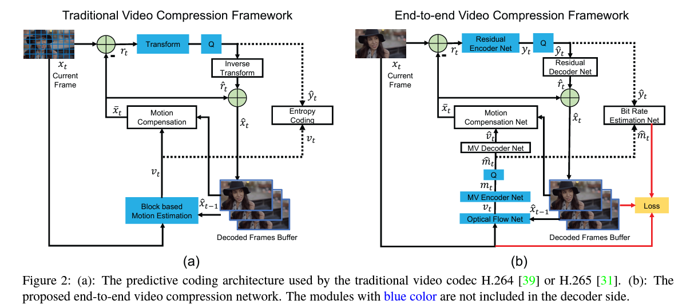
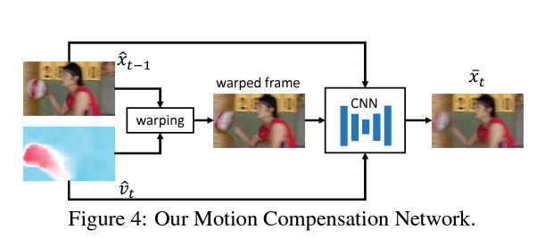

# Deep Learning-Based Video Compression: A Comprehensive Tutorial
[](../)
---


## Introduction

**Video compression** is essential for efficiently storing and transmitting video data. Traditional video compression standards like H.264/AVC and H.265/HEVC rely on hand-crafted algorithms and heuristics to reduce redundancy in video sequences. With the advent of deep learning, researchers have started exploring data-driven approaches to video compression, aiming to learn optimal representations directly from data.

This tutorial delves into deep learning-based video compression techniques, focusing on key research papers in the field. We will:

- Discuss prominent papers and their contributions.
- Explain the mathematical foundations and algorithms.
- Illustrate model architectures, components, and loss functions.
- Describe training and inference procedures.
- Provide pseudocode and code snippets with inline comments and tensor sizes.
- Use flowcharts and diagrams to visualize concepts.

---

## 1. Key Papers in Deep Learning-Based Video Compression

### 1.1. DVC: An End-to-End Deep Video Compression Framework

- **Authors**: Dong Liu, Haichuan Ma, Zhenghang Yuan, Yuchen Fan, Sibo Song, Houqiang Li, Feng Wu
- **Conference**: CVPR 2019
- **Link**: [arXiv:1902.09376](https://arxiv.org/abs/1902.09376)

**Contributions**:

- Proposes an end-to-end deep video compression framework (DVC) that integrates motion estimation, motion compression, residual compression, and entropy coding.
- Learns motion estimation and compensation jointly with residual compression.
- Uses deep neural networks for all components, allowing joint optimization.

### 1.2. Learning for Video Compression

- **Authors**: Oren Rippel, Lubomir Bourdev
- **Conference**: arXiv preprint 2018
- **Link**: [arXiv:1811.06981](https://arxiv.org/abs/1811.06981)

**Contributions**:

- Introduces a neural network architecture for video compression that learns to compress video sequences by predicting future frames and encoding residuals.
- Employs adversarial training to improve perceptual quality.

### 1.3. Deep Contextual Video Compression

- **Authors**: Wenhan Hu, Xiangyu Chang, Jie Liang, Yihua Yan, Jian Zhang
- **Conference**: NeurIPS 2018
- **Link**: [NeurIPS Proceedings](https://proceedings.neurips.cc/paper/2018/file/6c2a2b6c9d6e8f87210eaef48ed1e5e0-Paper.pdf)

**Contributions**:

- Proposes a deep learning-based video compression method using contextual information.
- Utilizes recurrent neural networks to capture temporal dependencies.

---

In this tutorial, we will focus on the **DVC framework** due to its comprehensive approach and significant impact on the field.

---

## 2. Overview of DVC: Deep Video Compression Framework

### 2.1. High-Level Idea

- **Objective**: Compress video sequences by leveraging deep neural networks to perform all key components of traditional video compression pipelines in an end-to-end learnable manner.
- **Components**:
  - **Motion Estimation (ME)**: Estimate motion between frames using a neural network.
  - **Motion Compression**: Compress the estimated motion vectors.
  - **Motion Compensation (MC)**: Generate predicted frames using the compressed motion vectors.
  - **Residual Compression**: Compress the residual between the predicted frame and the original frame.
  - **Entropy Coding**: Encode the compressed data efficiently.

### 2.2. Key Innovations

- **End-to-End Training**: All components are jointly optimized using a unified loss function.
- **Learned Motion Estimation and Compensation**: Replaces traditional block-based ME/MC with neural networks.
- **Adaptive Entropy Coding**: Learns probability models for entropy coding of compressed data.

---

## 3. Mathematical Foundations

### 3.1. Problem Formulation

Given a sequence of frames $$\{x_1, x_2, ..., x_T\}$$, the goal is to compress each frame $$x_t$$ using information from previous frames.

**Compression Pipeline**:

1. **Motion Estimation**:
   - Estimate optical flow $$v_t$$ between $$x_{t-1}$$ and $$x_t$$.
2. **Motion Compression**:
   - Compress $$v_t$$ into $$\hat{v}_t$$ using an autoencoder and entropy coding.
3. **Motion Compensation**:
   - Warp $$x_{t-1}$$ using $$\hat{v}_t$$ to obtain predicted frame $$\hat{x}_t^{MC}$$.
4. **Residual Calculation**:
   - Compute residual $$r_t = x_t - \hat{x}_t^{MC}$$.
5. **Residual Compression**:
   - Compress $$r_t$$ into $$\hat{r}_t$$ using another autoencoder and entropy coding.
6. **Frame Reconstruction**:
   - Reconstruct frame $$\hat{x}_t = \hat{x}_t^{MC} + \hat{r}_t$$.

### 3.2. Loss Function

The total loss $$\mathcal{L}$$ combines reconstruction error and rate terms:

$$
\mathcal{L} = \lambda \cdot D(x_t, \hat{x}_t) + R(\hat{v}_t) + R(\hat{r}_t)
$$

- $$D(x_t, \hat{x}_t)$$: Distortion between original and reconstructed frames (e.g., Mean Squared Error).
- $$R(\hat{v}_t)$$: Bit rate for motion information.
- $$R(\hat{r}_t)$$: Bit rate for residual information.
- $$\lambda$$: Trade-off parameter between rate and distortion.

### 3.3. Entropy Coding and Rate Estimation

- **Entropy Model**: Predicts probability distributions for compressed representations $$\hat{v}_t$$ and $$\hat{r}_t$$.
- **Rate Estimation**: The expected code length (bit rate) is estimated using:

$$
R(\hat{y}) = \mathbb{E}_{\hat{y}}[-\log_2 p_{\hat{y}}(\hat{y})]
$$

- $$p_{\hat{y}}(\hat{y})$$: Probability mass function of quantized representation $$\hat{y}$$.

---

## 4. Model Architecture and Components

### 4.1. Motion Estimation Network

- **Input**: Two consecutive frames $$x_{t-1}$$ and $$x_t$$.
- **Output**: Estimated optical flow $$v_t$$.
- **Architecture**: A convolutional neural network (CNN) similar to FlowNet.

### 4.2. Motion Compression Network

- **Purpose**: Compress the estimated optical flow $$v_t$$.
- **Components**:
  - **Encoder**: Compresses $$v_t$$ into latent representation $$y_v$$.
  - **Quantization**: Quantizes $$y_v$$ to $$\hat{y}_v$$.
  - **Entropy Coding**: Encodes $$\hat{y}_v$$ using the entropy model.
  - **Decoder**: Reconstructs $$\hat{v}_t$$ from $$\hat{y}_v$$.

### 4.3. Motion Compensation Network

- **Input**: Previous reconstructed frame $$\hat{x}_{t-1}$$ and compressed motion $$\hat{v}_t$$.
- **Output**: Predicted frame $$\hat{x}_t^{MC}$$.
- **Method**: Warps $$\hat{x}_{t-1}$$ using $$\hat{v}_t$$ with a differentiable warping function.

### 4.4. Residual Compression Network

- **Purpose**: Compress the residual $$r_t$$.
- **Components**:
  - **Encoder**: Compresses $$r_t$$ into latent representation $$y_r$$.
  - **Quantization**: Quantizes $$y_r$$ to $$\hat{y}_r$$.
  - **Entropy Coding**: Encodes $$\hat{y}_r$$ using the entropy model.
  - **Decoder**: Reconstructs $$\hat{r}_t$$ from $$\hat{y}_r$$.

### 4.5. Entropy Modeling

- **Hyperprior Network**: Learns side information $$z$$ to model the probability distributions of $$\hat{y}_v$$ and $$\hat{y}_r$$.
- **Context Modeling**: Uses spatial dependencies in $$\hat{y}$$ to improve probability estimation.

---

## 5. Training Procedure

### 5.1. Ground Truth Creation

- **Input**: Video sequences $$\{x_1, x_2, ..., x_T\}$$.
- **Ground Truth**: The original frames $$x_t$$ serve as ground truth for reconstruction.
- **Supervision**: Minimize the difference between $$x_t$$ and reconstructed $$\hat{x}_t$$.

### 5.2. Training Steps

1. **Initialize Parameters**: Randomly initialize network weights.
2. **Forward Pass**:
   - Estimate motion $$v_t$$ between $$x_{t-1}$$ and $$x_t$$.
   - Compress $$v_t$$ to obtain $$\hat{v}_t$$.
   - Warp $$\hat{x}_{t-1}$$ using $$\hat{v}_t$$ to get $$\hat{x}_t^{MC}$$.
   - Compute residual $$r_t = x_t - \hat{x}_t^{MC}$$.
   - Compress $$r_t$$ to obtain $$\hat{r}_t$$.
   - Reconstruct frame $$\hat{x}_t = \hat{x}_t^{MC} + \hat{r}_t$$.
3. **Loss Calculation**:
   - Compute reconstruction loss $$D(x_t, \hat{x}_t)$$.
   - Estimate rates $$R(\hat{v}_t)$$ and $$R(\hat{r}_t)$$.
   - Compute total loss $$\mathcal{L}$$.
4. **Backward Pass**:
   - Backpropagate gradients through all components.
5. **Optimization**:
   - Update network weights using an optimizer (e.g., Adam).

### 5.3. Training Details

- **Batch Size**: Typically set based on GPU memory constraints.
- **Learning Rate**: Use a scheduler to adjust learning rate during training.
- **Epochs**: Train for sufficient epochs to ensure convergence.

---

## 6. Inference Procedure

### 6.1. Input and Output

- **Input**: Compressed bitstream containing encoded motion vectors and residuals.
- **Output**: Reconstructed video frames $$\hat{x}_t$$.

### 6.2. Steps

1. **Decode Motion Vectors**:
   - Entropy decode $$\hat{y}_v$$ to get compressed motion representations.
   - Decode $$\hat{v}_t$$ from $$\hat{y}_v$$.
2. **Motion Compensation**:
   - Warp $$\hat{x}_{t-1}$$ using $$\hat{v}_t$$ to obtain $$\hat{x}_t^{MC}$$.
3. **Decode Residuals**:
   - Entropy decode $$\hat{y}_r$$ to get compressed residual representations.
   - Decode $$\hat{r}_t$$ from $$\hat{y}_r$$.
4. **Frame Reconstruction**:
   - Reconstruct frame $$\hat{x}_t = \hat{x}_t^{MC} + \hat{r}_t$$.

---


---

## 7. Flowchart of the DVC Framework

```
Start
 |
 |-- For each frame t in video sequence:
      |
      |-- Motion Estimation Network
      |     Inputs: x_{t-1}, x_t
      |     Output: v_t
      |
      |-- Motion Compression Network
      |     Input: v_t
      |     Outputs: \hat{v}_t, compressed bitstream
      |
      |-- Motion Compensation Network
      |     Inputs: \hat{x}_{t-1}, \hat{v}_t
      |     Output: \hat{x}_t^{MC}
      |
      |-- Compute Residual
      |     r_t = x_t - \hat{x}_t^{MC}
      |
      |-- Residual Compression Network
      |     Input: r_t
      |     Outputs: \hat{r}_t, compressed bitstream
      |
      |-- Frame Reconstruction
      |     \hat{x}_t = \hat{x}_t^{MC} + \hat{r}_t
      |
End
```

---

## 8. Pseudocode of the DVC Framework

```python
def dvc_compress(x_prev, x_current):
    # Motion Estimation
    v_t = motion_estimation_network(x_prev, x_current)
    
    # Motion Compression
    y_v = motion_encoder(v_t)
    \hat{y}_v = quantize(y_v)
    compressed_motion_bitstream = entropy_encode(\hat{y}_v)
    \hat{y}_v = \text{entropy_decode}(\text{compressed_motion_bitstream})
    \hat{v}_t = \text{motion_decoder}(\hat{y}_v)
    
    # Motion Compensation
    \hat{x}_t^{MC} = warp(x_prev, \hat{v}_t)
    
    # Residual Computation
    r_t = x_current - \hat{x}_t^{MC}
    
    # Residual Compression
    y_r = residual_encoder(r_t)
    \hat{y}_r = quantize(y_r)
    compressed_residual_bitstream = entropy_encode(\hat{y}_r)
    \hat{y}_r = \text{entropy_decode}(\text{compressed_residual_bitstream})
    \hat{r}_t = residual_decoder(\hat{y}_r)
    
    # Frame Reconstruction
    \hat{x}_t = \hat{x}_t^{MC} + \hat{r}_t
    
    return \hat{x}_t, compressed_motion_bitstream, compressed_residual_bitstream
```

---

## 9. Code Implementation with Inline Comments

Below is a simplified implementation of key components in PyTorch.


### 9.1. Motion Estimation Network

```python
import torch
import torch.nn as nn
import torch.nn.functional as F

class MotionEstimationNet(nn.Module):
    def __init__(self):
        super(MotionEstimationNet, self).__init__()
        # Define convolutional layers
        self.conv1 = nn.Conv2d(6, 64, kernel_size=7, stride=2, padding=3)  # Input: [B, 6, H, W]
        self.conv2 = nn.Conv2d(64, 128, kernel_size=5, stride=2, padding=2)  # [B, 64, H/2, W/2]
        self.conv3 = nn.Conv2d(128, 256, kernel_size=5, stride=2, padding=2)  # [B, 128, H/4, W/4]
        self.conv4 = nn.Conv2d(256, 512, kernel_size=3, stride=2, padding=1)  # [B, 256, H/8, W/8]
        self.conv5 = nn.Conv2d(512, 512, kernel_size=3, stride=2, padding=1)  # [B, 512, H/16, W/16]
        self.deconv1 = nn.ConvTranspose2d(512, 256, kernel_size=4, stride=2, padding=1)  # [B, 512, H/16, W/16]
        self.deconv2 = nn.ConvTranspose2d(512, 128, kernel_size=4, stride=2, padding=1)  # [B, 512, H/8, W/8]
        self.deconv3 = nn.ConvTranspose2d(256, 64, kernel_size=4, stride=2, padding=1)  # [B, 256, H/4, W/4]
        self.deconv4 = nn.ConvTranspose2d(128, 32, kernel_size=4, stride=2, padding=1)  # [B, 128, H/2, W/2]
        self.flow_pred = nn.Conv2d(64, 2, kernel_size=3, stride=1, padding=1)  # [B, 64, H, W]
    
    def forward(self, x):
        # x: Concatenated frames [B, 6, H, W]
        conv1 = F.relu(self.conv1(x))  # [B, 64, H/2, W/2]
        conv2 = F.relu(self.conv2(conv1))  # [B, 128, H/4, W/4]
        conv3 = F.relu(self.conv3(conv2))  # [B, 256, H/8, W/8]
        conv4 = F.relu(self.conv4(conv3))  # [B, 512, H/16, W/16]
        conv5 = F.relu(self.conv5(conv4))  # [B, 512, H/32, W/32]
        
        deconv1 = F.relu(self.deconv1(conv5))  # [B, 256, H/16, W/16]
        concat1 = torch.cat([deconv1, conv4], dim=1)  # [B, 512, H/16, W/16]
        deconv2 = F.relu(self.deconv2(concat1))  # [B, 128, H/8, W/8]
        concat2 = torch.cat([deconv2, conv3], dim=1)  # [B, 256, H/8, W/8]
        deconv3 = F.relu(self.deconv3(concat2))  # [B, 64, H/4, W/4]
        concat3 = torch.cat([deconv3, conv2], dim=1)  # [B, 128, H/4, W/4]
        deconv4 = F.relu(self.deconv4(concat3))  # [B, 32, H/2, W/2]
        concat4 = torch.cat([deconv4, conv1], dim=1)  # [B, 64, H/2, W/2]
        
        flow = self.flow_pred(concat4)  # [B, 2, H/2, W/2]
        flow_upsampled = F.interpolate(flow, scale_factor=2, mode='bilinear', align_corners=False)  # [B, 2, H, W]
        return flow_upsampled  # Optical flow [B, 2, H, W]
```


### 9.2. Motion Compression Network

```python
class MotionCompressor(nn.Module):
    def __init__(self):
        super(MotionCompressor, self).__init__()
        # Encoder
        self.encoder = nn.Sequential(
            nn.Conv2d(2, 64, kernel_size=5, stride=2, padding=2),  # [B, 2, H, W] -> [B, 64, H/2, W/2]
            nn.ReLU(),
            nn.Conv2d(64, 128, kernel_size=5, stride=2, padding=2),  # [B, 64, H/2, W/2] -> [B, 128, H/4, W/4]
            nn.ReLU(),
            nn.Conv2d(128, 256, kernel_size=5, stride=2, padding=2),  # [B, 128, H/4, W/4] -> [B, 256, H/8, W/8]
            nn.ReLU()
        )
        # Decoder
        self.decoder = nn.Sequential(
            nn.ConvTranspose2d(256, 128, kernel_size=5, stride=2, padding=2, output_padding=1),  # [B, 256, H/8, W/8] -> [B, 128, H/4, W/4]
            nn.ReLU(),
            nn.ConvTranspose2d(128, 64, kernel_size=5, stride=2, padding=2, output_padding=1),  # [B, 128, H/4, W/4] -> [B, 64, H/2, W/2]
            nn.ReLU(),
            nn.ConvTranspose2d(64, 2, kernel_size=5, stride=2, padding=2, output_padding=1),  # [B, 64, H/2, W/2] -> [B, 2, H, W]
        )
    
    def forward(self, v_t):
        # v_t: Optical flow [B, 2, H, W]
        y_v = self.encoder(v_t)  # Compressed representation [B, 256, H/8, W/8]
        # Quantization and entropy coding steps would be here
        # For simplicity, assume y_v is quantized to \hat{y}_v
        \hat{v}_t = self.decoder(y_v)  # Reconstructed flow [B, 2, H, W]
        return \hat{v}_t
```

### 9.3. Motion Compensation (Warping Function)

```python
def warp(x_prev, flow):
    # x_prev: Previous frame [B, C, H, W]
    # flow: Optical flow [B, 2, H, W]
    B, C, H, W = x_prev.size()
    # Create mesh grid
    grid_x, grid_y = torch.meshgrid(torch.arange(W), torch.arange(H))
    grid_x = grid_x.to(x_prev.device).float()
    grid_y = grid_y.to(x_prev.device).float()
    grid = torch.stack((grid_x, grid_y), dim=0)  # [2, H, W]
    grid = grid.unsqueeze(0).repeat(B, 1, 1, 1)  # [B, 2, H, W]
    # Add flow to grid
    vgrid = grid + flow
    # Normalize grid to [-1,1]
    vgrid[:, 0, :, :] = 2.0 * vgrid[:, 0, :, :] / max(W - 1, 1) - 1.0
    vgrid[:, 1, :, :] = 2.0 * vgrid[:, 1, :, :] / max(H - 1, 1) - 1.0
    vgrid = vgrid.permute(0, 2, 3, 1)  # [B, H, W, 2]
    # Sample pixels from x_prev
    x_t_MC = F.grid_sample(x_prev, vgrid, align_corners=False)
    return x_t_MC  # Warped frame [B, C, H, W]
```

### 9.4. Residual Compression Network

```python
class ResidualCompressor(nn.Module):
    def __init__(self):
        super(ResidualCompressor, self).__init__()
        # Encoder
        self.encoder = nn.Sequential(
            nn.Conv2d(3, 64, kernel_size=5, stride=2, padding=2),  # [B, 3, H, W] -> [B, 64, H/2, W/2]
            nn.ReLU(),
            nn.Conv2d(64, 128, kernel_size=5, stride=2, padding=2),  # [B, 64, H/2, W/2] -> [B, 128, H/4, W/4]
            nn.ReLU(),
            nn.Conv2d(128, 256, kernel_size=5, stride=2, padding=2),  # [B, 128, H/4, W/4] -> [B, 256, H/8, W/8]
            nn.ReLU()
        )
        # Decoder
        self.decoder = nn.Sequential(
            nn.ConvTranspose2d(256, 128, kernel_size=5, stride=2, padding=2, output_padding=1),  # [B, 256, H/8, W/8] -> [B, 128, H/4, W/4]
            nn.ReLU(),
            nn.ConvTranspose2d(128, 64, kernel_size=5, stride=2, padding=2, output_padding=1),  # [B, 128, H/4, W/4] -> [B, 64, H/2, W/2]
            nn.ReLU(),
            nn.ConvTranspose2d(64, 3, kernel_size=5, stride=2, padding=2, output_padding=1),  # [B, 64, H/2, W/2] -> [B, 3, H, W]
        )
    
    def forward(self, r_t):
        # r_t: Residual [B, 3, H, W]
        y_r = self.encoder(r_t)  # Compressed representation [B, 256, H/8, W/8]
        # Quantization and entropy coding steps would be here
        # For simplicity, assume y_r is quantized to \hat{y}_r
        \hat{r}_t = self.decoder(y_r)  # Reconstructed residual [B, 3, H, W]
        return \hat{r}_t
```

### 9.5. Overall Compression Function

```python
def compress_frame(x_prev, x_current):
    # x_prev: Previous reconstructed frame [B, 3, H, W]
    # x_current: Current frame [B, 3, H, W]
    
    # Motion Estimation
    x_concat = torch.cat([x_prev, x_current], dim=1)  # [B, 6, H, W]
    v_t = motion_estimator(x_concat)  # [B, 2, H, W]
    
    # Motion Compression
    \hat{v}_t = motion_compressor(v_t)  # [B, 2, H, W]
    
    # Motion Compensation
    x_t_MC = warp(x_prev, \hat{v}_t)  # [B, 3, H, W]
    
    # Residual Computation
    r_t = x_current - x_t_MC  # [B, 3, H, W]
    
    # Residual Compression
    \hat{r}_t = residual_compressor(r_t)  # [B, 3, H, W]
    
    # Frame Reconstruction
    \hat{x}_t = x_t_MC + \hat{r}_t  # [B, 3, H, W]
    
    return \hat{x}_t
```

### 9.6. Loss Function Implementation

```python
def compute_loss(x_current, \hat{x}_t, y_v, y_r, entropy_models):
    # x_current: Original frame [B, 3, H, W]
    # \hat{x}_t: Reconstructed frame [B, 3, H, W]
    # y_v, y_r: Compressed representations
    # entropy_models: Entropy models for motion and residuals
    
    # Reconstruction loss (e.g., MSE)
    distortion = F.mse_loss(\hat{x}_t, x_current)
    
    # Rate estimation
    R_v = entropy_models['motion'](y_v)
    R_r = entropy_models['residual'](y_r)
    
    # Total loss
    total_loss = lambda_ * distortion + R_v + R_r
    return total_loss
```

---

## 10. Conclusion

Deep learning-based video compression methods like DVC offer a promising alternative to traditional codecs by leveraging data-driven approaches to optimize all components jointly. This tutorial provided an overview of the DVC framework, covering mathematical foundations, model architecture, training procedures, and implementation details.

By understanding and implementing such frameworks, researchers and engineers can contribute to advancing video compression technology, leading to more efficient storage and transmission of video content.

---

## 11. References

1. **DVC: An End-to-end Deep Video Compression Framework**
   - Dong Liu, Haichuan Ma, Zhenghang Yuan, Yuchen Fan, Sibo Song, Houqiang Li, Feng Wu
   - CVPR 2019
   - [arXiv:1902.09376](https://arxiv.org/abs/1902.09376)

2. **Learning for Video Compression**
   - Oren Rippel, Lubomir Bourdev
   - arXiv preprint 2018
   - [arXiv:1811.06981](https://arxiv.org/abs/1811.06981)

3. **Deep Contextual Video Compression**
   - Wenhan Hu, Xiangyu Chang, Jie Liang, Yihua Yan, Jian Zhang
   - NeurIPS 2018
   - [NeurIPS Proceedings](https://proceedings.neurips.cc/paper/2018/file/6c2a2b6c9d6e8f87210eaef48ed1e5e0-Paper.pdf)

---

**Note**: The code snippets provided are simplified for illustrative purposes and may omit certain details like quantization, entropy coding, and hyperprior networks, which are critical in actual implementations.

If you have further questions or need clarification on specific components, feel free to ask!
