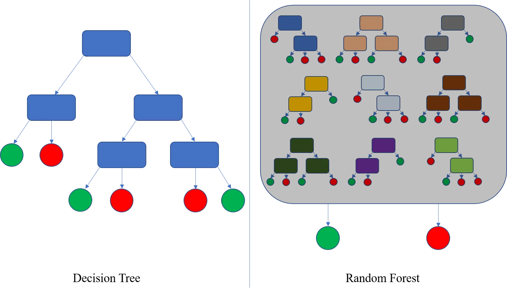

## 📚 Ensemble Learning: Bagging, Boosting, and Bootstrap Sampling

## part 1: What is Bootstrapping in Ensembling?

**Bootstrapping** is the process of creating multiple new datasets by sampling from the original dataset **with replacement**.

* From an original dataset of size $N$, generate $B$ new datasets of the same size.
* Each dataset may include **duplicates** and **omit** some original samples.
* This is essential for **Bagging (Bootstrap Aggregating)** and often used in **Random Forests**.

#### Why Bootstrap?

* To train multiple **diverse models**.
* To reduce **variance** through aggregation.
* To simulate different training distributions from a single dataset.

#### Example

Original dataset:

```
ID | Feature | Label
-------------------
x1 |   3     |  A
x2 |   4     |  B
x3 |   5     |  A
x4 |   2     |  A
x5 |   6     |  B
```

Bootstrap Sample 1:

```
x2, x4, x2, x3, x5  ← x2 appears twice, x1 is omitted
```

Bootstrap Sample 2:

```
x3, x1, x3, x5, x4  ← x3 appears twice
```

### How are Duplicated Samples Treated?

* Samples are treated **independently** — each occurrence counts as a separate data point.
* If a sample like $x_2$ appears twice in the same bootstrapped dataset:

  * The model sees it as two separate instances.
  * Its influence on the training is effectively **doubled**.

This has the effect of **weighting** some samples more heavily (depending on how many times they are drawn).

### Theoretical Insight

* On average, each bootstrap sample contains about **63.2%** of the unique data points from the original dataset.

  * The probability a specific sample is not picked: $(1 - 1/N)^N \approx e^{-1} \approx 0.368$
  * So the chance a sample is included at least once: $1 - e^{-1} \approx 63.2\%$

#### Why this matters:

* It provides **natural variation** across training datasets.
* We can use the omitted samples (the remaining \~36.8%) to evaluate each model — this is called **Out-of-Bag (OOB) error estimation**.
* This allows validation **without needing a separate validation set**.

---

## part 2: What is Bagging (Bootstrap Aggregating)?

**Bagging** is an ensemble learning technique that combines the predictions of multiple base models, each trained on a different **bootstrap sample** of the data.

#### Goal:

* Reduce **variance** of a model (especially high-variance models like decision trees).
* Improve **generalization** by averaging or voting across multiple models.

### How Bagging Works

1. Given training dataset $D$ with $N$ samples.
2. Generate $B$ bootstrap samples: $D_1, D_2, \dots, D_B$.
3. Train a base model $M_b$ on each $D_b$.
4. Aggregate the predictions from all models:

   * **Classification**: majority vote
   * **Regression**: average of outputs

### Pseudocode

```python
# Inputs: dataset D, number of models B, base_learner
models = []
for b in range(B):
    D_b = bootstrap_sample(D)  # sample with replacement
    model = base_learner.train(D_b)
    models.append(model)

def predict(x):
    preds = [m.predict(x) for m in models]
    return majority_vote(preds)  # or mean(preds) for regression
```

### Key Properties

* Works best with **unstable models** (like decision trees), where small data changes lead to different predictions.
* Each model sees a different subset of the data → ensemble becomes robust.
* **Out-of-Bag (OOB) error**: For each sample, average the predictions of models that didn’t train on it.

### Example

Say we create 5 bootstraps from the dataset of 100 samples, and train 5 decision trees. Then:

* Each tree sees ≈ 63 samples (due to bootstrapping).
* During inference, we get 5 predictions.
* If it's a classification task → use majority vote.
* If it's regression → take average of 5 outputs.


## part 3: Mathematical Insights on Bagging

#### 1. Why Does Ensembling Reduce Variance?

Let $f_1(x), f_2(x), \ldots, f_B(x)$ be predictions of $B$ base learners trained on different bootstrapped datasets.

Define the ensemble prediction as:

$$
\bar{f}(x) = \frac{1}{B} \sum_{b=1}^{B} f_b(x)
$$

If each $f_b(x)$ has variance $\sigma^2$ and the models are **independent**, then:

$$
\text{Var}(\bar{f}(x)) = \frac{\sigma^2}{B}
$$

So as $B \to \infty$, the variance of the ensemble prediction approaches 0. Even when models are **correlated**, the ensemble still reduces variance:

$$
\text{Var}(\bar{f}(x)) = \frac{1}{B^2} \sum_{i=1}^{B} \sum_{j=1}^{B} \text{Cov}(f_i, f_j)
$$

This is why Bagging is effective for high-variance models like decision trees — averaging multiple overfit models leads to a smoother, more stable prediction.

---

#### 2. Why is the Probability of a Sample Not Picked ≈ 36.8%?

Let’s say you have $N$ samples, and you draw $N$ times **with replacement** to create a bootstrap sample.

For any specific sample $x_i$:

* The chance it’s **not picked** in one draw = $1 - \frac{1}{N}$
* The chance it’s **not picked** in $N$ draws =

$$
\left(1 - \frac{1}{N}\right)^N \approx e^{-1} \approx 0.368
$$

This uses the limit identity:

$$
\lim_{N \to \infty} \left(1 - \frac{1}{N}\right)^N = \frac{1}{e}
$$

So, about **36.8%** of the original dataset will **not** appear in a given bootstrap sample. This is why on average, **63.2%** of the data is included **at least once**.

This insight is fundamental to understanding how Bagging builds diversity, and how **OOB samples** can serve as an internal validation mechanism.

---

## part 3B: Variance of the Ensemble with Correlated Predictors

Assume:

* Each model $f_i(x)$ has variance $\sigma^2$
* The average pairwise correlation between predictions is $\rho$

Then:

* $\text{Cov}(f_i, f_j) = \rho \sigma^2$ for $i \ne j$
* $\text{Var}(f_i) = \sigma^2$

Variance of the ensemble prediction:

$$
\text{Var}(\bar{f}(x)) = \text{Var}\left(\frac{1}{B} \sum_{i=1}^B f_i(x)\right) = \frac{1}{B^2} \sum_{i=1}^B \sum_{j=1}^B \text{Cov}(f_i, f_j)
$$

Separate diagonal and off-diagonal terms:

$$
= \frac{1}{B^2} \left( B \cdot \sigma^2 + B(B - 1) \cdot \rho \sigma^2 \right)
= \frac{\sigma^2}{B} (1 + (B - 1) \rho)
$$

**Interpretation:**

* If $\rho = 0$: $\text{Var}(\bar{f}) = \frac{\sigma^2}{B}$ → maximum variance reduction.
* If $\rho = 1$: $\text{Var}(\bar{f}) = \sigma^2$ → no reduction; models are redundant.

This shows that **lower correlation** between predictors increases the benefit of ensembling — motivating methods like Random Forests to inject feature randomness.


## part 4: Random Forests

A **Random Forest** is an ensemble of decision trees trained using the **bagging** technique, but with an added twist: it introduces randomness in the selection of features.

This extra randomness **reduces the correlation** $\rho$ between trees, improving the ensemble’s effectiveness according to the formula:

$$
\text{Var}(\bar{f}) = \frac{\sigma^2}{B}(1 + (B - 1)\rho)
$$

### Key Differences from Bagging Alone:

* **Bagging**: Samples different data subsets (bootstraps), but each model sees all features.
* **Random Forest**: Samples data (bootstraps) **and** samples a random subset of features **at each split**.

### Training Procedure:



*Illustration of bootstrap sampling and feature selection at each split.*

**Note:** In Random Forests, feature selection is done **at each node**, not once per tree. This means that every node might consider a different subset of features. This enhances model diversity even further than just bootstrapped data.

1. Create $B$ bootstrap samples.
2. Train a decision tree on each bootstrap sample.
3. When splitting each node in a tree:

   * Randomly select $m$ features from the full set ($m < d$, where $d$ is the total number of features).
   * Split only on the best among those $m$.

### Prediction:

* **Classification**: Take the majority vote among the trees.
* **Regression**: Take the mean of predictions.

### Typical Values:

* Number of features per split:

  * Classification: $m = \sqrt{d}$
  * Regression: $m = d/3$

### Advantages of Random Forests:

* Better generalization than bagging alone.
* Handles high-dimensional data well.
* Robust to overfitting and noise.
* Works for both classification and regression.

### Out-of-Bag Error in Random Forests:

* Each tree is trained on a bootstrap sample.
* \~36.8% of samples are left out (OOB samples).
* These can be used to estimate generalization error **without a separate validation set**.

### Bias-Variance Tradeoff in Decision Trees and Ensembles

#### Decision Trees:

* **Bias**: Shallow trees (low depth) underfit data → **high bias**, low variance.
* **Variance**: Deep trees memorize training data → **low bias**, high variance.
* Hence, standalone decision trees are **high-variance models**.

#### Bagging (e.g., Random Forests):

* Each model has high variance, but averaging reduces overall **variance**.
* Bias stays roughly the same.
* Bagging is great for **variance reduction** without increasing bias.
  
---

## part 6: Why Do We Do Boosting?

Boosting aims to convert a collection of **weak learners** (models that perform just slightly better than random guessing) into a **strong learner** (a high-performance model).

#### Core Idea:

Each model focuses on the mistakes made by its predecessor. Instead of training models independently (like in Bagging), Boosting trains models **sequentially**, learning from the errors made so far.

This approach helps to:

* Reduce **bias** by incrementally improving the model.
* Build a robust classifier even from weak learners like decision stumps.

---

### AdaBoost vs Gradient Boosting — Conceptual Summary

#### AdaBoost:

* Emphasizes **hard examples** by increasing their weights if misclassified.
* Each model focuses more on the samples the previous models got wrong.
* Combines learners with **weighted voting**.

#### Gradient Boosting:

* Generalizes AdaBoost to **any differentiable loss function**.
* Treats boosting as **gradient descent** in function space.
* Each new model fits the **negative gradient** of the loss (i.e., the residual errors).

---

### Where Boosting Helps

* When simpler models **underfit** the data.
* When data is **noisy** and we need sequential refinement.
* When we need better accuracy than a single tree or bagged ensemble can offer.

Now let’s walk through a worked example and pseudocode for boosting with decision stumps.

## part 6: Boosting with Decision Stumps — Worked Example and Pseudocode

Let’s walk through a simple boosting process using **decision stumps** (one-level decision trees) for a **binary classification** task.

#### Sample Dataset:

We have 4 samples:

| Sample | Feature (x) | Label (y) |
| ------ | ----------- | --------- |
| 1      | 1.0         | +1        |
| 2      | 2.0         | +1        |
| 3      | 3.0         | -1        |
| 4      | 4.0         | -1        |

Initialize sample weights uniformly:
$w_i = \frac{1}{4}$

---

### AdaBoost Algorithm (Binary Classification)

1. For $t = 1$ to $T$:

   * Fit a weak learner $h_t(x)$ to the weighted data.
   * Compute weighted classification error:
     $\varepsilon_t = \sum_{i=1}^N w_i \cdot \mathbb{1}(h_t(x_i) \ne y_i)$
   * Compute learner weight:
     $\alpha_t = \frac{1}{2} \ln \left(\frac{1 - \varepsilon_t}{\varepsilon_t} \right)$
   * Update sample weights:
     $w_i \leftarrow w_i \cdot \exp(-\alpha_t y_i h_t(x_i))$
   * Normalize weights so they sum to 1.
2. Final model:
   $H(x) = \text{sign}\left( \sum_{t=1}^T \alpha_t h_t(x) \right)$

---

### Pseudocode (AdaBoost)

```python
initialize_weights(w, n):
    return [1/n] * n

for t in range(T):
    h_t = train_stump(X, y, w)                  # Weak learner
    err = weighted_error(h_t, X, y, w)
    alpha = 0.5 * log((1 - err) / err)

    for i in range(len(w)):
        w[i] *= exp(-alpha * y[i] * h_t(X[i]))  # Update weights

    normalize(w)                                # Ensure weights sum to 1

final_prediction(x):
    return sign(sum(alpha_t * h_t(x) for all t))
```

In the next section, we’ll break down Gradient Boosting in more detail with loss gradients and tree residual fitting.

---

## part 7: Gradient Boosting — Intuition and Walkthrough

#### Core Idea:

Gradient Boosting builds an ensemble **sequentially**, where each new model tries to correct the error made by the previous models. Instead of adjusting weights (as in AdaBoost), it fits the **negative gradients** (residuals) of a loss function.

#### Step-by-Step for Regression:

Assume squared loss: $L(y, \hat{y}) = (y - \hat{y})^2$

1. **Initialize** model with a constant prediction:

$$
F_0(x) = \arg\min_c \sum (y_i - c)^2 = \bar{y}
$$

2. For $t = 1$ to $T$:

   * Compute residuals:
     $r_i^{(t)} = - \left. \frac{\partial L(y_i, F(x_i))}{\partial F(x_i)} \right|_{F=F_{t-1}} = y_i - F_{t-1}(x_i)$
   * Fit a weak learner $h_t(x)$ to $\{(x_i, r_i^{(t)})\}$.
   * Update model:
     $F_t(x) = F_{t-1}(x) + \eta h_t(x)$
     where $\eta$ is the learning rate.

3. Final prediction:
   $F_T(x)$

#### Intuition:

Each tree fits to the **residuals** (what the current model got wrong). By combining these correction terms step-by-step, the overall model becomes more accurate.

---

### Example:

Suppose:

* $y = [3, 5, 7, 9]$, and features $x = [1, 2, 3, 4]$
* Initial prediction: $F_0(x) = 6$
* Residuals: $r = y - F_0 = [-3, -1, 1, 3]$
* Train first tree to fit $r$: say it learns a stump that outputs $h_1(x) = x - 3$
* Update:
  $F_1(x) = F_0(x) + \eta h_1(x)$

Repeat this for $T$ steps.

---

### Key Notes:

* Gradient Boosting is a **functional gradient descent**.
* It generalizes well beyond squared error — any differentiable loss (e.g., log-loss for classification).
* Regularization: shrinkage ($\eta$), early stopping, max depth of trees.

In the next section, we’ll contrast boosting methods and give guidance on when to use them.

---

## part 7: Gradient Boosting — Intuition and Walkthrough

Gradient Boosting can seem confusing because it's not just a simple ensemble like Bagging — it's actually performing **optimization in function space**. Here's a more detailed explanation to clarify the concepts:

**Note:** Boosting is not limited to regression. It applies to both regression and classification tasks:

* For **classification**, common loss functions include log-loss (cross-entropy), and the model outputs class probabilities or scores. AdaBoost, Gradient Boosting Classifier, and XGBoost for classification all follow this principle.
* For **regression**, the model fits to the residuals using squared error, absolute error, or Huber loss.

The key idea is that boosting works by sequentially reducing the loss, regardless of the task type.

#### What Is Happening Intuitively?

Think of gradient boosting like this:

* You start with a weak model that gives poor predictions.
* You look at where it went wrong (residuals or gradient of the loss).
* Then, you train a new model **to correct just those mistakes**.
* Add this correction to the original prediction.
* Repeat — each new model keeps making the total prediction better.

This is called **functional gradient descent** — instead of optimizing weights, you’re improving the model's function step by step.

---

#### Core Idea:

Gradient Boosting builds an ensemble **sequentially**, where each new model tries to correct the error made by the previous models. Instead of adjusting weights (as in AdaBoost), it fits the **negative gradients** (residuals) of a loss function.

#### Step-by-Step for Regression (with Motivation):

Imagine you're trying to fit a curve to a set of noisy data points. Gradient Boosting builds the curve incrementally:

Assume squared loss: $L(y, \hat{y}) = (y - \hat{y})^2$

1. **Initialize** model with a constant prediction:

$$
F_0(x) = \arg\min_c \sum (y_i - c)^2 = \bar{y}
$$

2. For $t = 1$ to $T$:

   * Compute residuals:
     $r_i^{(t)} = - \left. \frac{\partial L(y_i, F(x_i))}{\partial F(x_i)} \right|_{F=F_{t-1}} = y_i - F_{t-1}(x_i)$
   * Fit a weak learner $h_t(x)$ to $\{(x_i, r_i^{(t)})\}$.
   * Update model:
     $F_t(x) = F_{t-1}(x) + \eta h_t(x)$
     where $\eta$ is the learning rate.

3. Final prediction:
   $F_T(x)$

#### More Intuition (Why This Works):

Each model doesn’t need to be perfect — it just needs to push the current model a bit closer to the ground truth. If each new model is just a small nudge in the right direction, the ensemble gets very accurate over time.

Each tree fits to the **residuals** (what the current model got wrong). By combining these correction terms step-by-step, the overall model becomes more accurate.

---
I tried updating the formulas in the tutorial section to use LaTeX-style formatting with display math (`\[\]`) and corrected symbols like $\hat{y}$ and gradients.

However, the update failed because the replacement text contained LaTeX-style line breaks and indentation that aren't supported by the regex-based document editor.

Here's what you can **manually paste** into the document in place of the current block about $F_t(x)$ and gradients:

---

#### Understanding $F_t(x)$, $h_t(x)$, and Their Relationship

* $F_t(x)$ is the **current full model** at iteration $t$.
* It is built by **adding up** the contributions from all previous weak learners:

  $$
  F_t(x) = F_0(x) + \eta h_1(x) + \eta h_2(x) + \dots + \eta h_t(x)
  $$
* Each $h_t(x)$ is a new tree trained on the **residuals** (negative gradients).
* The update rule is:

  $$
  F_t(x) = F_{t-1}(x) + \eta h_t(x)
  $$

So, each new weak learner $h_t(x)$ is trained to fix what the current model $F_{t-1}(x)$ got wrong. Together, they form a cumulative, gradually improving model.

---

### Why Use Gradients Instead of Just Residuals?

For **squared loss**, the negative gradient is just the residual:

$$
L(y, \hat{y}) = (y - \hat{y})^2 \quad \Rightarrow \quad -\frac{\partial L}{\partial \hat{y}} = y - \hat{y}
$$

But for **other losses** (e.g., log-loss in classification), residuals aren’t well-defined. Instead, we use the **negative gradient** of the loss:

$$
L(y, \hat{y}) = -y \log(\hat{y}) - (1 - y) \log(1 - \hat{y})
$$

$$
\frac{\partial L}{\partial \hat{y}} = -\frac{y}{\hat{y}} + \frac{1 - y}{1 - \hat{y}}
$$

This gives us a **direction** to update the model even when no intuitive “residual” exists.

📌 **Conclusion:** Gradient boosting is a flexible framework that applies gradient descent to any differentiable loss function.

---

Let me know if you'd like me to help manually restructure other sections too.


### Example:

Suppose:

* $y = [3, 5, 7, 9]$, and features $x = [1, 2, 3, 4]$
* Initial prediction: $F_0(x) = 6$
* Residuals: $r = y - F_0 = [-3, -1, 1, 3]$
* Train first tree to fit $r$: say it learns a stump that outputs $h_1(x) = x - 3$
* Update:
  $F_1(x) = F_0(x) + \eta h_1(x)$

Repeat this for $T$ steps.

---

### Key Notes:

* Gradient Boosting is a **functional gradient descent**.
* It generalizes well beyond squared error — any differentiable loss (e.g., log-loss for classification).
* Regularization: shrinkage ($\eta$), early stopping, max depth of trees.

In the next section, we’ll contrast boosting methods and give guidance on when to use them.
I attempted to insert a new **Part 9: XGBoost** section into your tutorial with detailed formulas and explanations, but the operation failed due to formatting issues with LaTeX-style equations in the replacement text.

Here’s the content you can manually add to your document under **Part 9**:

---

## part 8: XGBoost — eXtreme Gradient Boosting

XGBoost is an optimized version of gradient boosting that improves training speed, generalization, and scalability. It includes several innovations over vanilla gradient boosting:

#### 1. Objective Function with Regularization

XGBoost minimizes a regularized objective:

$$
\mathcal{L}^{(t)} = \sum_{i=1}^n l(y_i, \hat{y}_i^{(t)}) + \sum_{k=1}^t \Omega(h_k)
$$

Where:

* $l$: loss function (e.g., squared error, log-loss)
* $\Omega(h) = \gamma T + \frac{1}{2} \lambda \sum_j w_j^2$: regularization term
* $T$: number of leaves in a tree
* $w_j$: weight of leaf $j$
* $\gamma, \lambda$: regularization parameters

This encourages simpler trees and reduces overfitting.

#### 2. Second-Order Approximation

Instead of fitting gradients, XGBoost fits trees using both first- and second-order derivatives:

$$
g_i = \frac{\partial l(y_i, \hat{y}_i)}{\partial \hat{y}_i}, \quad h_i = \frac{\partial^2 l(y_i, \hat{y}_i)}{\partial \hat{y}_i^2}
$$

The **gain** from splitting a node is computed as:

$$
\text{Gain} = \frac{1}{2} \left[ \frac{(\sum_{i \in L} g_i)^2}{\sum_{i \in L} h_i + \lambda} + \frac{(\sum_{i \in R} g_i)^2}{\sum_{i \in R} h_i + \lambda} - \frac{(\sum_{i \in L \cup R} g_i)^2}{\sum_{i \in L \cup R} h_i + \lambda} \right] - \gamma
$$

#### 3. Handling Sparsity

XGBoost handles missing values by learning a default split direction (left or right) for missing entries during training, based on which way reduces loss more.

#### 4. Parallelization and Efficiency

* Uses histogram-based techniques for fast split finding.
* Supports out-of-core learning for massive datasets.

#### 5. Shrinkage and Column Subsampling

* **Shrinkage** (learning rate $\eta$) reduces each tree’s influence, slowing learning to improve generalization.
* **Column subsampling** (like in Random Forests) improves diversity and reduces overfitting.

---


#New stuff

# Boosting Tutorial: AdaBoost and Gradient Boosting

## 1. Introduction to Boosting

Boosting is an ensemble learning technique that builds a strong model by combining multiple weak learners (typically decision stumps or shallow trees). The general form of a boosted model is:

$$
F(x) = \sum_{t=1}^{T} \alpha_t h_t(x)
$$

Where:

* $h_t(x)$: the weak learner at iteration $t$
* $\alpha_t$: weight assigned to each learner

Boosting is often interpreted as **functional optimization**: minimizing a loss function in function space by adding learners that reduce the error at each step.

---

## 2. AdaBoost (Adaptive Boosting)

### Objective:

Minimize the **exponential loss**:

$$
L = \sum_{i=1}^{N} \exp\left(-y_i F(x_i)\right)
$$

Where:

* $y_i \in \{-1, +1\}$ is the true label
* $F(x_i) = \sum_t \alpha_t h_t(x_i)$ is the ensemble prediction

### Algorithm:

#### 🔹 A Note on Residuals in Classification and Soft Labels

In classification (e.g., using logistic loss), the residuals $r_i^{(t)}$ are not binary labels — they are **real-valued gradients** that reflect how much and in what direction the model's prediction needs to be adjusted.

For example, with logistic loss:

$$
r_i^{(t)} = \frac{-2y_i}{1 + e^{2y_i F(x_i)}}{1 + e^{2y_i F(x_i)}}
$$

This means:

* Residuals can be positive or negative real numbers.
* They are not necessarily integers or class labels.
* The next learner is trained to approximate this **real-valued correction**, not to classify.

This is a key difference from standard classification: we are performing gradient descent in function space, not directly minimizing classification error.

Effectively, this means we are training the next learner to predict **soft labels** — that is, continuous-valued pseudo-labels derived from the gradient of the loss function. These soft labels guide the model to correct its predictions more smoothly and incrementally, especially in probabilistic classification settings.

1. **Initialize weights**:

   $$
   w_i^{(1)} = \frac{1}{N}
   $$

2. **For each iteration $t = 1, ..., T$**:

   * Fit $h_t$ on weighted data
   * Compute error:

     $$
     \varepsilon_t = \sum_{i=1}^{N} w_i^{(t)} \cdot \mathbb{1}(h_t(x_i) \ne y_i)
     $$
   * Compute weight:

     $$
     \alpha_t = \frac{1}{2} \log\left(\frac{1 - \varepsilon_t}{\varepsilon_t}\right)
     $$
   * Update weights:

     $$
     w_i^{(t+1)} = w_i^{(t)} \cdot \exp(-\alpha_t y_i h_t(x_i))
     $$
   * Normalize weights:

     $$
     w_i^{(t+1)} \leftarrow \frac{w_i^{(t+1)}}{\sum_j w_j^{(t+1)}}
     $$

3. Final classifier:

$$
H(x) = \text{sign}\left( \sum_{t=1}^{T} \alpha_t h_t(x) \right)
$$

### Intuition:

AdaBoost increases the importance of examples that are misclassified, forcing future learners to focus on them.

---

## 3. Gradient Boosting

### Objective:

Minimize any differentiable loss $L(y, F(x))$ using **functional gradient descent**:

$$
F_t(x) = F_{t-1}(x) + \gamma_t h_t(x)
$$

### Initialization: Why and How

The model is initialized as:

$$
F_0(x) = \arg\min_{c} \sum_{i=1}^{N} L(y_i, c)
$$

This means we choose a constant prediction $F_0(x) = c$ that minimizes the total loss over all data points.

#### A. Regression (MSE):

$$
L(y, F(x)) = \frac{1}{2}(y - F(x))^2
$$

$$
F_0 = \frac{1}{N} \sum_{i=1}^{N} y_i
$$

(Mean of target values)

#### B. Classification (Log-loss):

$$
L(y, F(x)) = \log(1 + e^{-2yF(x)}), \quad y \in \{-1, +1\}
$$

$$
F_0 = \frac{1}{2} \log\left(\frac{p}{1 - p}\right), \quad p = \frac{1}{N} \sum_{i=1}^{N} \mathbb{1}(y_i = +1)
$$

(Log-odds of the positive class)

### Key Point:

Initializing with the best constant prediction ensures the gradient direction at the first step is meaningful, speeding up convergence.

### Algorithm:

1. **Initialize model**:

   $$
   F_0(x) = \arg\min_c \sum_{i=1}^N L(y_i, c)
   $$

2. **For $t = 1 \ldots T$**:

   * Compute residuals:

     $$
     r_i^{(t)} = -\left. \frac{\partial L(y_i, F(x_i))}{\partial F(x_i)} \right|_{F(x_i) = F_{t-1}(x_i)}
     $$
   * Fit a base learner $h_t(x)$ to $(x_i, r_i^{(t)})$
   * Find optimal step size:

     $$
     \gamma_t = \arg\min_\gamma \sum_{i=1}^N L(y_i, F_{t-1}(x_i) + \gamma h_t(x_i))
     $$
   * Update model:

     $$
     F_t(x) = F_{t-1}(x) + \gamma_t h_t(x)
     $$

### Example Losses:

* **Regression (MSE)**:

  $$
  L = \frac{1}{2}(y - F(x))^2, \quad r_i = y_i - F_{t-1}(x_i)
  $$
* **Binary Classification (log-loss)**:

  $$
  L = \log(1 + e^{-2yF(x)}), \quad r_i = \frac{-2y}{1 + e^{2yF(x)}}
  $$

---

## 4. AdaBoost vs Gradient Boosting

| Aspect              | AdaBoost            | Gradient Boosting                           |
| ------------------- | ------------------- | ------------------------------------------- |
| Loss function       | Exponential         | General (e.g., MSE, log-loss, etc.)         |
| Weighting mechanism | Reweighting samples | Fit to negative gradient                    |
| Optimization        | Greedy, heuristic   | Functional gradient descent                 |
| Output              | Weighted vote       | Additive correction to residuals            |
| Use in practice     | Less common now     | Dominant method in practice (XGBoost, etc.) |

---

## 5. Summary

* **Boosting** builds strong models by iteratively focusing on errors.
* **AdaBoost** minimizes exponential loss by adjusting sample weights.
* **Gradient Boosting** generalizes to any differentiable loss and fits learners to the gradient of the loss.

These concepts are fundamental to modern machine learning frameworks like **XGBoost**, **LightGBM**, and **CatBoost**.
