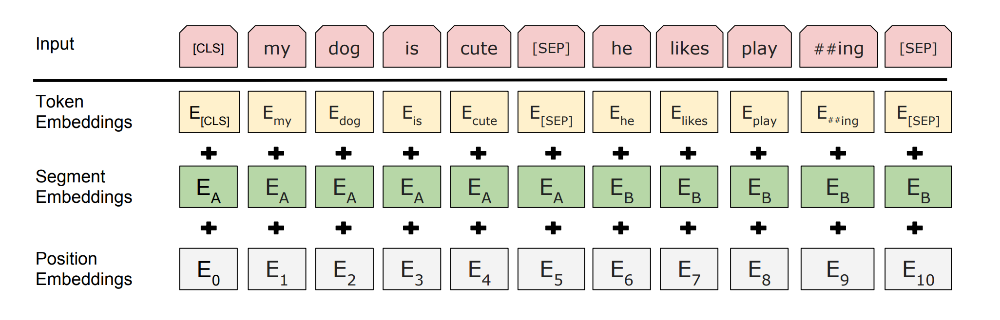
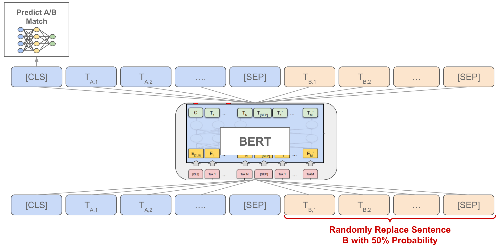

## A Deep Dive into BERT: The Complete Tutorial (Definitive Edition)

*Last Updated: June 7, 2025*

### 1\. The Task: True Language Understanding

The core task of any foundational language model is not just to process text, but to *understand* it. For years, the dominant paradigm was unidirectional. The goal of BERT is to create a model that can build a rich, contextual representation of each word by looking at the *entire sentence simultaneously*—both left and right. This is the task of creating a **deeply bidirectional language representation**.

-----

### 2\. The Core Architecture: The Transformer Encoder

BERT is fundamentally a stack of Transformer Encoder layers. By eschewing the decoder, BERT can process an entire input sequence simultaneously, which is the key to its bidirectionality.

Each encoder layer is composed of two primary sub-layers: a Multi-Head Self-Attention mechanism and a Position-wise Feed-Forward Network.

#### 2.1 The Mathematics of Self-Attention

This mechanism allows the model to weigh the importance of other words when encoding a specific word. Given an input sequence of token embeddings $X$, we first project them into Query ($Q$), Key ($K$), and Value ($V$) matrices using learned weight matrices ($W^Q, W^K, W^V$).

The **Scaled Dot-Product Attention** is then calculated as:

$$\text{Attention}(Q, K, V) = \text{softmax}\left(\frac{QK^T}{\sqrt{d_k}}\right)V$$

This formula computes a weighted sum of all token Values, where the weights are determined by the similarity between each token's Query and all other Keys.

-----

### 3\. BERT Architecture: An Overview

| Parameter | BERT-Base | BERT-Large |
| :--- | :--- | :--- |
| **Encoder Layers (L)** | 12 | 24 |
| **Hidden Size (H)** | 768 | 1024 |
| **Attention Heads (A)** | 12 | 16 |
| **Total Parameters** | 110 Million | 340 Million |

  * **Embedding Size:** The hidden size (H) is synonymous with the embedding size. Each token is represented by a 768-dimensional vector in BERT-Base.
  * **Sequence Length:** BERT was pre-trained with a maximum sequence length of **512 tokens**.

-----

### 4\. BERT's Output and Operational Details

#### 4.1 The Core Model's Output

The base, pre-trained BERT model does **not** have a single, universal "output layer." Its final output is the sequence of hidden states from its last Transformer encoder layer, with a shape of `[batch_size, sequence_length, hidden_size]`. This is a rich, contextualized embedding for every token, serving as the foundation for task-specific heads.

#### 4.2 The Role of the Softmax Layer (in Fine-Tuning)

The **softmax** activation function is not part of the base BERT model. It is added as the final step in the **task-specific head** during fine-tuning to convert raw output scores (logits) into a probability distribution.

#### 4.3 A Note on Sampling (Top-k/Top-p)

BERT is an **encoder** model designed for language *understanding*, not a **generative** decoder model like GPT. Therefore, it does not use sampling techniques like top-k or top-p. Its predictions are deterministic, typically derived by taking the `argmax` of the output logits.

#### 4.4 How BERT Handles Sequences Longer Than 512 Tokens: Chunking and Pooling in Detail

The fixed 512-token limit is a hard constraint. Here is a more detailed breakdown of the standard "chunking and pooling" strategy for long document classification.

**1. Chunking with Overlap:**

  * **Objective:** To break a long document into manageable chunks that fit within the 512-token limit, without losing critical context at the chunk boundaries.
  * **Process:**
    1.  Tokenize the entire long document.
    2.  Define a `chunk_size` (e.g., 512) and a `stride` or `overlap_size` (e.g., 128). The overlap ensures that context at the end of one chunk is also present at the beginning of the next.
    3.  Create the first chunk by taking the first 512 tokens.
    4.  Create the second chunk by sliding the window forward by (`chunk_size` - `overlap_size`) tokens. In our example, we would move forward by 512 - 128 = 384 tokens.
    5.  Repeat this process until the entire document is covered.
  * **Result:** A single long document is now represented as a batch of `N` overlapping chunks.

**2. Independent Processing:**

  * Each of the `N` chunks is passed through the fine-tuned BERT model independently. We extract the `[CLS]` token's final hidden state for each chunk.
  * **Result:** We now have `N` different `[CLS]` vectors, which can be viewed as a tensor of shape `[N, hidden_size]`.

**3. Pooling:**

  * **Objective:** To aggregate these `N` individual chunk representations into a single vector that represents the entire document.
  * **Process:** Apply a pooling function across the `N` dimension of our `[N, hidden_size]` tensor.
      * **Mean Pooling:** `final_vector = torch.mean(cls_vectors, dim=0)`. Creates a smooth, average representation of the document.
      * **Max Pooling:** `final_vector = torch.max(cls_vectors, dim=0).values`. Captures the most salient features detected in *any* chunk.

The resulting `final_vector` is then fed into the final classification layer.

-----

### 5\. A Deeper Look at the WordPiece Tokenizer

BERT uses a sub-word tokenizer called **WordPiece**. It effectively **eliminates out-of-vocabulary (OOV) problems** by breaking down unknown words into known, meaningful sub-words (e.g., `epistemology` -\> `epis`, `##tem`, `##ology`). This manages vocabulary size while preserving partial meaning for novel words.

-----

### 6\. BERT's Input Representation


*Fig. 1 BERT structure of Embeddings in the input*

The final input vector for each token is the sum of three embeddings:

  * **Token Embeddings:** Vectors for each sub-word in the WordPiece vocabulary.
  * **Segment Embeddings:** A vector (`E_A` or `E_B`) indicating membership in the first or second sentence.
  * **Position Embeddings:** A learned vector for each position (0-511) to provide the model with a sense of order.
  * **Special Tokens:** `[CLS]` (for sequence-level representation) and `[SEP]` (to separate sentences).
  * **Attention Mask:** A binary tensor that tells the attention mechanism to ignore `[PAD]` tokens.

-----

### 7. BERT's Pre-training Tasks and Data Generation

BERT's deep bidirectional understanding of language is a direct result of its unique, unsupervised pre-training on two specific tasks. The training data for these tasks is generated "on the fly" from a massive, unlabeled text corpus (like Wikipedia). These tasks are trained **simultaneously**.

#### 7.1 Task 1: Masked Language Model (MLM)


*Fig. 2 BERT MLM task overview*

* **The Task:** The MLM task moves beyond simple left-to-right language modeling. Instead of predicting the *next* word, the model must predict a word that has been intentionally hidden or "masked" from the input. To do this, it is forced to use both the left and right context, making it deeply bidirectional.

* **Training Data Generation:** Here is how a single training instance is generated:
    1.  **Start with a sentence:** `The quick brown fox jumps over the lazy dog.`
    2.  **Tokenize:** `['the', 'quick', 'brown', 'fox', 'jumps', 'over', 'the', 'lazy', 'dog']`
    3.  **Select tokens for masking:** About 15% of the tokens are chosen at random. Let's say we select `brown` and `lazy`.
    4.  **Apply masking rules:** For each chosen token, we apply a specific transformation:
        * **80% of the time, replace with `[MASK]`:** The token `brown` becomes `[MASK]`.
        * **10% of the time, replace with a random token:** The token `lazy` might be replaced with a random word from the vocabulary, like `apple`. This acts as a regularizer, forcing the model to learn a rich representation for every token, not just rely on the context around the `[MASK]` token.
        * **10% of the time, keep the original token:** The token would remain `lazy`. This helps to bias the model towards the true observed data.
    5.  **Final Training Pair:**
        * **Input to BERT:** `['the', 'quick', '[MASK]', 'fox', 'jumps', 'over', 'the', 'apple', 'dog']`
        * **Ground Truth Labels:** The model is tasked to predict the original tokens at the corrupted positions. The ground truth would be `(position 2: 'brown')` and `(position 8: 'lazy')`. The loss is only calculated on these masked positions.

* **Example:**
    * **Input:** `My dog is [MASK] and very playful.`
    * **Expected Prediction:** The model should predict the word `hairy` for the `[MASK]` position by understanding the context provided by "dog," "is," and "playful."

#### 7.2 Task 2: Next Sentence Prediction (NSP)



*Fig. 3 BET NSP task overview*

* **The Task:** This is a binary classification task designed to teach the model to understand sentence relationships. Given two sentences, A and B, the model must predict whether Sentence B is the actual sentence that followed Sentence A in the original text.

* **Training Data Generation:** Training pairs are generated by sampling from a large corpus with clear document structure.
    1.  **Start with a corpus:** A collection of long articles or books.
    2.  To create one training instance, we sample two sentences.
    3.  **With 50% probability (Positive Example):**
        * We find a document and extract two **consecutive** sentences to serve as Sentence A and Sentence B.
        * The ground truth label for this pair is `IsNext`.
    4.  **With 50% probability (Negative Example):**
        * We take Sentence A from one document.
        * We take Sentence B from a **different, random** document.
        * The ground truth label for this pair is `NotNext`.
    5.  The final input is formatted as: `[CLS] Sentence A [SEP] Sentence B [SEP]`.

* **Example:**
    * **Positive Training Pair (`IsNext`):**
        * **Sentence A:** `The man walked into the store.`
        * **Sentence B:** `He bought a gallon of milk.`
        * **Input to BERT:** `[CLS] The man walked into the store. [SEP] He bought a gallon of milk. [SEP]`
        * **Label:** `IsNext`
    * **Negative Training Pair (`NotNext`):**
        * **Sentence A:** `The man walked into the store.`
        * **Sentence B:** `Penguins are flightless birds.`
        * **Input to BERT:** `[CLS] The man walked into the store. [SEP] Penguins are flightless birds. [SEP]`
        * **Label:** `NotNext`

By training on this task, BERT learns about coherence, causality, and other high-level relationships between sentences, which is critical for downstream tasks like Question Answering.

### 8\. BERT's Pre-training Heads and Loss Functions

During pre-training, two specialized "heads" are placed on top of the BERT backbone to perform the two training tasks. Their losses are added together.

$$L_{\text{batch}}(\theta) = L_{MLM}^{\text{batch}}(\theta) + L_{NSP}^{\text{batch}}(\theta)$$

#### 8.1 The Masked Language Model (MLM) Head

  * **Architecture:** Takes the final hidden state of **every token** (`[B, S, H]`) and passes it through a dense layer with GELU activation, followed by Layer Normalization and a final linear layer that projects the output to the vocabulary size (`H` -\> `V`), producing logits.

  * **Loss Function (MLM):** The average **Negative Log-Likelihood** over all masked positions in the batch. Let $M\_b$ be the set of masked indices for sequence $b$.

    $$L_{MLM}^{\text{batch}}(\theta) = - \frac{1}{\sum_b |M_b|} \sum_{b=1}^{B} \sum_{i \in M_b} \log p_{b,i}(x_{b,i})$$

    **How `log p_i(x_i)` is Calculated:**

    1.  The final hidden state for a masked token, $h\_i \\in \\mathbb{R}^{H}$, is passed through the MLM head to produce a logit vector $\\text{logits}\_i \\in \\mathbb{R}^{|V|}$.
    2.  A softmax function is applied to the logits to get a probability distribution: $P\_i = \\text{softmax}(\\text{logits}\_i)$.
    3.  $p\_i(x\_i)$ is the probability value in the vector $P\_i$ at the index corresponding to the true token $x\_i$.
    4.  The natural logarithm of this probability is taken for the loss calculation.

#### 8.2 The Next Sentence Prediction (NSP) Head

  * **Architecture:** Takes the final hidden state of only the **`[CLS]`** token (`[B, H]`) and passes it through a single linear layer that projects it to `2` (for `IsNext` and `NotNext`), producing logits.

  * **Loss Function (NSP):** The average **Negative Log-Likelihood** over the binary classification task for each sequence in the batch.

    $$L_{NSP}^{\text{batch}}(\theta) = - \frac{1}{B} \sum_{b=1}^{B} \log p_{cls, b}(y_b)$$

  * **Clarification on NSP:** The NSP task is a **sequence-level** classification. There is only **one prediction per sequence pair**, which is made using the `[CLS]` token's final state as the aggregate representative. The segment embeddings (`E_A`, `E_B`) on every token serve as the critical *input feature* that allows the model to learn the relationship between the two sentences.

-----

### 9\. Fine-Tuning BERT for Downstream Tasks


*Fig. 4 Some BERT downstream tasks that BERT can be fine-tuned over *

Fine-tuning is the process where the pre-trained BERT model, with all its generalized linguistic knowledge, is adapted for a specific, supervised task. This involves adding a small, often simple, task-specific neural network layer—a "head"—on top of the BERT backbone.

A crucial point to understand is the fine-tuning strategy: for most tasks, we perform **end-to-end fine-tuning**. This means we do **not** freeze the original BERT weights. Instead, the entire model, from the embedding layer to the final attention layer, is updated during training. However, we use a much smaller learning rate than in pre-training. This allows the pre-trained weights to adapt subtly to the nuances of the downstream task without catastrophically forgetting their powerful initial representations.

Let's examine the specifics for several key tasks.

#### 9.1 Text Classification (e.g., Sentiment Analysis)
This is the most straightforward fine-tuning task.

* **Task:** Assign a single label to a sequence of text.
* **Model Change:** A single linear classification layer is added. It takes the final hidden state of the **`[CLS]`** token (`[batch_size, hidden_size]`) and projects it to a vector of size `[batch_size, num_labels]`.
* **Input-Output Pair:**
    * **Input:** `[CLS] The movie was a masterpiece. [SEP]`
    * **Output (Ground Truth):** A single class label, e.g., `Positive`.

---
#### 9.2 Question Answering (Extractive QA)

This is a more complex, token-level task. The canonical dataset for this is the Stanford Question Answering Dataset (SQuAD).

* **The Task:** Given a question and a context passage, the model must identify the continuous span of text *within the passage* that contains the answer. This is "extractive" because the model does not generate the answer; it extracts it.

* **Input-Output Training Pair Construction:**
    * **Input:** The input is a single packed sequence containing both the question and the context passage, separated by a `[SEP]` token.
        * `[CLS] <Question Text> [SEP] <Context Passage Text> [SEP]`
    * **Example Input:** `[CLS] What is the capital of France? [SEP] Paris is the capital and most populous city of France... [SEP]`
    * **Output (Ground Truth):** The ground truth is **not** a class label. It consists of two integers:
        1.  `start_position`: The index of the token where the answer begins in the passage.
        2.  `end_position`: The index of the token where the answer ends.
    * **Example Output:** For the input above, if "Paris" corresponds to token index 10 in the sequence, the ground truth would be `(start_position: 10, end_position: 10)`.

* **How the Model is Changed (The QA Head):**
    A single linear layer is added on top of the BERT backbone, but its application is different from classification.
    1.  It takes the final hidden state of **every token** in the sequence as input (Shape: `[batch_size, sequence_length, hidden_size]`).
    2.  It projects this input to an output of shape `[batch_size, sequence_length, 2]`.
    3.  This final output tensor contains two numbers for each token:
        * The **Start Logit**: The score indicating the likelihood of that token being the start of the answer span. (Slice `[:, :, 0]`)
        * The **End Logit**: The score indicating the likelihood of that token being the end of the answer span. (Slice `[:, :, 1]`)

* **Exact Training Procedure:**
    1.  **Fine-Tuning Strategy:** The entire model is fine-tuned end-to-end.
    2.  **Forward Pass:** An input pair is passed through the model to get the start and end logits for every token.
    3.  **Loss Function:** The total loss is the sum of the cross-entropy losses for the start and end positions.
        $$L_{QA} = L_{\text{start}} + L_{\text{end}}$$
        * $L_{\text{start}}$ is the cross-entropy loss between the distribution of start logits (across all tokens) and the true `start_position`.
        * $L_{\text{end}}$ is the cross-entropy loss between the distribution of end logits (across all tokens) and the true `end_position`.
    4.  **Inference:** To predict an answer, we apply a `softmax` across the start logits and end logits independently to get probabilities. We then find the token indices `(i, j)` that maximize the score `p_start(i) + p_end(j)`, subject to the constraint that `j >= i`. The token span from `i` to `j` is the predicted answer.

---
#### 9.3 Named Entity Recognition (NER)

NER is another common token-level classification task.

* **The Task:** Classify each token in a sentence into a set of predefined categories such as Person (PER), Organization (ORG), Location (LOC), or Other (O). This often uses the IOB2 tagging scheme (e.g., `B-PER` for the beginning of a Person entity, `I-PER` for a token inside a Person entity).

* **Input-Output Training Pair Construction:**
    * **Input:** A single tokenized sentence.
        * `[CLS] George Washington went to Washington . [SEP]`
    * **Output (Ground Truth):** A sequence of labels, one for each corresponding input token.
        * `[O, B-PER, I-PER, O, O, B-LOC, O, O]`
    * **Handling Sub-words:** This is a critical nuance. If a word is split by the WordPiece tokenizer (e.g., "Washington" -> `Washing`, `##ton`), the standard practice is to assign the label to the first sub-word (`B-LOC`) and a special padding label (often `X` or `-100` in implementations, which is ignored by the loss function) to subsequent sub-words (`##ton`).

* **How the Model is Changed (The NER Head):**
    1.  A linear classification layer is added on top of the BERT backbone.
    2.  It takes the final hidden state of **every token** as input (Shape: `[batch_size, sequence_length, hidden_size]`).
    3.  It projects these hidden states to the number of NER tags (e.g., 9 for a typical IOB2 scheme with 4 entities), resulting in an output of shape `[batch_size, sequence_length, num_ner_tags]`.

* **Exact Training Procedure:**
    1.  **Fine-Tuning Strategy:** The entire model is fine-tuned end-to-end.
    2.  **Forward Pass:** The input sentence is passed through the model to get a logit distribution over the NER tags for every token.
    3.  **Loss Function:** A standard **token-level cross-entropy loss**. The loss is calculated for every token in the sequence by comparing its predicted label distribution against its true label. The final loss is the average of the losses for all non-special (and non-sub-word-padding) tokens in the batch.

### 10\. Implementation in Practice

#### 10.1 Pseudocode for Pre-training

```
# Conceptual Pseudocode for BERT Pre-training
for each batch in large_unlabeled_corpus:
    # 1. Prepare batch (create pairs, apply masking)
    input_ids, mlm_labels, is_next_label = prepare_batch(batch)
    attention_mask, segment_ids = ...
    
    # 2. Forward Pass through BERT backbone
    sequence_output, cls_output = BERT_backbone(input_ids, attention_mask, segment_ids)
    
    # 3. Forward Pass through Heads
    mlm_logits = MLM_Head(sequence_output)
    nsp_logits = NSP_Head(cls_output)

    # 4. Calculate Losses
    mlm_loss = CrossEntropyLoss(mlm_logits, mlm_labels)
    nsp_loss = CrossEntropyLoss(nsp_logits, is_next_label)
    
    # 5. Backpropagation
    total_loss = mlm_loss + nsp_loss
    total_loss.backward()
    optimizer.step()
```

#### 10.2 Fine-Tuning Training and Validation Loop (PyTorch)

```python
import torch
from torch.utils.data import DataLoader, Dataset
from transformers import BertTokenizer, BertForSequenceClassification, AdamW, get_linear_schedule_with_warmup

# --- 1. Dataset Class ---
class TextDataset(Dataset):
    def __init__(self, encodings, labels):
        self.encodings = encodings
        self.labels = labels
    def __getitem__(self, idx):
        item = {key: torch.tensor(val[idx]) for key, val in self.encodings.items()}
        item['labels'] = torch.tensor(self.labels[idx])
        return item
    def __len__(self):
        return len(self.labels)

# --- 2. Tokenization and DataLoader Setup ---
# Assume train_texts, train_labels, etc. are loaded and num_epochs is defined
tokenizer = BertTokenizer.from_pretrained('bert-base-uncased')
train_encodings = tokenizer(train_texts, truncation=True, padding=True, max_length=128)
# ... (repeat for validation data) ...
train_dataset = TextDataset(train_encodings, train_labels)
train_loader = DataLoader(train_dataset, batch_size=16, shuffle=True)

# --- 3. Model, Optimizer, and Scheduler Setup ---
device = torch.device('cuda') if torch.cuda.is_available() else torch.device('cpu')
model = BertForSequenceClassification.from_pretrained('bert-base-uncased', num_labels=2)
model.to(device)
optimizer = AdamW(model.parameters(), lr=5e-5)
scheduler = get_linear_schedule_with_warmup(optimizer, num_warmup_steps=0, num_training_steps=len(train_loader) * num_epochs)

# --- 4. Training Loop ---
for epoch in range(num_epochs):
    model.train()
    for batch in train_loader:
        # Tensors in `batch`:
        # 'input_ids':      [batch_size, sequence_length], e.g., [16, 128]
        # 'attention_mask': [batch_size, sequence_length], e.g., [16, 128]
        # 'labels':         [batch_size],                  e.g., [16]
        optimizer.zero_grad()
        outputs = model(input_ids=batch['input_ids'].to(device),
                        attention_mask=batch['attention_mask'].to(device),
                        labels=batch['labels'].to(device))
        loss = outputs.loss
        loss.backward()
        optimizer.step()
        scheduler.step()
    # ... (add validation loop here) ...
```

-----

### 11\. De-Tokenization

De-tokenization is the process of converting the model's output token IDs back into human-readable text. The tokenizer object provides this functionality, typically via a `decode` method. This method takes a sequence of token IDs, looks them up in its vocabulary, and intelligently stitches sub-words (those starting with `##`) back into complete words.
