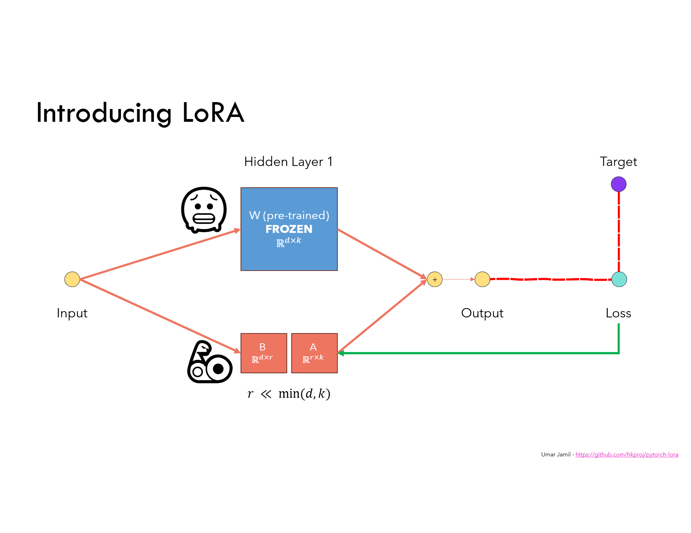

[](../)

## [](../main_page/GenAI)

# LoRA (Low-Rank Adaptation) for Multi-Head Attention: Complete Tutorial

## 1. Introduction to LoRA

**LoRA (Low-Rank Adaptation)** is a parameter-efficient fine-tuning technique for large-scale pre-trained models. It allows us to adapt a model by introducing low-rank trainable matrices into certain parts of the network while keeping the original pre-trained weights frozen.

## 2. Core Idea

In standard training, a weight matrix $W \in \mathbb{R}^{d \times k}$ is updated directly. LoRA freezes $W$ and instead introduces a trainable low-rank perturbation:

$W' = W + \Delta W \quad \text{where} \quad \Delta W = A B \quad A \in \mathbb{R}^{d \times r}, B \in \mathbb{R}^{r \times k}, r \ll \min(d, k)$

This allows only $A$ and $B$ to be trained.


*Fig.~1 LORA fine-tuning the weights with intorducing the low-rank trainable matrices*

[Good implementation](https://github.com/hkproj/pytorch-lora/tree/main)

### Why Efficient?

* The full matrix $W$ has $d \times k$ parameters.
* LoRA adds $d \times r + r \times k = r (d + k)$ trainable parameters.
* For square matrices where $d = k$, LoRA has $2 \times r \times d$ parameters.

This is a massive reduction when $r \ll d$.

### Why Can We Approximate a Matrix with a Low-Rank One?

Most real-world weight matrices contain significant redundancy. The effective information often lies in a low-dimensional subspace. Through **Singular Value Decomposition (SVD)**:

$W = U \Sigma V^\top$

We can keep only the top $r$ singular values and associated vectors:

$W \approx U_r \Sigma_r V_r^\top = A B$

LoRA mimics this with trainable $A$ and $B$, assuming that the model only needs a low-dimensional update for fine-tuning. This insight drastically reduces the number of trainable parameters without a significant drop in performance.

## 3. Where LoRA is Applied in Attention

In Transformers, attention is computed as:

$\text{Attention}(Q, K, V) = \text{softmax}\left( \frac{Q K^\top}{\sqrt{d_k}} \right)V$

Where:

* $Q = X W^Q$, $K = X W^K$, $V = X W^V$

LoRA is usually applied to:

* $W^Q$, $W^V$
* Optionally $W^K$

**Why Q and V?**

To understand this intuitively, imagine a **math classroom** where tokens are students:

* Each student learns about a specific topic (e.g., algebra, geometry).
* Each student can ask questions (**Query / Q**) and answer questions (**Value / V**).
* Each student also wears a name tag (**Key / K**) that tells others what topic they are knowledgeable about.

Let’s extend the classroom analogy:

* Imagine you're in a math classroom that was pre-trained on general math topics (arithmetic, algebra, calculus).
* Now you want to fine-tune the class for **geometry**.

Here’s what happens:

* **Queries (Q)**: With LoRA, we teach students to ask more focused geometry-related questions. Instead of saying "What’s the rule here?", they now ask, "What’s the rule for calculating the area of a triangle?"
* **Values (V)**: We also train them to respond with more precise, domain-relevant information. Instead of giving a generic math fact, they now say: "The area of a triangle is 0.5 × base × height."

So LoRA modifies both how students **ask** and **answer** questions to suit the new topic — geometry.

* **Values (V)** are the answers students give. With LoRA, we make sure the answers contain geometry-relevant information.

But what about **Keys (K)**?

* Keys are like the **name tags** or **subject expertise labels** students wear, indicating what they know.

Your concern is valid: if no student is labeled as a "geometry expert" (i.e., there is no pre-existing K for geometry), how can questions about geometry be matched to the right answers?

Here’s the insight:

* In pretraining, the model may not have explicit geometry tokens, but many tokens might partially relate to geometry (e.g., "shape," "angle," "proof").
* LoRA **adjusts Queries (Q)** to align geometry questions toward **existing Keys (K)** that are semantically close.
* It also **adjusts Values (V)** to ensure those matched tokens return geometry-relevant content.

By doing this, we exploit the latent expressiveness of the pretrained model — even if no student had a "geometry" badge before, many had enough math foundation to help.

Updating K can cause instability:

* A token formerly recognized as an algebra expert might suddenly appear to specialize in geometry — but without learning how to actually answer geometry questions (unless V is also changed).
* This disrupts the learned alignment between Q and K and often hurts performance.

So instead of relabeling students (K), we teach students to direct their questions more effectively (Q) and provide new, relevant answers (V) using the same matching system.

However, what if we **do update both K and V**?

If we carefully adapt **both**:

* **K (Keys)** to label tokens as geometry-relevant entities, and
* **V (Values)** to ensure those tokens now provide appropriate geometry answers,

then we can potentially avoid destabilization.

But this approach requires **tight coupling between K and V updates**:

* Any shift in K must be mirrored by a shift in V to preserve semantic alignment.
* If K is changed but V is not updated accordingly, attention scores may be redirected to the wrong tokens, leading to degraded performance.

So, yes—it is **possible** to update both K and V safely. But:

* It demands **more parameters** and
* **More careful training** (e.g., warm-up, learning rate tuning)

In low-rank settings like LoRA, Q and V often give the best return on investment with the least risk.

Empirically, this is enough to shift the model toward the new domain without corrupting its internal structure.

**LORA is Not applied to:**

* $QK^\top$, the attention score matrix, which is a result of computation.
* $QK^\top V$, the attention output, which is not a parameter but an intermediate result.

Because they are not weights, they are only the result of multiplications that depend on the input data.

## 4. Rank of Matrix in LoRA

The **rank** of a matrix is the number of linearly independent columns (or rows). In LoRA, we approximate a high-rank matrix by multiplying two low-rank matrices:

$\Delta W = A B \quad \text{rank}(\Delta W) \le r$

This reduces both memory and compute. The success of this approximation depends on the low intrinsic dimensionality of useful updates.

### What is Low Intrinsic Dimensionality?

Although the weight matrix $W$ might be high-dimensional (e.g., 1024×1024), the essential changes needed to adapt it for a new task often lie in a much lower-dimensional space.

This means:

* The majority of meaningful updates to the model live in a small subspace.
* Most of the directions in the full matrix space are either redundant or irrelevant for fine-tuning.

By using low-rank matrices $A$ and $B$, LoRA captures the most impactful directions without needing to store or compute all $d 	\times k$ values.

This principle — that the **intrinsic dimensionality** of useful changes is small — allows LoRA to work effectively with far fewer parameters.

## 5. LoRA-Enhanced Attention: How It Works

Given a frozen weight $W^Q$, we replace it with:

$W^Q_{\text{LoRA}} = W^Q + \alpha A_Q B_Q$

During training, only $A_Q, B_Q$ are updated. $W^Q$ remains frozen.

This is similarly done for $W^V$, optionally $W^K$.

### Scaling Factor in LoRA

From Section 4.1 of the original LoRA paper:

* The update is defined as $\Delta W = \frac{\alpha}{r} B A$
* $\alpha$: A constant scaling hyperparameter (often set equal to $r$)
* $r$: The rank of the low-rank update

This scaling ensures that:

* The contribution of $\Delta W$ remains numerically stable regardless of $r$
* When combined with optimizers like Adam, $\alpha$ acts like a gain factor or implicit learning rate for the adapter

The authors note that tuning $\alpha$ is roughly equivalent to tuning the learning rate, so they usually set $\alpha = r$ to avoid retuning.

### LoRA weights randomly initialized even with a pretrained base.
---
This is intentional and necessary:

* The frozen base weights $W$ are loaded from a strong pretrained model.
* The LoRA adapters $A$ and $B$ are **task-specific**. They start from random initialization and are trained to adapt $W$ for the **new downstream task**.
* Since pretraining does not know the downstream task in advance, there's no meaningful way to pretrain the LoRA adapters.

This formulation ensures three things:

1. **LoRA starts near-zero:**

   * $B$ is initialized to zeros and $A$ with small random noise.
   * So initially, $\Delta W = BA \approx 0$, and the effective weight is just the frozen $W$.
   * This allows the model to behave identically to the pretrained base at the beginning of fine-tuning.

2. **Stable learning dynamics:**

   * Without proper scaling, increasing rank $r$ increases the magnitude of $\Delta W$, which can destabilize the model.
   * By scaling $\Delta W$ as $\frac{\alpha}{r} BA$, LoRA keeps its contribution numerically stable across ranks. 

3. **Minimal hyperparameter tuning:**

   * Tuning $\alpha$ behaves similarly to adjusting learning rate.
   * Empirically, setting $\alpha = r$ works well across tasks and simplifies experimentation.
   * You don’t need to retune learning rate every time you change $r$.

Think of $W$ as the pre-trained brain, and $AB$ as adjustable reading glasses:

* The brain is already powerful (pretrained weights).
* You custom-fit new glasses (randomly initialized LoRA) to help the brain adapt to a new vision problem (task).

---

## 6. LoRA Multi-Head Attention Code (No LLM Libraries)

```python
import torch
import torch.nn as nn
import torch.nn.functional as F

class LoRAParametrization(nn.Module):
    def __init__(self, features_in, features_out, rank=1, alpha=1, device='cpu'):
        super().__init__()
        self.lora_A = nn.Parameter(torch.zeros((rank, features_out)).to(device))
        self.lora_B = nn.Parameter(torch.zeros((features_in, rank)).to(device))
        nn.init.normal_(self.lora_A, mean=0, std=1)
        self.scale = alpha / rank
        self.enabled = True

    def forward(self, original_weights):
        if self.enabled:
            return original_weights + torch.matmul(self.lora_B, self.lora_A).view(original_weights.shape) * self.scale
        else:
            return original_weights

# Note: In practical usage, LoRA modules (q_proj and v_proj) should also be initialized
# with weights from a pre-trained model if available, to preserve compatibility.
class MultiHeadAttentionWithLoRA(nn.Module):
    # Accept pretrained weights for Q and V projections (optional)
    def __init__(self, embed_dim, num_heads, r=4, alpha=1.0, pretrained_q=None, pretrained_v=None):
        super().__init__()
        assert embed_dim % num_heads == 0
        self.embed_dim = embed_dim
        self.num_heads = num_heads
        self.head_dim = embed_dim // num_heads

        self.q_weight = nn.Parameter(
            pretrained_q.clone().detach() if pretrained_q is not None else torch.empty(embed_dim, embed_dim),
            requires_grad=False
        )
        if pretrained_q is None:
            nn.init.kaiming_uniform_(self.q_weight, a=math.sqrt(5))
        self.v_weight = nn.Parameter(
            pretrained_v.clone().detach() if pretrained_v is not None else torch.empty(embed_dim, embed_dim),
            requires_grad=False
        )
        if pretrained_v is None:
            nn.init.kaiming_uniform_(self.v_weight, a=math.sqrt(5))

        self.q_lora = LoRAParametrization(embed_dim, embed_dim, rank=r, alpha=alpha)
        self.v_lora = LoRAParametrization(embed_dim, embed_dim, rank=r, alpha=alpha)

        self.k_proj = nn.Linear(embed_dim, embed_dim)
        self.out_proj = nn.Linear(embed_dim, embed_dim)

    def forward(self, x):
        B, T, C = x.shape

        q_weight = self.q_lora(self.q_weight)
        Q = F.linear(x, q_weight).view(B, T, self.num_heads, self.head_dim).transpose(1, 2)
        K = self.k_proj(x).view(B, T, self.num_heads, self.head_dim).transpose(1, 2)
        v_weight = self.v_lora(self.v_weight)
        V = F.linear(x, v_weight).view(B, T, self.num_heads, self.head_dim).transpose(1, 2)

        attn_weights = torch.matmul(Q, K.transpose(-2, -1)) / (self.head_dim ** 0.5)
        attn_probs = F.softmax(attn_weights, dim=-1)
        attn_output = torch.matmul(attn_probs, V)

        attn_output = attn_output.transpose(1, 2).contiguous().view(B, T, C)
        return self.out_proj(attn_output)

# Example
x = torch.randn(2, 16, 64)
mha_lora = MultiHeadAttentionWithLoRA(embed_dim=64, num_heads=4, r=8)
out = mha_lora(x)
print(out.shape)  # (2, 16, 64)
```
## 7. Summary Table

| Component         | LoRA Applied? | Explanation                               |
| ----------------- | ------------- | ----------------------------------------- |
| $W^Q, W^V$        | ✅             | Most commonly adapted weights             |
| $W^K$             | Optional      | Sometimes skipped to save compute         |
| $QK^\top$         | ❌             | No learnable parameters                   |
| $QK^\top V$       | ❌             | Not a target of LoRA                      |
| Output proj $W^O$ | Optional      | Sometimes adapted in large-scale settings |
