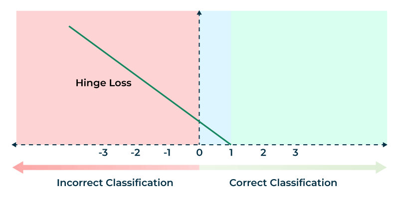

## Support Vector Machines (SVMs)

---

### **1. SVM Analogy: Medical School Admission**

Imagine you're trying to decide whether students get into medical school based on two features:

* **GPA (Grade Point Average)**
* **MCAT score (Medical College Admission Test)**

Plotting these as points in 2D space (GPA on x-axis, MCAT on y-axis), suppose accepted students are mostly in the upper-right (high GPA, high MCAT), while rejected students are in the lower-left.

We aim to find a **decision boundary** (a line) that separates the two classes.

**Definitions:**

* **Hyperplane**: In 2D, this is a line. In general, it's an (n-1)-dimensional flat subspace separating two classes.
* **Margin**: The distance between the hyperplane and the closest points from each class.
* **Support Vectors**: The data points that lie exactly on the margin boundaries. These are the critical points that "support" the hyperplane.
* **Optimal Hyperplane**: The one that **maximizes the margin** between classes.

---

*Fig.~1 Support Vector Machines, Hard Marging SVM (left) vs Soft Margin SVM (right) where some outliers are allowed with a penalty*

### **2. Hard Margin SVM (Linearly Separable Case)**

We assume the data is **perfectly linearly separable**.

#### **Goal:**

Find a hyperplane $w^T x + b = 0$ that:

* Separates the data.
* Maximizes the margin (i.e., minimizes $\|w\|^2$).

#### **Formulation:**

Let $(x_i, y_i)$ be the training data with $y_i \in \{-1, +1\}$

**Constraints:**

$$
 y_i(w^T x_i + b) \geq 1 \quad \forall i
$$

**Optimization Problem:**

$$
\min_{w, b} \frac{1}{2} \|w\|^2 \quad \text{subject to} \quad y_i(w^T x_i + b) \geq 1
$$

This is a **convex quadratic optimization problem with linear constraints**. We solve it using **quadratic programming**, not gradient descent.

#### ❗ Why Not Gradient Descent?

Hard-margin SVM uses exact inequality constraints: $y_i(w^T x_i + b) \geq 1$. These are not amenable to standard gradient descent:

* We'd have to use **penalty methods** to turn constraints into penalties, effectively creating a soft-margin SVM.
* The true hard-margin problem is typically solved via **quadratic programming solvers**, which handle constraints directly.

Thus, **gradient descent is not used** for training hard-margin SVMs in practice.

#### **Lagrangian Dual Derivation**

We derive the dual form by introducing **Lagrange multipliers** $\alpha_i \geq 0$ for the constraints.

**Primal Lagrangian:**

$$
\mathcal{L}(w, b, \alpha) = \frac{1}{2} \|w\|^2 - \sum_i \alpha_i [y_i(w^T x_i + b) - 1]
$$

To find the saddle point, we take partial derivatives and set them to zero:

**1. Derivative with respect to $w$:**

$$
\frac{\partial \mathcal{L}}{\partial w} = w - \sum_i \alpha_i y_i x_i = 0 \Rightarrow w = \sum_i \alpha_i y_i x_i
$$

**2. Derivative with respect to $b$:**

$$
\frac{\partial \mathcal{L}}{\partial b} = -\sum_i \alpha_i y_i = 0 \Rightarrow \sum_i \alpha_i y_i = 0
$$

**Plug back into the Lagrangian:**

$$
\mathcal{L}(w, b, \alpha) = \frac{1}{2} \left\|\sum_i \alpha_i y_i x_i \right\|^2 - \sum_i \alpha_i \left[y_i\left(\sum_j \alpha_j y_j x_j^T x_i + b\right) - 1\right]
$$

Simplify:

* First term becomes: $\frac{1}{2} \sum_{i,j} \alpha_i \alpha_j y_i y_j x_i^T x_j$
* Second term: $-\sum_i \alpha_i y_i \sum_j \alpha_j y_j x_j^T x_i = -\sum_{i,j} \alpha_i \alpha_j y_i y_j x_i^T x_j$
* Third term: $-\sum_i \alpha_i y_i b = 0$ by constraint
* Constant: $+\sum_i \alpha_i$

So the dual becomes:

$$
\max_{\alpha} \sum_i \alpha_i - \frac{1}{2} \sum_{i,j} \alpha_i \alpha_j y_i y_j x_i^T x_j
$$

Subject to:

$$
\alpha_i \geq 0, \quad \sum_i \alpha_i y_i = 0
$$

#### **Why Do We Maximize the Dual? (Intuition)**
Perfect — let’s address this precisely.

---

#### Why is minimizing the **primal problem with constraints** equivalent to solving the **saddle point problem**:

$$
\min_{\mathbf{w}, b} \max_{\boldsymbol{\alpha} \geq 0} \mathcal{L}(\mathbf{w}, b, \boldsymbol{\alpha})
$$

Why does this min-max give the **same result** as solving the original constrained optimization?

---

**This is guaranteed by the Karush-Kuhn-Tucker (KKT) conditions and strong duality** — but let’s derive it intuitively and mathematically.

##  Original Constrained Problem (Primal Form)

We want to solve:

$$
\begin{aligned}
\min_{\mathbf{w}, b} \quad & \frac{1}{2} \|\mathbf{w}\|^2 \\
\text{s.t.} \quad & y_i(\mathbf{w}^\top \mathbf{x}_i + b) \geq 1 \quad \forall i
\end{aligned}
$$

These are **inequality constraints**, so we introduce **Lagrange multipliers** $\alpha_i \geq 0$.

---

##  Define the Lagrangian Function

We build:

$$
\mathcal{L}(\mathbf{w}, b, \boldsymbol{\alpha}) = \frac{1}{2} \|\mathbf{w}\|^2 - \sum_{i=1}^N \alpha_i \left[ y_i (\mathbf{w}^\top \mathbf{x}_i + b) - 1 \right]
$$

This combines:

* The **objective** $\frac{1}{2} \|\mathbf{w}\|^2$
* The **penalties** for constraint violation (through $\alpha_i$)

---

We now look for the **saddle point** of $\mathcal{L}$:

$$
\min_{\mathbf{w}, b} \max_{\boldsymbol{\alpha} \geq 0} \mathcal{L}(\mathbf{w}, b, \boldsymbol{\alpha})
$$

This saddle point represents:

* Minimizing over $(\mathbf{w}, b)$: trying to **reduce the objective**
* Maximizing over $\boldsymbol{\alpha} \geq 0$: trying to **enforce the constraints**

Here’s the deep **intuition**:

* If a constraint is **violated**, the corresponding $\alpha_i$ will grow and push the optimizer to satisfy the constraint.
* If a constraint is **satisfied**, the corresponding $\alpha_i$ will go to 0 (by complementary slackness).

This min-max structure **automatically balances** satisfying constraints and optimizing the objective.

This dual view also gives us the flexibility to introduce kernels, because it only depends on **dot products** $x_i^T x_j$.

#### **Pseudocode: Hard Margin SVM Training **

$$
\begin{aligned}
&\textbf{Input:} \ \text{Training data } \{(x_i, y_i)\}, \ y_i \in \{-1, +1\} \\
&\textbf{Output:} \ \text{Weight vector } w \text{ and bias } b \\
&1. \ \text{Formulate primal: minimize } \frac{1}{2} \|w\|^2 \\
&\quad \text{subject to } y_i(w^T x_i + b) \geq 1 \ \forall i \\
&2. \ \text{Form Lagrangian and derive dual:} \\
&\quad L(\alpha) = \sum_i \alpha_i - \frac{1}{2} \sum_{i,j} \alpha_i \alpha_j y_i y_j x_i^T x_j \\
&\quad \text{subject to } \sum_i \alpha_i y_i = 0, \ \alpha_i \geq 0 \\
&3. \ \text{Solve using a QP solver to get } \alpha_i \\
&4. \ \text{Compute } w = \sum_i \alpha_i y_i x_i \\
&\quad \text{Select any support vector } x_k, \text{ then compute } b = y_k - w^T x_k \\
&5. \ \text{Return } w, b
\end{aligned}
$$

### **Inference After Training Hard-Margin SVM**

Once we have trained a hard-margin SVM and obtained:

* The Lagrange multipliers $\alpha_i$
* The weight vector $w$
* The bias term $b$

we can perform classification using the linear decision rule.

#### **Step-by-Step Procedure (No Kernel)**

1. **Solve the dual optimization problem:**

   $$
   \max_{\alpha} \sum_i \alpha_i - \frac{1}{2} \sum_{i,j} \alpha_i \alpha_j y_i y_j x_i^T x_j
   $$

   Subject to:

   $$
   \alpha_i \geq 0, \quad \sum_i \alpha_i y_i = 0
   $$

2. **Obtain the weight vector:**

   $$
   w = \sum_i \alpha_i y_i x_i
   $$

   Only the **support vectors** have $\alpha_i > 0$, so the sum is sparse.

3. **Compute the bias $b$:**
   Pick any support vector $x_k$ (i.e., with $\alpha_k > 0$):

   $$
   b = y_k - w^T x_k
   $$

4. **Classify a new point $x$:**

   $$
   f(x) = w^T x + b, \quad \text{prediction: } \text{sign}(f(x))
   $$

### **Pseudocode for Inference (Linear, No Kernel)**

$$
\begin{aligned}
&\textbf{Input: } x, \text{ support vectors } \{x_i, y_i, \alpha_i\}, \text{ bias } b \\
&\textbf{Output: } \text{Predicted label } y \\
&1. \ w \leftarrow \sum_i \alpha_i y_i x_i \\ 
&2. \ f \leftarrow w^T x + b \\
&3. \ \text{Return } \text{sign}(f)
\end{aligned}
$$

This applies when training is done via solving the dual problem **without kernels**, using only dot products in the original input space.

---

*Fig.~2 Hinge loss used in the soft margin SVMs*

### **3. Soft Margin SVM (Handling Non-Separable Data)**

In real-world problems (like the med school example), perfect separation is rare. For instance, a student with high GPA and low MCAT might still be accepted, creating an **outlier**.

To handle such cases, we allow some violations of the margin using **slack variables** $\xi_i \geq 0$.

#### **Soft Margin SVM Primal Formulation:**

We modify the constraints:

$$
 y_i(w^T x_i + b) \geq 1 - \xi_i
$$

Objective becomes:

$$
\min_{w, b, \xi} \quad \frac{1}{2} \|w\|^2 + C \sum_i \xi_i
$$

Where:

* $\frac{1}{2} \|w\|^2$: encourages a large margin
* $\sum \xi_i$: penalizes margin violations
* $C$: trade-off parameter between margin size and violations

---

### **Hinge Loss Reformulation**

The problem can also be expressed using **hinge loss**:

$$
L(w, b) = \frac{1}{2} \|w\|^2 + C \sum_i \max(0, 1 - y_i(w^T x_i + b))
$$

* If $y_i(w^T x_i + b) \geq 1$, loss is zero (correctly classified with margin)
* If $y_i(w^T x_i + b) < 1$, we incur linear loss

This form is subdifferentiable and suitable for **gradient-based optimization**.

---

### **Training Soft Margin SVM via Gradient Descent**

Let $z_i = y_i(w^T x_i + b)$.
Gradient of the hinge loss is:
$$
\nabla_w L = w - C \sum_{i: z_i < 1} y_i x_i
$$
$$
\nabla_b L = -C \sum_{i: z_i < 1} y_i
$$
#### **Pseudocode: Soft Margin SVM (Gradient Descent)**

$$
\begin{aligned}
&\textbf{Input:} \ \text{Training data } \{(x_i, y_i)\}, \text{learning rate } \eta, \text{regularization } C, \text{epochs } T \\
&\textbf{Output:} \ w, b \\
&1. \ \text{Initialize } w = 0, \ b = 0 \\
&2. \ \text{For } t = 1 \text{ to } T:\\
&\quad \text{For each } (x_i, y_i):\\
&\quad\quad \text{Compute margin: } m = y_i(w^T x_i + b) \\
&\quad\quad \text{If } m \geq 1:\\
&\quad\quad\quad w \leftarrow w - \eta w \\
&\quad\quad\quad b \leftarrow b \\
&\quad\quad \text{Else:}\\
&\quad\quad\quad w \leftarrow w - \eta (w - C y_i x_i) \\
&\quad\quad\quad b \leftarrow b + \eta C y_i \\
&3. \ \text{Return } w, b
\end{aligned}
$$

---

### **How the Dual Helps in High Dimensions**

The dual formulation of SVM is particularly powerful in high-dimensional spaces.

#### **Why?**

* In the dual, the data appears **only in terms of dot products**: $x_i^T x_j$.
* These dot products can be computed **without explicitly constructing high-dimensional features** via the **kernel trick**.
* This allows us to work in **infinite-dimensional** feature spaces (like with the RBF kernel) while computing everything efficiently in the original space.

#### **Intuition:**

Even if the data is not linearly separable in its original space, it may be separable in a higher-dimensional space. Instead of transforming all data points manually, we **implicitly map them using a kernel**, which computes dot products in that higher-dimensional space **without ever forming the mapped vectors**.

This makes the dual SVM especially suited for high-dimensional or nonlinearly separable problems.

#### **Dual Optimization vs Support Vectors**

* The dual optimization problem introduces one Lagrange multiplier $\alpha_i$ **for every training point**.
* So during training, the dual is optimized over **all data points**.
* However, **after training**, most $\alpha_i$ are zero.
* Only the **support vectors** — points that lie exactly on the margin or violate it — have non-zero $\alpha_i$.

**Therefore:**

* **Dual training** involves all data.
* **Inference (prediction)** only uses support vectors:

$$
f(x) = \sum_{i \in \text{SV}} \alpha_i y_i K(x_i, x) + b
$$

This sparsity is a key reason why SVMs are efficient at prediction time.

---

### **Kernel Trick: Making SVMs Nonlinear**

#### **Why Do We Need Kernels? (Intuition)**

*Fig.3 Mapping the features to a new space via a nonlinear transformation does the trick and helps the SVM to linearly separate the data using a hyperplane.*

Suppose you have a dataset where class 0 lies in a small circle centered at the origin, and class 1 surrounds it in a ring. Clearly, no straight line (or hyperplane) can separate them in 2D space — **the problem is nonlinear**.

One idea: **manually project** the data into a higher-dimensional space. For example, we can map:

$$
\phi(x_i) = ((x_i^1)^2, (x_i^2)^2, \sqrt{2}x_i^1x_i^2, \sqrt{2}x_i^1, \sqrt{2}x_i^2, 1)
$$

This maps the 2D input into a **6-dimensional space** where the inner and outer circles can be linearly separated.

To perform classification with a linear SVM in this new space, we need dot products between projected vectors.
Let two input vectors be:

$$
x_i = (x_i^1, x_i^2), \quad x_j = (x_j^1, x_j^2)
$$

Then:

$$
\phi(x_i)^T \phi(x_j) = (x_i^1)^2(x_j^1)^2 + (x_i^2)^2(x_j^2)^2 + 2x_i^1x_i^2x_j^1x_j^2 + 2x_i^1x_j^1 + 2x_i^2x_j^2 + 1
$$

But this is exactly:

$$
(x_i^T x_j + 1)^2
$$

This shows that **a simple kernel function**:

$$
K(x_i, x_j) = (x_i^T x_j + 1)^2
$$

computes the dot product in the 6D feature space **without ever computing $\phi(x_i)$** explicitly.

---

#### **Problems with Manual Feature Mapping**

* Requires clever and problem-specific design.
* Explicitly computing $\phi(x_i)$ for all data points becomes infeasible as dimensionality increases.
* Storage and computation cost grow rapidly.

#### **How Kernels Help**

The **kernel trick** allows us to skip computing the high-dimensional mapping $\phi(x_i)$ altogether.
Instead of projecting to feature space and doing the dot product, we use:

$$
K(x_i, x_j) = \phi(x_i)^T \phi(x_j)
$$

This allows us to work implicitly in high-dimensional or infinite-dimensional spaces using only functions of dot products in the original space.

This leads to **significant savings in computation and memory**, especially in large or complex datasets.

---

### **Common Kernel Functions**

#### **1. Polynomial Kernel**

Defined as:

$$
K(x_i, x_j) = (x_i^T x_j + c)^d
$$

* $d$: degree of the polynomial
* $c$: constant to control the influence of higher-order terms

**Example (quadratic):**

$$
K(x_i, x_j) = (x_i^T x_j + 1)^2
$$

This implicitly maps inputs to a space that includes all degree-2 combinations of features:

$$
(x_i^1, x_i^2) \mapsto ((x_i^1)^2, (x_i^2)^2, x_i^1 x_i^2, x_i^1, x_i^2, 1)
$$

#### **2. Radial Basis Function (RBF) Kernel / Gaussian Kernel**

Defined as:

$$
K(x_i, x_j) = \exp\left(-\frac{\|x_i - x_j\|^2}{2\sigma^2}\right)
$$

* $\sigma$: width of the Gaussian

This measures similarity: close points give high values $\approx 1$, distant points yield values $\approx 0$.
It corresponds to mapping inputs into an **infinite-dimensional space** of Gaussian basis functions.

---

### **Kernelized Dual Optimization Problem**

After applying a kernel, the dual becomes:

$$
\max_{\alpha} \sum_i \alpha_i - \frac{1}{2} \sum_{i,j} \alpha_i \alpha_j y_i y_j K(x_i, x_j)
$$

Subject to:

$$
\alpha_i \geq 0, \quad \sum_i \alpha_i y_i = 0
$$

The prediction function for a new sample $x$ becomes:

$$
f(x) = \sum_{i \in \text{SV}} \alpha_i y_i K(x_i, x) + b
$$

This enables nonlinear separation using a linear classifier in a transformed space.

#### **RBF as Infinite Polynomial Expansion**

The standard RBF kernel is defined as:

$$
K(x_i, x_j) = \exp\left(-\frac{\|x_i - x_j\|^2}{2\sigma^2}\right)
$$

We can rewrite the squared norm using the identity:

$$
\|x_i - x_j\|^2 = \|x_i\|^2 + \|x_j\|^2 - 2 x_i^T x_j
$$

So:

$$
K(x_i, x_j) = \exp\left(-\frac{\|x_i\|^2}{2\sigma^2}\right) \cdot \exp\left(-\frac{\|x_j\|^2}{2\sigma^2}\right) \cdot \exp\left(\frac{x_i^T x_j}{\sigma^2}\right)
$$

Let:

$$
C(x_i, x_j) = \exp\left(-\frac{\|x_i\|^2 + \|x_j\|^2}{2\sigma^2}\right)
$$

Then:

$$
K(x_i, x_j) = C(x_i, x_j) \cdot \exp\left(\frac{x_i^T x_j}{\sigma^2}\right)
$$

Now, for any constant $\gamma = 1/\sigma^2$, consider:

$$
\exp\left(\gamma x_i^T x_j\right) = \exp\left(\gamma (x_i^T x_j + 1 - 1)\right) = e^{-\gamma} \cdot \exp\left(\gamma (1 + x_i^T x_j)\right)
$$

So we can write:

$$
K(x_i, x_j) = C'(x_i, x_j) \cdot \exp\left(\gamma (1 + x_i^T x_j)\right)
$$

where $C'(x_i, x_j) = C(x_i, x_j) e^{-\gamma}$.

Finally, apply the Taylor expansion:

$$
\exp(\gamma (1 + x_i^T x_j)) = \sum_{n=0}^\infty \frac{\gamma^n}{n!}(1 + x_i^T x_j)^n
$$

So the full kernel becomes:

$$
K(x_i, x_j) = C'(x_i, x_j) \cdot \sum_{n=0}^\infty \frac{\gamma^n}{n!}(1 + x_i^T x_j)^n
$$

This shows that the RBF kernel is equivalent to a **weighted infinite sum of polynomial kernels of the form** $(1 + x_i^T x_j)^n$.

**Intuition:**
This expansion reveals how the RBF kernel implicitly combines all polynomial degrees simultaneously, allowing the model to separate data with arbitrarily complex decision boundaries in a smooth and efficient manner — without explicitly computing high-dimensional feature maps.

---

**How the Data Looks in Infinite Polynomial Space**

When you transform data using all polynomial functions of all degrees (as the RBF kernel effectively does), you're projecting each data point into an infinite-dimensional space. Each new dimension corresponds to a different nonlinear combination of the original features:

* degree-1 features: $x_i^1, x_i^2, \ldots$
* degree-2 features: $(x_i^1)^2, x_i^1 x_i^2, \ldots$
* degree-3 features: $(x_i^1)^3, (x_i^1)^2 x_i^2, \ldots$
* ... up to infinity

So every data point becomes a vector with infinitely many components, encoding all possible polynomial interactions. In this space:

* Data that was **nonlinearly separable in the original space** becomes **linearly separable** because the higher-order dimensions stretch the space so that even complex curved boundaries become flat (linear hyperplanes).
* This is particularly helpful for highly entangled classes or structured patterns (e.g., concentric circles, spirals, etc.).

**How SVM Can Handle It**

* SVM in its dual form **does not require explicitly computing this infinite-dimensional vector**.
* It **only requires computing dot products** in this space — which the RBF kernel does implicitly.

Thus, even though we are conceptually working in infinite dimensions, the kernel trick allows SVM to:

* Represent and compute everything efficiently using only the kernel function.
* Learn a separating hyperplane in this infinite space, which corresponds to a **nonlinear decision boundary** in the original space.

This is the core power of kernelized SVMs: they **transform impossible classification tasks into easy linear separations**, all while remaining computationally tractable.

---

## Multiclass SVM: Linear and Nonlinear Cases

SVM is inherently a **binary classifier**, but it can be extended to multiclass problems using two primary strategies:

### **1. One-vs-Rest (OvR) Strategy**

* For $K$ classes, train $K$ binary SVM classifiers.
* Each classifier $f_k(x)$ learns to distinguish class $k$ vs. all other classes.
* During inference, evaluate all $f_k(x)$ and pick the class with the highest score:

  $$
  \hat{y} = \arg\max_k f_k(x)
  $$

### **2. One-vs-One (OvO) Strategy**

* Train $\frac{K(K-1)}{2}$ binary SVM classifiers, each distinguishing a pair of classes.
* During inference, each classifier votes, and the class with the majority of votes is selected.

### **Linear vs Nonlinear SVM in Multiclass**

* **Linear Multiclass SVM**: Uses linear decision boundaries in original feature space. Suitable for data that is linearly separable or close to it.
* **Nonlinear Multiclass SVM**: Uses kernels (e.g., polynomial, RBF) to create nonlinear decision boundaries in the input space. Particularly useful for complex, overlapping class structures.

### **Kernel Multiclass SVM (Nonlinear)**

* OvR and OvO strategies still apply.
* Each classifier uses the kernel trick to implicitly operate in high-dimensional space.
* Example: Use RBF kernel in OvR setup to create one nonlinear boundary for each class.

**Note:** Modern libraries like `scikit-learn` handle multiclass SVMs automatically using OvR by default. They abstract the training of multiple binary classifiers behind a unified multiclass interface.

---
