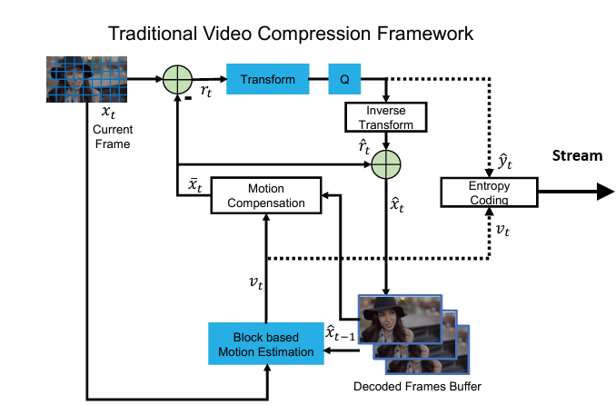

[](../)

## [](../main_page/CP)


## **Comprehensive Tutorial on Traditional Video Compression**

This tutorial explains the entire workflow of traditional video compression, combining motion estimation, motion compensation (including warping), residual calculation, DCT transformation, quantization, and encoding. We'll add **mathematical relationships** between the blocks to provide a deeper understanding.

---


### **Step-by-Step Compression Workflow**

#### **1. Frame Separation**
- A video is a sequence of frames. Frames are divided into:
  - **Keyframes (Intra-frames):** Compressed independently using spatial techniques (e.g., DCT).
  - **Predicted Frames (Inter-frames):** Compressed using motion estimation and compensation to exploit temporal redundancy.

#### **Mathematical Representation**
Let $$X_t$$ be the frame at time $$t$$. The predicted frame, $$\hat{X}_t$$, is derived from a reference frame $$X_{t-1}$$:

$$
\hat{X}_t = \text{Warp}(X_{t-1}, V_t)
$$

Where $$V_t$$ represents the motion vectors (derived during motion estimation).

---

#### **2. Motion Estimation**
- Motion estimation identifies how blocks in the current frame $$X_t$$ move relative to a reference frame $$X_{t-1}$$.
- Frames are divided into non-overlapping blocks (e.g., $$B_{i,j}$$, a block at position \((i, j)\)).
- For each block in $$X_t$$, find the best match in $$X_{t-1}$$ using a **block matching algorithm**:

  $$
  V_{i,j} = \arg \min_{(dx, dy)} \| B_{i,j} - B_{i+dx,j+dy} \|^2
  $$

  where $$V_{i,j} = (dx, dy)$$ is the motion vector for block $$B_{i,j}$$.

---

#### **3. Motion Compensation (with Warping)**
- Using motion vectors $$V_{i,j}$$, motion compensation generates a **predicted frame $$\hat{X}_t$$**:

  $$
  \hat{B}_{i,j} = X_{t-1}(i+dx, j+dy)
  $$

  where $$X_{t-1}(i+dx, j+dy)$$ is the block in the reference frame displaced by the motion vector.

- **Warping:** For more complex motion (e.g., rotation or scaling), apply geometric transformations:
  $$
  \hat{X}_t(x, y) = X_{t-1}(M \cdot [x, y]^T)
  $$
  where $$M$$ is the transformation matrix representing scaling, rotation, or translation.

---

#### **4. Residual Calculation**
- The **residual frame** captures the difference between the actual frame $$X_t$$ and the predicted frame $$\hat{X}_t$$:

  $$
  R_t = X_t - \hat{X}_t
  $$

- The residual frame contains the information that motion compensation cannot capture (e.g., occlusions, texture changes).

---

#### **5. Discrete Cosine Transform (DCT)**
- The residual frame $$R_t$$ is transformed into the frequency domain using the DCT. The DCT separates the image into:
  - **Low-frequency components:** Represent large-scale features.
  - **High-frequency components:** Represent fine details.
- For each block $$B_{i,j}$$ in $$R_t$$, the DCT transformation is:

  $$
  D(u, v) = \frac{1}{4} \sum_{x=0}^{N-1} \sum_{y=0}^{N-1} R_t(x, y) \cdot \cos\left[\frac{(2x+1)u\pi}{2N}\right] \cdot \cos\left[\frac{(2y+1)v\pi}{2N}\right]
  $$

  where $$N$$ is the block size (e.g., $$8 \times 8$$).

---

#### **6. Quantization**
- The DCT coefficients $$D(u, v)$$ are quantized to reduce precision, making the data more compressible:

  $$
  Q(u, v) = \text{round}\left(\frac{D(u, v)}{Q_{\text{matrix}}(u, v)}\right)
  $$

  where $$Q_{\text{matrix}}(u, v)$$ is the quantization matrix (e.g., JPEG standard matrix). Higher frequencies (small details) are quantized more aggressively.

---

#### **7. Entropy Encoding**
- Quantized coefficients $$Q(u, v)$$ are encoded using entropy coding (e.g., Huffman or arithmetic coding) to further reduce redundancy.
- Symbols (e.g., quantized values) are represented with shorter codes for frequent values and longer codes for rare values.

---

### **Putting It All Together**

#### **Overall Mathematical Workflow**
1. **Input Video Frames:**
   - Frames $$X_t$$ and $$X_{t-1}$$.
2. **Motion Estimation:**
   - Compute motion vectors $$V_t$$ for all blocks.

    $$
   V_t = \arg \min_{(dx, dy)} \| B_t - B_{t-1} \|^2
   $$

4. **Motion Compensation (Warping):**
   - Generate predicted frame:

   $$
   \hat{X}_t(x, y) = X_{t-1}(M \cdot [x, y]^T)
   $$

5. **Residual Calculation:**
   - Compute residual:

   $$
   R_t = X_t - \hat{X}_t
   $$

6. **DCT Transformation:**
   - Transform residual to frequency domain:

   $$
   D(u, v) = \frac{1}{4} \sum_{x=0}^{N-1} \sum_{y=0}^{N-1} R_t(x, y) \cdot \cos\left[\frac{(2x+1)u\pi}{2N}\right] \cdot \cos\left[\frac{(2y+1)v\pi}{2N}\right]
   $$

7. **Quantization:**
   - Quantize the DCT coefficients:

   $$
   Q(u, v) = \text{round}\left(\frac{D(u, v)}{Q_{\text{matrix}}(u, v)}\right)
   $$

8. **Entropy Encoding:**
   - Compress quantized coefficients using Huffman coding.

---

### **Complete Pseudo-Code**
```pseudo
# Motion Estimation
for each block in current_frame:
    motion_vector = block_matching(reference_frame, current_block)

# Motion Compensation with Warping
for each block in reference_frame:
    predicted_block = apply_warping(reference_block, motion_vector)
    predicted_frame += predicted_block

# Residual Calculation
residual_frame = current_frame - predicted_frame

# DCT Transformation
for each block in residual_frame:
    dct_coefficients[block] = apply_dct(residual_frame[block])

# Quantization
for each coefficient in dct_coefficients:
    quantized_coefficients[block] = round(dct_coefficients[block] / quantization_matrix)

# Entropy Encoding
compressed_data = huffman_encode(quantized_coefficients)
```

---

### **Visualization of Workflow**
1. **Input Frame:** Current and reference frames ($$X_t$$ and $$X_{t-1}$$).
2. **Motion Estimation:** Compute motion vectors $$V_t$$.
3. **Motion Compensation:** Warp reference frame $$X_{t-1}$$ to create predicted frame $$\hat{X}_t$$.
4. **Residual Calculation:** Subtract predicted frame $$\hat{X}_t$$ from actual frame $$X_t$$.
5. **Transform & Quantization:** Apply DCT and quantize coefficients $$Q(u, v)$$.
6. **Encoding:** Compress quantized coefficients.

This version uses $$X$$ for the frames and aligns the mathematical relationships accordingly. Let me know if you need further elaboration!
